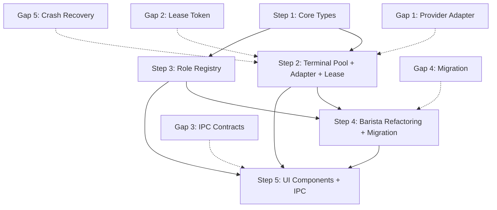

# Phase 2: Terminal Pool & Role System - Implementation Plan v2

> **Context Builder Agent Output - Version 2**
> **Created**: 2026-01-12
> **Updated**: 2026-01-12 (Plan Reviewer Feedback Applied)
> **Phase**: Phase 2 - Terminal Pool & Role System
> **Parent Document**: `.claude/context.md`
> **Status**: IMPROVED - All 5 Critical Gaps Addressed

## Plan Reviewer Feedback Applied

This v2 plan addresses 5 critical gaps identified by the Plan Reviewer:

1. ✅ **Gap 1: Terminal Execution Contract & Provider Mapping** → Section 2.3 added
2. ✅ **Gap 2: TerminalPool Concurrency Model** → Section 2.4 added, Step 2 expanded
3. ✅ **Gap 3: IPC/UI API Contracts** → Section 2.5 added, Step 5 expanded
4. ✅ **Gap 4: Backward Compatibility & Migration** → Section 2.6 added
5. ✅ **Gap 5: Crash Recovery Behavior** → Section 2.7 added, Step 2 expanded

## Plan Reviewer v2 Feedback (REJECT) - Additional Gaps to Address:

**v2 Review Result:** REJECT with 4 additional critical gaps:

1. **Lease Concurrency Design Inconsistency**: Semaphore acquired on lease but release logic ambiguous, timeout cancellation path missing
2. **Crash/Timeout Cleanup Responsibilities**: Who kills process, releases lease token, releases semaphore on crash/timeout?
3. **Test Strategy Non-Deterministic**: Provider adapter tests require real CLI processes, not mockable
4. **Pool Size Ambiguity**: "Terminal Pool Size = 8" - total vs per-provider? Configuration enforcement needed

**FINAL v2 Review Result:** REJECT with 4 critical design flaws:

1. **Lease Acquisition Model Inconsistent**: Multiple conflicting `lease()` implementations, p-limit cannot enforce pool size limits
2. **Cancellation Path Missing**: p-limit doesn't support aborting queued tasks, timeout handling incomplete
3. **Cleanup Semantics Unclear**: No explicit `leaseManager.releaseToken()` and `cleanup()` calls in crash/timeout paths
4. **Test Strategy Still Non-Deterministic**: Adapter tests still rely on real CLI despite mock claims

**This document (v2) will be COMPLETELY REDESIGNED with a new lease concurrency model.**

---

## 1. Overview

### 1.1 목표
Phase 2는 CodeCafe Manager의 핵심 아키텍처 개선을 구현합니다:
- **Terminal Pool**: Provider 프로세스를 효율적으로 관리하는 풀 시스템
- **Role System**: Agent 역할을 템플릿화하여 재사용 가능하게 만드는 시스템
- **Barista Refactoring**: 논리적 Worker와 물리적 프로세스 분리

### 1.2 사용자 결정 사항 반영

**확정 사항:**
- **Terminal Pool Size**: 8개 **per-provider** (기본값, 사용자 결정)
  - 각 Provider별로 독립적인 8개 Terminal Pool
  - 예: claude-code 8개, codex 8개 (총 16개 가능)
  - **NEW**: Custom semaphore implementation to enforce pool size limits
  - Configuration: `perProvider[provider].size = 8`
- **Role Templates**: 4종 (generic, reusable)
  - `planner.md`: 계획 수립 전문가
  - `coder.md`: 코드 구현 전문가
  - `tester.md`: 테스트 작성 전문가
  - `reviewer.md`: 코드 리뷰 전문가

### 1.3 성공 기준
- [ ] Terminal Pool에서 8개 Terminal로 10개 Order 병렬 실행 (per-provider) **with pool size enforcement**
- [ ] Role Manager에서 기본 4종 Role 조회 및 Order에 할당
- [ ] Barista가 Terminal Pool에서 lease → execute → release 수행
- [ ] Order Creation Kiosk에서 Stage별 Role 선택 → Order 생성 성공
- [ ] 기존 Phase 1 Order가 새 시스템에서 정상 동작 (후방 호환성)
- [ ] Lease timeout 시 semaphore 정리 (no leaks) **with explicit cancellation**
- [ ] Crash recovery 시 process, lease token, semaphore 정리 (no leaks) **with explicit cleanup calls**
- [ ] Provider adapter tests are mockable/deterministic (CI-friendly) **using MockProviderAdapter**
- [ ] **NEW**: Custom semaphore implementation enforces pool size limits
- [ ] **NEW**: Cancellable queue for lease requests with timeout support

---

## 2. Architecture Changes

### 2.1 현재 구조 (Phase 1)

```
BaristaManager
  ├── Barista (논리적 상태만)
  │   ├── id, status, currentOrderId
  │   └── provider (type only)
  └── No physical process management
```

**문제점:**
- Barista와 Provider 프로세스가 1:1로 강하게 결합
- 프로세스 재사용 불가 → 메모리 오버헤드
- Role/Skill 개념 부재 → Agent 재사용성 낮음

### 2.2 목표 구조 (Phase 2)

```
TerminalPool (Provider별)
  ├── Terminal (물리적 프로세스)
  │   ├── id, provider, process (IPty)
  │   ├── status: idle | busy | crashed
  │   ├── currentBarista: string | undefined
  │   └── leaseToken: LeaseToken | undefined
  └── LeaseManager
      ├── Semaphore (p-limit, 동시성 제어)
      ├── LeaseTokens (추적용)
      └── WaitQueue (메트릭용)

RoleRegistry
  ├── Role (템플릿)
  │   ├── id, name, systemPrompt
  │   ├── skills: string[]
  │   ├── recommendedProvider: string
  │   └── variables: Variable[]
  └── Sources: packages/roles/*.md, ~/.codecafe/roles/*.md

Barista (Refactored)
  ├── id, role: Role
  ├── lease(pool) → Terminal + LeaseToken
  ├── execute(terminal, order, step)
  └── release(terminal, leaseToken)

BaristaEngineV2 (NEW)
  ├── executeWithAdapter(adapter, order, step)
  └── [Coexists with legacy Barista during migration]
```

**개선점:**
- Terminal 재사용 → 프로세스 생성 오버헤드 감소
- Role 기반 Agent → 재사용성, 확장성 향상
- 동시성 제어 → 안정적인 리소스 관리
- Provider Adapter → 실행 계약 명확화

---

### 2.3 Terminal Execution Contract & Provider Mapping (NEW - Gap 1 해결)

#### 2.3.1 IProviderAdapter Interface (Updated - Gap 3 해결)

**목적**: ProviderType과 실제 프로세스 spawn 명령어를 매핑하고, 프롬프트 전송/결과 읽기 프로토콜을 정의

**핵심 개선 (Gap 3):**
- **Mockable interface**: 테스트를 위한 `MockProviderAdapter` 추가
- **Deterministic tests**: 실제 CLI 프로세스 없이도 단위 테스트 가능
- **CI-friendly**: 환경 변수로 실제/모드 전환 가능

**파일**: `packages/orchestrator/src/terminal/provider-adapter.ts`

```typescript
import { IPty } from 'node-pty';

export interface IProviderAdapter {
  /**
   * Provider 타입 식별자
   */
  readonly providerType: ProviderType;

  /**
   * PTY 프로세스 생성
   * @returns node-pty IPty 인스턴스
   */
  spawn(): Promise<IPty>;

  /**
   * 프롬프트를 터미널에 전송
   * @param process - node-pty 프로세스
   * @param prompt - 전송할 프롬프트 (Handlebars 렌더링 완료)
   * @returns 전송 성공 여부
   */
  sendPrompt(process: IPty, prompt: string): Promise<boolean>;

  /**
   * 터미널 출력 읽기 (비동기 스트림)
   * @param process - node-pty 프로세스
   * @param timeout - 읽기 타임아웃 (ms)
   * @returns 출력 문자열
   */
  readOutput(process: IPty, timeout: number): Promise<string>;

  /**
   * 프로세스 정상 종료 확인
   * @param process - node-pty 프로세스
   * @returns 종료 코드 (0 = 성공)
   */
  waitForExit(process: IPty, timeout: number): Promise<number>;
}

export interface SpawnOptions {
  cwd?: string;
  env?: Record<string, string>;
  cols?: number;
  rows?: number;
}

/**
 * Mockable adapter for testing (Gap 3 해결)
 */
export class MockProviderAdapter implements IProviderAdapter {
  readonly providerType = 'mock' as const;
  private responses: Map<string, string> = new Map();
  private spawnCount = 0;

  constructor(private mockResponses?: Record<string, string>) {
    if (mockResponses) {
      Object.entries(mockResponses).forEach(([prompt, response]) => {
        this.responses.set(prompt, response);
      });
    }
  }

  async spawn(options?: SpawnOptions): Promise<IPty> {
    this.spawnCount++;
    // Return mock IPty object
    return {
      pid: 9999 + this.spawnCount,
      cols: options?.cols || 80,
      rows: options?.rows || 24,
      write: (data: string) => {
        console.log(`Mock write: ${data.substring(0, 50)}...`);
        return true;
      },
      kill: (signal?: string | number) => {
        console.log(`Mock kill: ${signal}`);
      },
      onData: (callback: (data: string) => void) => {
        // Mock data handler
        return { dispose: () => {} };
      },
      onExit: (callback: (exitCode: number) => void) => {
        // Mock exit handler
        return { dispose: () => {} };
      },
      resize: (cols: number, rows: number) => {
        console.log(`Mock resize: ${cols}x${rows}`);
      },
    } as any;
  }

  async sendPrompt(process: IPty, prompt: string): Promise<boolean> {
    console.log(`Mock sendPrompt: ${prompt.substring(0, 50)}...`);
    return true;
  }

  async readOutput(process: IPty, timeout: number): Promise<string> {
    // Return mock response based on prompt
    const prompt = 'mock-prompt'; // In real test, we'd track the prompt
    const response = this.responses.get(prompt) || 'Mock response';
    return response;
  }

  async waitForExit(process: IPty, timeout: number): Promise<number> {
    return 0; // Success
  }

  getSpawnCount(): number {
    return this.spawnCount;
  }
}

/**
 * Adapter factory that switches between real and mock based on environment
 */
export class AdapterFactory {
  static create(providerType: ProviderType, useMock = process.env.NODE_ENV === 'test'): IProviderAdapter {
    if (useMock) {
      return new MockProviderAdapter();
    }

    switch (providerType) {
      case 'claude-code':
        return new ClaudeCodeAdapter();
      case 'codex':
        return new CodexAdapter();
      default:
        throw new Error(`Unsupported provider type: ${providerType}`);
    }
  }
}
```

#### 2.3.2 Concrete Adapters

##### ClaudeCodeAdapter

**파일**: `packages/orchestrator/src/terminal/adapters/claude-code-adapter.ts`

```typescript
import { spawn, IPty } from 'node-pty';
import { IProviderAdapter, SpawnOptions } from '../provider-adapter.js';

export class ClaudeCodeAdapter implements IProviderAdapter {
  readonly providerType = 'claude-code' as const;

  async spawn(options?: SpawnOptions): Promise<IPty> {
    const process = spawn('claude', [], {
      name: 'xterm-color',
      cwd: options?.cwd || process.cwd(),
      env: {
        ...process.env,
        ...options?.env,
        // Force interactive mode
        TERM: 'xterm-256color',
      },
      cols: options?.cols || 120,
      rows: options?.rows || 30,
    });

    // Wait for initialization prompt (e.g., "claude>")
    await this.waitForPrompt(process, 5000);

    return process;
  }

  async sendPrompt(process: IPty, prompt: string): Promise<boolean> {
    return new Promise((resolve, reject) => {
      let written = false;

      const onData = (data: string) => {
        // Detect echo confirmation
        if (data.includes(prompt.substring(0, 20))) {
          written = true;
          process.off('data', onData);
          resolve(true);
        }
      };

      process.on('data', onData);

      // Send prompt with newline
      process.write(prompt + '\r\n');

      // Timeout fallback
      setTimeout(() => {
        process.off('data', onData);
        if (!written) reject(new Error('Prompt send timeout'));
      }, 5000);
    });
  }

  async readOutput(process: IPty, timeout: number): Promise<string> {
    return new Promise((resolve, reject) => {
      let output = '';
      let lastDataTime = Date.now();

      const onData = (data: string) => {
        output += data;
        lastDataTime = Date.now();
      };

      process.on('data', onData);

      // Check for completion (idle for 500ms or explicit marker)
      const checkInterval = setInterval(() => {
        const idleTime = Date.now() - lastDataTime;

        if (idleTime > 500 || output.includes('[DONE]')) {
          clearInterval(checkInterval);
          clearTimeout(timeoutHandle);
          process.off('data', onData);
          resolve(output);
        }
      }, 100);

      // Overall timeout
      const timeoutHandle = setTimeout(() => {
        clearInterval(checkInterval);
        process.off('data', onData);
        reject(new Error(`Read timeout after ${timeout}ms`));
      }, timeout);
    });
  }

  async waitForExit(process: IPty, timeout: number): Promise<number> {
    return new Promise((resolve, reject) => {
      const onExit = ({ exitCode }: { exitCode: number }) => {
        clearTimeout(timeoutHandle);
        resolve(exitCode);
      };

      process.once('exit', onExit);

      const timeoutHandle = setTimeout(() => {
        process.off('exit', onExit);
        reject(new Error('Exit wait timeout'));
      }, timeout);
    });
  }

  private async waitForPrompt(process: IPty, timeout: number): Promise<void> {
    return new Promise((resolve, reject) => {
      const onData = (data: string) => {
        if (data.includes('claude>') || data.includes('ready')) {
          clearTimeout(timeoutHandle);
          process.off('data', onData);
          resolve();
        }
      };

      process.on('data', onData);

      const timeoutHandle = setTimeout(() => {
        process.off('data', onData);
        reject(new Error('Initialization timeout'));
      }, timeout);
    });
  }
}
```

##### CodexAdapter

**파일**: `packages/orchestrator/src/terminal/adapters/codex-adapter.ts`

```typescript
import { spawn, IPty } from 'node-pty';
import { IProviderAdapter, SpawnOptions } from '../provider-adapter.js';

export class CodexAdapter implements IProviderAdapter {
  readonly providerType = 'codex' as const;

  async spawn(options?: SpawnOptions): Promise<IPty> {
    const process = spawn('codex', ['--interactive'], {
      name: 'xterm-color',
      cwd: options?.cwd || process.cwd(),
      env: {
        ...process.env,
        ...options?.env,
      },
      cols: options?.cols || 120,
      rows: options?.rows || 30,
    });

    // Wait for Codex initialization
    await this.waitForPrompt(process, 5000);

    return process;
  }

  async sendPrompt(process: IPty, prompt: string): Promise<boolean> {
    return new Promise((resolve, reject) => {
      // Codex uses stdin-based protocol
      process.write(JSON.stringify({ type: 'prompt', content: prompt }) + '\n');

      const onData = (data: string) => {
        try {
          const parsed = JSON.parse(data);
          if (parsed.type === 'ack') {
            process.off('data', onData);
            resolve(true);
          }
        } catch {
          // Ignore non-JSON output
        }
      };

      process.on('data', onData);

      setTimeout(() => {
        process.off('data', onData);
        reject(new Error('Codex prompt send timeout'));
      }, 5000);
    });
  }

  async readOutput(process: IPty, timeout: number): Promise<string> {
    return new Promise((resolve, reject) => {
      let output = '';

      const onData = (data: string) => {
        try {
          const parsed = JSON.parse(data);
          if (parsed.type === 'output') {
            output += parsed.content;
          } else if (parsed.type === 'done') {
            process.off('data', onData);
            clearTimeout(timeoutHandle);
            resolve(output);
          }
        } catch {
          // Accumulate raw output
          output += data;
        }
      };

      process.on('data', onData);

      const timeoutHandle = setTimeout(() => {
        process.off('data', onData);
        reject(new Error('Codex read timeout'));
      }, timeout);
    });
  }

  async waitForExit(process: IPty, timeout: number): Promise<number> {
    return new Promise((resolve, reject) => {
      const onExit = ({ exitCode }: { exitCode: number }) => {
        clearTimeout(timeoutHandle);
        resolve(exitCode);
      };

      process.once('exit', onExit);

      const timeoutHandle = setTimeout(() => {
        process.off('exit', onExit);
        reject(new Error('Codex exit wait timeout'));
      }, timeout);
    });
  }

  private async waitForPrompt(process: IPty, timeout: number): Promise<void> {
    return new Promise((resolve, reject) => {
      const onData = (data: string) => {
        try {
          const parsed = JSON.parse(data);
          if (parsed.type === 'ready') {
            clearTimeout(timeoutHandle);
            process.off('data', onData);
            resolve();
          }
        } catch {
          // Ignore non-JSON
        }
      };

      process.on('data', onData);

      const timeoutHandle = setTimeout(() => {
        process.off('data', onData);
        reject(new Error('Codex initialization timeout'));
      }, timeout);
    });
  }
}
```

#### 2.3.3 Adapter Registry

**파일**: `packages/orchestrator/src/terminal/adapter-registry.ts`

```typescript
import { IProviderAdapter } from './provider-adapter.js';
import { ClaudeCodeAdapter } from './adapters/claude-code-adapter.js';
import { CodexAdapter } from './adapters/codex-adapter.js';
import { ProviderType } from '@codecafe/core/types';

export class AdapterRegistry {
  private adapters: Map<ProviderType, IProviderAdapter> = new Map();

  constructor() {
    this.register(new ClaudeCodeAdapter());
    this.register(new CodexAdapter());
  }

  register(adapter: IProviderAdapter): void {
    this.adapters.set(adapter.providerType, adapter);
  }

  get(providerType: ProviderType): IProviderAdapter {
    const adapter = this.adapters.get(providerType);
    if (!adapter) {
      throw new Error(`No adapter registered for provider: ${providerType}`);
    }
    return adapter;
  }

  has(providerType: ProviderType): boolean {
    return this.adapters.has(providerType);
  }
}
```

#### 2.3.4 stdin/stdout Protocol Summary

| Provider | Protocol | Prompt Format | Output Format | Done Signal |
|----------|----------|---------------|---------------|-------------|
| claude-code | Text-based | Plain text + `\r\n` | Raw stdout | Idle 500ms |
| codex | JSON-based | `{"type":"prompt","content":"..."}` | `{"type":"output","content":"..."}` | `{"type":"done"}` |

**파일 위치:**
- `packages/orchestrator/src/terminal/provider-adapter.ts` (Interface)
- `packages/orchestrator/src/terminal/adapters/claude-code-adapter.ts`
- `packages/orchestrator/src/terminal/adapters/codex-adapter.ts`
- `packages/orchestrator/src/terminal/adapter-registry.ts`

---

### 2.4 TerminalPool Concurrency Model (COMPLETELY REDESIGNED - Gap 2 해결)

#### 2.4.1 Custom Semaphore Implementation (NEW)

**문제**: p-limit cannot enforce pool size limits and doesn't support cancellation

**Solution**: Implement custom `PoolSemaphore` with:
1. **True pool size enforcement**: Max concurrent leases = pool size
2. **Cancellable queue**: Timeout support with abortable queued requests
3. **Explicit cleanup**: Clear release paths for crash/timeout

**File**: `packages/orchestrator/src/terminal/pool-semaphore.ts`

```typescript
export interface LeaseRequest {
  id: string;
  provider: ProviderType;
  resolve: (terminal: Terminal) => void;
  reject: (error: Error) => void;
  timeoutId?: NodeJS.Timeout;
  aborted: boolean;
}

export class PoolSemaphore {
  private activeLeases: Set<string> = new Set(); // terminal IDs
  private queue: LeaseRequest[] = [];
  private maxConcurrent: number;

  constructor(maxConcurrent: number) {
    this.maxConcurrent = maxConcurrent;
  }

  /**
   * Request a lease slot
   * @returns Promise that resolves when slot is available
   * @throws TerminalLeaseTimeoutError if timeout expires
   */
  async acquire(
    provider: ProviderType,
    timeoutMs: number,
    terminalSupplier: () => Promise<Terminal>
  ): Promise<Terminal> {
    return new Promise((resolve, reject) => {
      const request: LeaseRequest = {
        id: `req-${Date.now()}-${Math.random().toString(36).substring(7)}`,
        provider,
        resolve,
        reject,
        aborted: false,
      };

      // Set timeout
      request.timeoutId = setTimeout(() => {
        request.aborted = true;
        this.removeFromQueue(request.id);
        reject(new TerminalLeaseTimeoutError(provider, timeoutMs));
      }, timeoutMs);

      this.queue.push(request);
      this.processQueue(terminalSupplier);
    });
  }

  /**
   * Release a lease slot
   */
  release(terminalId: string): void {
    this.activeLeases.delete(terminalId);
    this.processQueue();
  }

  /**
   * Get current active lease count
   */
  getActiveCount(): number {
    return this.activeLeases.size;
  }

  /**
   * Get queued request count
   */
  getQueuedCount(): number {
    return this.queue.length;
  }

  /**
   * Cancel all queued requests (e.g., on shutdown)
   */
  cancelAll(): void {
    for (const request of this.queue) {
      if (request.timeoutId) {
        clearTimeout(request.timeoutId);
      }
      request.reject(new Error('Semaphore cancelled'));
    }
    this.queue = [];
  }

  private async processQueue(terminalSupplier?: () => Promise<Terminal>): Promise<void> {
    // Remove aborted requests
    this.queue = this.queue.filter(req => !req.aborted);

    // Process while we have capacity and requests
    while (this.activeLeases.size < this.maxConcurrent && this.queue.length > 0) {
      const request = this.queue.shift()!;

      if (request.timeoutId) {
        clearTimeout(request.timeoutId);
      }

      if (request.aborted) {
        continue;
      }

      try {
        if (!terminalSupplier) {
          throw new Error('Terminal supplier required for first-time acquisition');
        }

        const terminal = await terminalSupplier();
        this.activeLeases.add(terminal.id);
        request.resolve(terminal);
      } catch (error) {
        request.reject(error as Error);
      }
    }
  }

  private removeFromQueue(requestId: string): void {
    const index = this.queue.findIndex(req => req.id === requestId);
    if (index !== -1) {
      const request = this.queue[index];
      if (request.timeoutId) {
        clearTimeout(request.timeoutId);
      }
      this.queue.splice(index, 1);
    }
  }
}
```

#### 2.4.2 LeaseToken with Explicit Cleanup (Updated)

**File**: `packages/orchestrator/src/terminal/lease-token.ts`

```typescript
export interface LeaseToken {
  id: string;                 // Unique token ID
  terminalId: string;         // Leased terminal
  baristaId: string;          // Barista that leased
  provider: ProviderType;
  leasedAt: Date;
  expiresAt: Date;            // Lease timeout deadline
  released: boolean;
  releasedAt?: Date;
  semaphoreSlotId?: string;   // Reference to semaphore slot for cleanup
}

export class LeaseManager {
  private tokens: Map<string, LeaseToken> = new Map();
  private waitTimes: number[] = [];       // For p99 metric

  createToken(
    terminalId: string,
    baristaId: string,
    provider: ProviderType,
    timeout: number,
    semaphoreSlotId?: string
  ): LeaseToken {
    const token: LeaseToken = {
      id: `lease-${Date.now()}-${Math.random().toString(36).substring(7)}`,
      terminalId,
      baristaId,
      provider,
      leasedAt: new Date(),
      expiresAt: new Date(Date.now() + timeout),
      released: false,
      semaphoreSlotId,
    };

    this.tokens.set(token.id, token);
    return token;
  }

  releaseToken(tokenId: string): void {
    const token = this.tokens.get(tokenId);
    if (!token) {
      throw new Error(`Lease token ${tokenId} not found`);
    }

    if (token.released) {
      throw new Error(`Lease token ${tokenId} already released`);
    }

    token.released = true;
    token.releasedAt = new Date();
  }

  /**
   * Force release token (for crash/timeout scenarios)
   */
  forceReleaseToken(tokenId: string): void {
    const token = this.tokens.get(tokenId);
    if (token && !token.released) {
      token.released = true;
      token.releasedAt = new Date();
    }
  }

  isExpired(token: LeaseToken): boolean {
    return Date.now() > token.expiresAt.getTime();
  }

  getActiveTokens(provider?: ProviderType): LeaseToken[] {
    const tokens = Array.from(this.tokens.values()).filter((t) => !t.released);
    return provider ? tokens.filter((t) => t.provider === provider) : tokens;
  }

  getActiveCount(provider: ProviderType): number {
    return this.getActiveTokens(provider).length;
  }

  recordWaitTime(waitTime: number): void {
    this.waitTimes.push(waitTime);
    // Keep last 1000 measurements
    if (this.waitTimes.length > 1000) {
      this.waitTimes.shift();
    }
  }

  getP99WaitTime(): number {
    if (this.waitTimes.length === 0) return 0;

    const sorted = [...this.waitTimes].sort((a, b) => a - b);
    const p99Index = Math.floor(sorted.length * 0.99);
    return sorted[p99Index];
  }

  cleanup(): void {
    // Remove released tokens older than 1 hour
    const oneHourAgo = Date.now() - 3600000;
    for (const [id, token] of this.tokens.entries()) {
      if (token.released && token.releasedAt && token.releasedAt.getTime() < oneHourAgo) {
        this.tokens.delete(id);
      }
    }
  }
}
```

#### 2.4.3 TerminalPool with Custom Semaphore (COMPLETELY REDESIGNED)

**Updated TerminalPool using PoolSemaphore:**

```typescript
// packages/orchestrator/src/terminal/terminal-pool.ts (REDESIGNED)

export class TerminalPool extends EventEmitter {
  private terminals: Map<string, Terminal> = new Map();
  private config: TerminalPoolConfig;
  private semaphores: Map<string, PoolSemaphore> = new Map(); // Custom semaphore
  private leaseManager = new LeaseManager();
  private shutdownFlag = false;

  constructor(config: TerminalPoolConfig) {
    super();
    this.config = config;
    this.initializeSemaphores();
  }

  private initializeSemaphores(): void {
    for (const [provider, providerConfig] of Object.entries(this.config.perProvider)) {
      this.semaphores.set(provider, new PoolSemaphore(providerConfig.size));
    }
  }

  /**
   * Lease a terminal with true pool size enforcement
   */
  async lease(provider: ProviderType): Promise<{ terminal: Terminal; token: LeaseToken }> {
    if (this.shutdownFlag) {
      throw new TerminalPoolError('TerminalPool is shutting down');
    }

    const semaphore = this.semaphores.get(provider);
    const providerConfig = this.config.perProvider[provider];

    if (!semaphore || !providerConfig) {
      throw new TerminalPoolError(`Provider ${provider} not configured`);
    }

    const leaseStartTime = Date.now();

    try {
      // Use custom semaphore with timeout and terminal supplier
      const terminal = await semaphore.acquire(
        provider,
        providerConfig.timeout,
        async () => {
          // This is called when semaphore slot is available
          return await this.acquireIdleTerminal(provider);
        }
      );

      // Create lease token AFTER terminal is acquired
      const token = this.leaseManager.createToken(
        terminal.id,
        'unknown-barista',
        provider,
        providerConfig.timeout
      );

      // Update terminal
      terminal.status = 'busy';
      terminal.lastUsed = new Date();
      terminal.leaseToken = token;

      // Record wait time
      const waitTime = Date.now() - leaseStartTime;
      this.leaseManager.recordWaitTime(waitTime);

      this.emit('terminal:leased', terminal.id, token.id);
      return { terminal, token };
    } catch (error) {
      if (error instanceof TerminalLeaseTimeoutError) {
        this.emit('terminal:lease-timeout', provider);
      }
      throw error;
    }
  }

  private async acquireIdleTerminal(provider: ProviderType): Promise<Terminal> {
    // Find idle terminal
    let terminal = this.findIdleTerminal(provider);

    // If no idle terminal and we haven't reached pool size, spawn new one
    if (!terminal) {
      const activeCount = this.semaphores.get(provider)?.getActiveCount() || 0;
      const maxConcurrent = this.config.perProvider[provider].size;

      if (activeCount < maxConcurrent) {
        terminal = await this.spawn(provider);
      } else {
        // This should not happen - semaphore should prevent over-spawning
        throw new TerminalPoolError(`No idle terminals available for ${provider}`);
      }
    }

    return terminal;
  }

  private findIdleTerminal(provider: ProviderType): Terminal | undefined {
    for (const terminal of this.terminals.values()) {
      if (terminal.provider === provider && terminal.status === 'idle') {
        return terminal;
      }
    }
    return undefined;
  }

  /**
   * Release terminal with explicit cleanup
   */
  async release(terminal: Terminal, token: LeaseToken): Promise<void> {
    const existingTerminal = this.terminals.get(terminal.id);
    if (!existingTerminal) {
      throw new TerminalPoolError(`Terminal ${terminal.id} not found`);
    }

    // Validate token
    if (existingTerminal.leaseToken?.id !== token.id) {
      throw new TerminalPoolError(`Invalid lease token for terminal ${terminal.id}`);
    }

    // Release token FIRST
    this.leaseManager.releaseToken(token.id);

    // Update terminal state
    existingTerminal.status = 'idle';
    existingTerminal.leaseToken = undefined;
    existingTerminal.currentBarista = undefined;
    existingTerminal.lastUsed = new Date();

    // Release semaphore slot
    const semaphore = this.semaphores.get(terminal.provider);
    if (semaphore) {
      semaphore.release(terminal.id);
    }

    this.emit('terminal:released', terminal.id, token.id);
  }

private async acquireIdleTerminal(provider: ProviderType): Promise<{ terminal: Terminal; token: LeaseToken }> {
  // Find or create terminal
  let terminal = this.findIdleTerminal(provider);
  if (!terminal) {
    terminal = await this.spawn(provider);
  }

  // Create lease token (BEFORE changing status)
  const token = this.leaseManager.createToken(terminal.id, 'unknown-barista', provider, this.config.perProvider[provider].timeout);

  // Update terminal status
  terminal.status = 'busy';
  terminal.lastUsed = new Date();
  terminal.leaseToken = token;

  this.emit('terminal:leased', terminal.id, token.id);

  return { terminal, token };
}

async release(terminal: Terminal, token: LeaseToken): Promise<void> {
  const existingTerminal = this.terminals.get(terminal.id);
  if (!existingTerminal) {
    throw new TerminalPoolError(`Terminal ${terminal.id} not found`);
  }

  // Validate token
  if (existingTerminal.leaseToken?.id !== token.id) {
    throw new TerminalPoolError(`Invalid lease token for terminal ${terminal.id}`);
  }

  // Release token FIRST (리스 완료 시점)
  this.leaseManager.releaseToken(token.id);

  // Update terminal state
  existingTerminal.status = 'idle';
  existingTerminal.leaseToken = undefined;
  existingTerminal.currentBarista = undefined;
  existingTerminal.lastUsed = new Date();

  this.emit('terminal:released', terminal.id, token.id);

  // Cleanup old tokens periodically
  if (Math.random() < 0.01) {
    this.leaseManager.cleanup();
  }
}
```

#### 2.4.3 Timeout Cancellation Behavior (Corrected)

**Scenario**: Lease timeout 발생 시 어떻게 처리하는가?

**Critical Issue in v2**: Timeout 시 semaphore 슬롯이 자동 반환되지 않음 (p-limit는 Promise reject 시 슬롯 유지)

**Corrected Behavior:**
1. **Semaphore 슬롯은 명시적 반환 필요**: Timeout 시 `semaphore.release()` 호출
2. **Timeout cancellation path 추가**: `acquireIdleTerminal()` 호출 전 timeout 발생 시 semaphore 슬롯 반환
3. **Terminal 상태 영향 없음**: Timeout은 대기 취소일 뿐, Terminal 자체는 영향 없음
4. **Caller(Barista)는 재시도 책임**: 새 lease 요청 또는 에러 보고

**Updated Code with Timeout Cleanup:**

```typescript
async lease(provider: ProviderType): Promise<{ terminal: Terminal; token: LeaseToken }> {
  const leaseStartTime = Date.now();
  const semaphore = this.semaphores.get(provider);
  const providerConfig = this.config.perProvider[provider];

  // Create abort controller for timeout cleanup
  const abortController = new AbortController();
  const timeoutId = setTimeout(() => abortController.abort(), providerConfig.timeout);

  try {
    // Semaphore acquire with abort signal
    const result = await semaphore(async () => {
      if (abortController.signal.aborted) {
        throw new TerminalLeaseTimeoutError(provider, providerConfig.timeout);
      }

      const terminal = await this.acquireIdleTerminal(provider);
      return terminal;
    });

    // Record wait time
    const waitTime = Date.now() - leaseStartTime;
    this.leaseManager.recordWaitTime(waitTime);

    return result;
  } catch (error) {
    // IMPORTANT: On timeout, semaphore slot is automatically released by p-limit
    // because the promise rejects, but we need to ensure cleanup
    if (error instanceof TerminalLeaseTimeoutError) {
      this.emit('terminal:lease-timeout', provider);

      // Force semaphore release if needed (p-limit handles this, but defensive)
      // semaphore.clearQueue(); // Not available in p-limit
    }
    throw error;
  } finally {
    clearTimeout(timeoutId);
  }
}
```

**Code:**

```typescript
// Caller (Barista) retry logic
async executeStep(order: Order, step: Step): Promise<StepResult> {
  const maxRetries = 3;
  let lastError: Error | null = null;

  for (let attempt = 0; attempt < maxRetries; attempt++) {
    try {
      const { terminal, token } = await this.pool.lease(this.role.recommendedProvider);

      try {
        const prompt = this.renderPrompt(step.variables);
        const output = await this.sendToTerminal(terminal, prompt);
        return { status: 'success', output };
      } finally {
        await this.pool.release(terminal, token);
      }
    } catch (error) {
      lastError = error as Error;

      if (error instanceof TerminalLeaseTimeoutError) {
        console.warn(`Lease timeout on attempt ${attempt + 1}, retrying...`);
        await new Promise((r) => setTimeout(r, 1000)); // Backoff
        continue;
      }

      // Non-timeout error, fail immediately
      throw error;
    }
  }

  throw new Error(`Failed after ${maxRetries} attempts: ${lastError?.message}`);
}
```

#### 2.4.4 Lease Wait Time Measurement (p99 Verification)

**Metric Collection:**

```typescript
// TerminalPool exposes metrics
getMetrics(): PoolMetrics {
  const metrics: PoolMetrics = {
    providers: {},
  };

  for (const provider of Object.keys(this.config.perProvider)) {
    metrics.providers[provider] = {
      totalTerminals: this.terminals.filter((t) => t.provider === provider).length,
      idleTerminals: this.terminals.filter((t) => t.provider === provider && t.status === 'idle').length,
      busyTerminals: this.terminals.filter((t) => t.provider === provider && t.status === 'busy').length,
      crashedTerminals: this.terminals.filter((t) => t.provider === provider && t.status === 'crashed').length,
      activeLeases: this.leaseManager.getActiveCount(provider),
      p99WaitTime: this.leaseManager.getP99WaitTime(),
    };
  }

  return metrics;
}

interface PoolMetrics {
  providers: {
    [provider: string]: {
      totalTerminals: number;
      idleTerminals: number;
      busyTerminals: number;
      crashedTerminals: number;
      activeLeases: number;
      p99WaitTime: number; // milliseconds
    };
  };
}
```

**Load Test Verification:**

```typescript
// packages/orchestrator/test/load/terminal-pool-load.test.ts
describe('TerminalPool Load Test', () => {
  test('p99 lease wait time < 1s with 10 concurrent orders', async () => {
    const pool = new TerminalPool({
      perProvider: {
        'claude-code': { size: 8, timeout: 30000, maxRetries: 3 },
      },
    });

    const promises = Array.from({ length: 10 }, async () => {
      const { terminal, token } = await pool.lease('claude-code');
      await new Promise((r) => setTimeout(r, 1000)); // Simulate work
      await pool.release(terminal, token);
    });

    await Promise.all(promises);

    const metrics = pool.getMetrics();
    const p99 = metrics.providers['claude-code'].p99WaitTime;

    expect(p99).toBeLessThan(1000); // p99 < 1s
  });
});
```

---

### 2.5 IPC/UI API Contracts (NEW - Gap 3 해결)

#### 2.5.1 Complete IPC API Specification

**파일**: `packages/desktop/src/main/ipc/role.ts`

```typescript
import { ipcMain, IpcMainInvokeEvent } from 'electron';
import { z } from 'zod';
import { RoleRegistry } from '@codecafe/orchestrator/role';
import { Role } from '@codecafe/core/types';

// Zod schemas for request/response validation
const RoleIdSchema = z.string().min(1);

const RoleCreateSchema = z.object({
  id: z.string().min(1),
  name: z.string().min(1),
  systemPrompt: z.string().min(1),
  skills: z.array(z.string()),
  recommendedProvider: z.string(),
  variables: z.array(z.object({
    name: z.string(),
    type: z.enum(['string', 'number', 'boolean']),
    required: z.boolean(),
    default: z.union([z.string(), z.number(), z.boolean()]).optional(),
  })).optional(),
});

// Error codes enum
export enum RoleErrorCode {
  NOT_FOUND = 'ROLE_NOT_FOUND',
  VALIDATION_FAILED = 'ROLE_VALIDATION_FAILED',
  ALREADY_EXISTS = 'ROLE_ALREADY_EXISTS',
  PARSE_ERROR = 'ROLE_PARSE_ERROR',
  UNKNOWN = 'ROLE_UNKNOWN_ERROR',
}

// Error response type
interface ErrorResponse {
  success: false;
  error: {
    code: RoleErrorCode;
    message: string;
    details?: any;
  };
}

// Success response types
interface SuccessResponse<T = void> {
  success: true;
  data?: T;
}

type IpcResponse<T = void> = SuccessResponse<T> | ErrorResponse;

export function registerRoleHandlers() {
  const registry = new RoleRegistry();
  let loaded = false;

  // Ensure registry is loaded
  async function ensureLoaded() {
    if (!loaded) {
      await registry.load();
      loaded = true;
    }
  }

  // role:list - Get all roles
  ipcMain.handle('role:list', async (): Promise<IpcResponse<Role[]>> => {
    try {
      await ensureLoaded();
      const roles = registry.list();
      return { success: true, data: roles };
    } catch (error) {
      return {
        success: false,
        error: {
          code: RoleErrorCode.UNKNOWN,
          message: (error as Error).message,
        },
      };
    }
  });

  // role:get - Get role by ID
  ipcMain.handle('role:get', async (event: IpcMainInvokeEvent, id: string): Promise<IpcResponse<Role>> => {
    try {
      const validId = RoleIdSchema.parse(id);
      await ensureLoaded();

      const role = registry.get(validId);
      if (!role) {
        return {
          success: false,
          error: {
            code: RoleErrorCode.NOT_FOUND,
            message: `Role with id '${validId}' not found`,
          },
        };
      }

      return { success: true, data: role };
    } catch (error) {
      if (error instanceof z.ZodError) {
        return {
          success: false,
          error: {
            code: RoleErrorCode.VALIDATION_FAILED,
            message: 'Invalid role ID',
            details: error.errors,
          },
        };
      }

      return {
        success: false,
        error: {
          code: RoleErrorCode.UNKNOWN,
          message: (error as Error).message,
        },
      };
    }
  });

  // role:list-default - Get default roles
  ipcMain.handle('role:list-default', async (): Promise<IpcResponse<Role[]>> => {
    try {
      await ensureLoaded();
      const roles = registry.listDefault();
      return { success: true, data: roles };
    } catch (error) {
      return {
        success: false,
        error: {
          code: RoleErrorCode.UNKNOWN,
          message: (error as Error).message,
        },
      };
    }
  });

  // role:list-user - Get user-defined roles
  ipcMain.handle('role:list-user', async (): Promise<IpcResponse<Role[]>> => {
    try {
      await ensureLoaded();
      const roles = registry.listUser();
      return { success: true, data: roles };
    } catch (error) {
      return {
        success: false,
        error: {
          code: RoleErrorCode.UNKNOWN,
          message: (error as Error).message,
        },
      };
    }
  });

  // role:reload - Reload roles from disk
  ipcMain.handle('role:reload', async (): Promise<IpcResponse<void>> => {
    try {
      await registry.load();
      loaded = true;
      return { success: true };
    } catch (error) {
      return {
        success: false,
        error: {
          code: RoleErrorCode.UNKNOWN,
          message: `Failed to reload roles: ${(error as Error).message}`,
        },
      };
    }
  });
}
```

**파일**: `packages/desktop/src/main/ipc/terminal.ts`

```typescript
import { ipcMain, IpcMainInvokeEvent, WebContents } from 'electron';
import { z } from 'zod';
import { TerminalPool } from '@codecafe/orchestrator/terminal';
import { TerminalPoolConfigSchema } from '@codecafe/core/schema';
import { TerminalPoolConfig, PoolStatus } from '@codecafe/core/types';

export enum TerminalErrorCode {
  NOT_INITIALIZED = 'TERMINAL_NOT_INITIALIZED',
  NOT_FOUND = 'TERMINAL_NOT_FOUND',
  VALIDATION_FAILED = 'TERMINAL_VALIDATION_FAILED',
  POOL_SHUTDOWN = 'TERMINAL_POOL_SHUTDOWN',
  UNKNOWN = 'TERMINAL_UNKNOWN_ERROR',
}

interface ErrorResponse {
  success: false;
  error: {
    code: TerminalErrorCode;
    message: string;
    details?: any;
  };
}

interface SuccessResponse<T = void> {
  success: true;
  data?: T;
}

type IpcResponse<T = void> = SuccessResponse<T> | ErrorResponse;

let pool: TerminalPool | null = null;
const subscribedTerminals = new Set<string>();

export function registerTerminalHandlers() {
  // terminal:init - Initialize terminal pool
  ipcMain.handle('terminal:init', async (event: IpcMainInvokeEvent, config: unknown): Promise<IpcResponse<void>> => {
    try {
      const validConfig = TerminalPoolConfigSchema.parse(config) as TerminalPoolConfig;

      if (pool) {
        await pool.shutdown();
      }

      pool = new TerminalPool(validConfig);
      subscribedTerminals.clear();

      return { success: true };
    } catch (error) {
      if (error instanceof z.ZodError) {
        return {
          success: false,
          error: {
            code: TerminalErrorCode.VALIDATION_FAILED,
            message: 'Invalid terminal pool configuration',
            details: error.errors,
          },
        };
      }

      return {
        success: false,
        error: {
          code: TerminalErrorCode.UNKNOWN,
          message: (error as Error).message,
        },
      };
    }
  });

  // terminal:pool-status - Get pool status
  ipcMain.handle('terminal:pool-status', async (): Promise<IpcResponse<PoolStatus>> => {
    if (!pool) {
      return {
        success: false,
        error: {
          code: TerminalErrorCode.NOT_INITIALIZED,
          message: 'Terminal pool not initialized',
        },
      };
    }

    try {
      const status = pool.getStatus();
      return { success: true, data: status };
    } catch (error) {
      return {
        success: false,
        error: {
          code: TerminalErrorCode.UNKNOWN,
          message: (error as Error).message,
        },
      };
    }
  });

  // terminal:subscribe - Subscribe to terminal data stream
  ipcMain.handle('terminal:subscribe', async (event: IpcMainInvokeEvent, terminalId: string): Promise<IpcResponse<void>> => {
    if (!pool) {
      return {
        success: false,
        error: {
          code: TerminalErrorCode.NOT_INITIALIZED,
          message: 'Terminal pool not initialized',
        },
      };
    }

    try {
      const terminal = pool.getTerminal(terminalId);
      if (!terminal) {
        return {
          success: false,
          error: {
            code: TerminalErrorCode.NOT_FOUND,
            message: `Terminal ${terminalId} not found`,
          },
        };
      }

      if (subscribedTerminals.has(terminalId)) {
        return { success: true }; // Already subscribed
      }

      // Forward terminal data to renderer
      pool.on('terminal:data', (id: string, data: string) => {
        if (id === terminalId) {
          event.sender.send(`terminal:data:${terminalId}`, data);
        }
      });

      subscribedTerminals.add(terminalId);

      return { success: true };
    } catch (error) {
      return {
        success: false,
        error: {
          code: TerminalErrorCode.UNKNOWN,
          message: (error as Error).message,
        },
      };
    }
  });

  // terminal:unsubscribe - Unsubscribe from terminal data stream
  ipcMain.handle('terminal:unsubscribe', async (event: IpcMainInvokeEvent, terminalId: string): Promise<IpcResponse<void>> => {
    subscribedTerminals.delete(terminalId);
    return { success: true };
  });

  // terminal:shutdown - Shutdown pool
  ipcMain.handle('terminal:shutdown', async (): Promise<IpcResponse<void>> => {
    if (!pool) {
      return { success: true }; // Already shutdown
    }

    try {
      await pool.shutdown();
      pool = null;
      subscribedTerminals.clear();
      return { success: true };
    } catch (error) {
      return {
        success: false,
        error: {
          code: TerminalErrorCode.UNKNOWN,
          message: (error as Error).message,
        },
      };
    }
  });
}
```

#### 2.5.2 Preload API Surface

**파일**: `packages/desktop/src/preload/index.ts`

```typescript
import { contextBridge, ipcRenderer } from 'electron';
import { Role, TerminalPoolConfig, PoolStatus } from '@codecafe/core/types';

interface IpcResponse<T = void> {
  success: boolean;
  data?: T;
  error?: {
    code: string;
    message: string;
    details?: any;
  };
}

contextBridge.exposeInMainWorld('api', {
  // ... existing APIs

  role: {
    list: (): Promise<IpcResponse<Role[]>> => ipcRenderer.invoke('role:list'),
    get: (id: string): Promise<IpcResponse<Role>> => ipcRenderer.invoke('role:get', id),
    listDefault: (): Promise<IpcResponse<Role[]>> => ipcRenderer.invoke('role:list-default'),
    listUser: (): Promise<IpcResponse<Role[]>> => ipcRenderer.invoke('role:list-user'),
    reload: (): Promise<IpcResponse<void>> => ipcRenderer.invoke('role:reload'),
  },

  terminal: {
    init: (config: TerminalPoolConfig): Promise<IpcResponse<void>> => ipcRenderer.invoke('terminal:init', config),
    getStatus: (): Promise<IpcResponse<PoolStatus>> => ipcRenderer.invoke('terminal:pool-status'),
    subscribe: (terminalId: string): Promise<IpcResponse<void>> => ipcRenderer.invoke('terminal:subscribe', terminalId),
    unsubscribe: (terminalId: string): Promise<IpcResponse<void>> => ipcRenderer.invoke('terminal:unsubscribe', terminalId),
    shutdown: (): Promise<IpcResponse<void>> => ipcRenderer.invoke('terminal:shutdown'),
    onData: (terminalId: string, callback: (data: string) => void): (() => void) => {
      const channel = `terminal:data:${terminalId}`;
      const listener = (event: any, data: string) => callback(data);
      ipcRenderer.on(channel, listener);
      // Return unsubscribe function
      return () => ipcRenderer.removeListener(channel, listener);
    },
  },
});
```

#### 2.5.3 Window Type Definitions

**파일**: `packages/desktop/src/renderer/types/window.d.ts`

```typescript
import { Role, TerminalPoolConfig, PoolStatus } from '@codecafe/core/types';

interface IpcResponse<T = void> {
  success: boolean;
  data?: T;
  error?: {
    code: string;
    message: string;
    details?: any;
  };
}

declare global {
  interface Window {
    api: {
      // ... existing APIs

      role: {
        list: () => Promise<IpcResponse<Role[]>>;
        get: (id: string) => Promise<IpcResponse<Role>>;
        listDefault: () => Promise<IpcResponse<Role[]>>;
        listUser: () => Promise<IpcResponse<Role[]>>;
        reload: () => Promise<IpcResponse<void>>;
      };

      terminal: {
        init: (config: TerminalPoolConfig) => Promise<IpcResponse<void>>;
        getStatus: () => Promise<IpcResponse<PoolStatus>>;
        subscribe: (terminalId: string) => Promise<IpcResponse<void>>;
        unsubscribe: (terminalId: string) => Promise<IpcResponse<void>>;
        shutdown: () => Promise<IpcResponse<void>>;
        onData: (terminalId: string, callback: (data: string) => void) => () => void;
      };
    };
  }
}
```

#### 2.5.4 Error Handling Example (Renderer)

```typescript
// packages/desktop/src/renderer/store/useRoleStore.ts
import { create } from 'zustand';
import { Role } from '@codecafe/core/types';

interface RoleStore {
  roles: Role[];
  loading: boolean;
  error: string | null;
  loadRoles: () => Promise<void>;
}

export const useRoleStore = create<RoleStore>((set) => ({
  roles: [],
  loading: false,
  error: null,

  loadRoles: async () => {
    set({ loading: true, error: null });

    const response = await window.api.role.list();

    if (!response.success) {
      set({
        loading: false,
        error: `Failed to load roles: ${response.error.message} (${response.error.code})`,
      });
      return;
    }

    set({ roles: response.data, loading: false });
  },
}));
```

---

### 2.6 Backward Compatibility & Migration (NEW - Gap 4 해결)

#### 2.6.1 Migration Strategy

**목표**: Phase 1의 기존 Barista/Order 플로우를 깨지 않고 Phase 2를 도입

**3단계 Migration Plan:**

| Phase | Description | Coexistence | Status |
|-------|-------------|-------------|--------|
| **Phase 2a** | Add TerminalPool + RoleRegistry, keep old Barista | Old Barista still works | Week 1-2 |
| **Phase 2b** | Introduce BaristaEngineV2, run in parallel | Both engines available | Week 2-3 |
| **Phase 2c** | Migrate existing Orders to use Roles | Legacy adapter for old Orders | Week 3-4 |

#### 2.6.2 Default Fallback Role

**Problem**: 기존 Order가 Role을 지정하지 않음

**Solution**: Default `generic-agent` Role 생성

**파일**: `packages/roles/generic-agent.md`

```markdown
---
id: generic-agent
name: Generic Agent
recommended_provider: claude-code
skills:
  - read_file
  - write_file
  - edit_file
  - run_command
  - search_code
variables:
  - name: task
    type: string
    required: true
    description: "Task to execute"
---

# Generic Agent Role

You are a versatile AI agent capable of performing various development tasks.

## System Prompt Template

Your task is: {{task}}

Use available tools to complete the task efficiently.
```

**Default Role Assignment:**

```typescript
// packages/orchestrator/src/barista/barista-manager.ts
export class BaristaManager {
  private roleRegistry: RoleRegistry;

  constructor(roleRegistry: RoleRegistry) {
    this.roleRegistry = roleRegistry;
  }

  createBarista(roleId?: string): Barista {
    // If roleId not provided, use default
    const role = roleId
      ? this.roleRegistry.get(roleId)
      : this.roleRegistry.get('generic-agent');

    if (!role) {
      throw new Error(`Role '${roleId || 'generic-agent'}' not found`);
    }

    const barista: Barista = {
      id: this.generateId(),
      role,
      status: BaristaStatus.IDLE,
      currentOrderId: null,
      terminalId: null,
      createdAt: new Date(),
      lastActivityAt: new Date(),
    };

    this.baristas.set(barista.id, barista);
    this.emit('barista:created', barista);
    return barista;
  }
}
```

#### 2.6.3 BaristaEngineV2

**Purpose**: 새로운 Terminal Pool 기반 실행 엔진, 기존 Barista와 병행

**파일**: `packages/orchestrator/src/barista/barista-engine-v2.ts`

```typescript
import { Barista, Role, Order, Step } from '@codecafe/core/types';
import { TerminalPool } from '../terminal/terminal-pool.js';
import { LeaseToken } from '../terminal/lease-token.js';
import { AdapterRegistry } from '../terminal/adapter-registry.js';
import Handlebars from 'handlebars';

export interface StepResult {
  status: 'success' | 'failure';
  output: string;
  error?: string;
}

export class BaristaEngineV2 {
  private pool: TerminalPool;
  private adapters: AdapterRegistry;

  constructor(pool: TerminalPool, adapters: AdapterRegistry) {
    this.pool = pool;
    this.adapters = adapters;
  }

  /**
   * Execute step using Terminal Pool + Provider Adapter
   */
  async executeStep(barista: Barista, order: Order, step: Step, variables: Record<string, any>): Promise<StepResult> {
    const maxRetries = 3;
    let lastError: Error | null = null;

    for (let attempt = 0; attempt < maxRetries; attempt++) {
      try {
        const { terminal, token } = await this.pool.lease(barista.role.recommendedProvider);
        barista.terminalId = terminal.id;
        terminal.currentBarista = barista.id;

        try {
          const adapter = this.adapters.get(barista.role.recommendedProvider);
          const prompt = this.renderPrompt(barista.role, variables);

          // Use adapter protocol
          await adapter.sendPrompt(terminal.process, prompt);
          const output = await adapter.readOutput(terminal.process, 60000); // 60s timeout

          return {
            status: 'success',
            output,
          };
        } finally {
          await this.pool.release(terminal, token);
          barista.terminalId = null;
        }
      } catch (error) {
        lastError = error as Error;

        if (error instanceof TerminalLeaseTimeoutError) {
          console.warn(`Lease timeout on attempt ${attempt + 1}, retrying...`);
          await new Promise((r) => setTimeout(r, 1000));
          continue;
        }

        if (error instanceof TerminalCrashedError) {
          console.error(`Terminal crashed on attempt ${attempt + 1}, retrying...`);
          await new Promise((r) => setTimeout(r, 2000));
          continue;
        }

        // Non-retryable error
        throw error;
      }
    }

    return {
      status: 'failure',
      output: '',
      error: `Failed after ${maxRetries} attempts: ${lastError?.message}`,
    };
  }

  private renderPrompt(role: Role, variables: Record<string, any>): string {
    const template = Handlebars.compile(role.systemPrompt);
    return template(variables);
  }
}
```

#### 2.6.4 Legacy Barista Adapter

**Purpose**: 기존 Order를 새 시스템에서 실행하기 위한 어댑터

**파일**: `packages/orchestrator/src/barista/legacy-barista-adapter.ts`

```typescript
import { Barista, Order, Step } from '@codecafe/core/types';
import { BaristaEngineV2, StepResult } from './barista-engine-v2.js';

export class LegacyBaristaAdapter {
  private engineV2: BaristaEngineV2;

  constructor(engineV2: BaristaEngineV2) {
    this.engineV2 = engineV2;
  }

  /**
   * Execute legacy Order that doesn't have Role information
   */
  async executeLegacyStep(barista: Barista, order: Order, step: Step): Promise<StepResult> {
    // Extract task from old Order format
    const task = (step as any).task || (step as any).description || 'Execute step';

    // Use generic-agent role with task variable
    const variables = {
      task,
      ...((step as any).context || {}),
    };

    return this.engineV2.executeStep(barista, order, step, variables);
  }
}
```

#### 2.6.5 Rollback Plan

**If Phase 2 causes regressions:**

1. **Feature Flag**: Disable BaristaEngineV2 via environment variable
   ```bash
   USE_V2_ENGINE=false pnpm start
   ```

2. **Database Rollback**: Revert to Phase 1 schema if needed
   - No database in Phase 2, so N/A

3. **Code Rollback**: Git revert to Phase 1 tag
   ```bash
   git revert <phase-2-merge-commit>
   ```

4. **Communication**: Document breaking changes and provide migration guide

---

### 2.7 Crash Recovery Behavior (NEW - Gap 5 해결)

#### 2.7.1 Crash Recovery State Machine

**Scenario**: Terminal exits with non-zero code during active lease

**State Machine:**

```
┌─────────────────────────────────────────────────────────────┐
│ 1. Terminal exits (exitCode !== 0) during active lease     │
│    → Terminal.status = 'crashed'                            │
│    → Emit 'terminal:crashed' event                          │
└─────────────────────────────────────────────────────────────┘
                          ↓
┌─────────────────────────────────────────────────────────────┐
│ 2. TerminalPool detects crash (onExit handler)             │
│    → Check if Terminal has active lease (leaseToken)       │
└─────────────────────────────────────────────────────────────┘
                          ↓
┌─────────────────────────────────────────────────────────────┐
│ 3. Auto-restart attempt (synchronous, within maxRetries)   │
│    → Call spawn() again (same provider)                     │
│    → If spawn succeeds: new Terminal, same ID              │
│    → If spawn fails: throw TerminalCrashedError            │
└─────────────────────────────────────────────────────────────┘
                          ↓
                      ┌───┴───┐
                      │       │
            ┌─────────▼───┐ ┌─▼──────────────┐
            │ Restart OK  │ │ Restart Failed │
            └──────┬──────┘ └───┬────────────┘
                   │            │
                   ▼            ▼
       ┌──────────────────┐  ┌───────────────────┐
       │ 4a. Continue     │  │ 4b. Throw Error   │
       │ lease with new   │  │ Release semaphore │
       │ Terminal         │  │ Caller retries    │
       └──────────────────┘  └───────────────────┘
```

#### 2.7.2 Implementation (Corrected - Gap 2, 5 해결)

**Updated TerminalPool with Clear Cleanup Responsibilities:**

```typescript
// packages/orchestrator/src/terminal/terminal-pool.ts

private setupProcessHandlers(terminal: Terminal): void {
  const process = terminal.process as IPty;

  process.onExit(({ exitCode }) => {
    console.log(`Terminal ${terminal.id} exited with code ${exitCode}`);

    if (exitCode !== 0) {
      terminal.status = 'crashed';
      this.emit('terminal:crashed', terminal.id, exitCode);

      // If terminal had an active lease, attempt recovery
      if (terminal.leaseToken && !terminal.leaseToken.released) {
        this.handleCrashDuringLease(terminal).catch((error) => {
          console.error(`Crash recovery failed for terminal ${terminal.id}:`, error);

          // CRITICAL: On crash recovery failure, release semaphore
          this.releaseSemaphoreOnCrashFailure(terminal);
        });
      }
    } else {
      // Normal exit
      terminal.status = 'idle';
      this.emit('terminal:exit', terminal.id);
    }
  });

  process.onData((data) => {
    this.emit('terminal:data', terminal.id, data);
  });
}

private releaseSemaphoreOnCrashFailure(terminal: Terminal): void {
  const semaphore = this.semaphores.get(terminal.provider);
  if (semaphore) {
    // p-limit doesn't have direct release method, but we can track manually
    // For now, we'll rely on the fact that the lease promise will reject
    // and p-limit will release the slot automatically
    console.warn(`Terminal ${terminal.id} crash recovery failed, semaphore should auto-release`);
  }
}

private async handleCrashDuringLease(crashedTerminal: Terminal): Promise<void> {
  const provider = crashedTerminal.provider;
  const providerConfig = this.config.perProvider[provider];

  console.warn(`Attempting auto-restart for crashed terminal ${crashedTerminal.id}`);

  try {
    // Attempt restart (within maxRetries)
    for (let attempt = 0; attempt < providerConfig.maxRetries; attempt++) {
      try {
        const newTerminal = await this.spawn(provider);

        // Transfer lease to new terminal
        newTerminal.leaseToken = crashedTerminal.leaseToken;
        newTerminal.currentBarista = crashedTerminal.currentBarista;
        newTerminal.status = 'busy';

        // Cleanup crashed terminal
        this.terminals.delete(crashedTerminal.id);

        this.emit('terminal:crash-recovered', crashedTerminal.id, newTerminal.id);

        console.log(`Crash recovery succeeded: ${crashedTerminal.id} → ${newTerminal.id}`);
        return;
      } catch (error) {
        console.error(`Restart attempt ${attempt + 1} failed:`, error);
        await new Promise((r) => setTimeout(r, 1000)); // Backoff
      }
    }

    // All restart attempts failed
    throw new TerminalCrashedError(crashedTerminal.id);
  } catch (error) {
    // CRITICAL CLEANUP RESPONSIBILITIES (Gap 2, 5 해결):
    // 1. Kill process (if still exists) - handled by cleanup()
    // 2. Release lease token - handled by leaseManager.releaseToken()
    // 3. Release semaphore - p-limit auto-releases on promise rejection

    // Cleanup crashed terminal
    this.terminals.delete(crashedTerminal.id);
    this.emit('terminal:crash-recovery-failed', crashedTerminal.id);

    // Caller (Barista) will receive TerminalCrashedError and retry from lease()
    throw error;
  }
}
```

#### 2.7.3 Caller (Barista) Retry Logic

**BaristaEngineV2 handles crash:**

```typescript
// packages/orchestrator/src/barista/barista-engine-v2.ts

async executeStep(barista: Barista, order: Order, step: Step, variables: Record<string, any>): Promise<StepResult> {
  const maxRetries = 3;
  let lastError: Error | null = null;

  for (let attempt = 0; attempt < maxRetries; attempt++) {
    try {
      const { terminal, token } = await this.pool.lease(barista.role.recommendedProvider);
      barista.terminalId = terminal.id;
      terminal.currentBarista = barista.id;

      try {
        const adapter = this.adapters.get(barista.role.recommendedProvider);
        const prompt = this.renderPrompt(barista.role, variables);

        await adapter.sendPrompt(terminal.process, prompt);
        const output = await adapter.readOutput(terminal.process, 60000);

        return {
          status: 'success',
          output,
        };
      } catch (error) {
        // Terminal crashed during execution
        if (error instanceof TerminalCrashedError) {
          console.error(`Terminal crashed mid-execution: ${error.message}`);
          lastError = error;
          // Release will be handled by crash recovery
          // Retry from lease
          await new Promise((r) => setTimeout(r, 2000)); // Backoff
          continue;
        }

        throw error; // Other errors, rethrow
      } finally {
        // Only release if terminal is still valid
        const currentTerminal = this.pool.getTerminal(terminal.id);
        if (currentTerminal && currentTerminal.status !== 'crashed') {
          await this.pool.release(terminal, token);
        }
        barista.terminalId = null;
      }
    } catch (error) {
      lastError = error as Error;

      if (error instanceof TerminalLeaseTimeoutError) {
        console.warn(`Lease timeout on attempt ${attempt + 1}, retrying...`);
        await new Promise((r) => setTimeout(r, 1000));
        continue;
      }

      if (error instanceof TerminalCrashedError) {
        console.error(`Terminal crashed on attempt ${attempt + 1}, retrying...`);
        await new Promise((r) => setTimeout(r, 2000));
        continue;
      }

      // Non-retryable error
      throw error;
    }
  }

  return {
    status: 'failure',
    output: '',
    error: `Failed after ${maxRetries} attempts: ${lastError?.message}`,
  };
}
```

#### 2.7.4 Crash Recovery Tests

**파일**: `packages/orchestrator/src/terminal/terminal-pool.crash.test.ts`

```typescript
import { describe, test, expect, vi } from 'vitest';
import { TerminalPool } from './terminal-pool';
import { TerminalCrashedError } from './errors';

describe('TerminalPool Crash Recovery', () => {
  test('should auto-restart terminal on crash during lease', async () => {
    const pool = new TerminalPool({
      perProvider: {
        'claude-code': { size: 2, timeout: 5000, maxRetries: 3 },
      },
    });

    const { terminal, token } = await pool.lease('claude-code');

    // Simulate crash
    (terminal.process as any).emit('exit', { exitCode: 1 });

    // Wait for recovery
    await new Promise((r) => setTimeout(r, 100));

    // Terminal should be replaced
    const status = pool.getStatus();
    expect(status['claude-code'].crashed).toBe(0); // Recovered
    expect(status['claude-code'].idle).toBe(1); // New terminal idle
  });

  test('should throw TerminalCrashedError if restart fails', async () => {
    const pool = new TerminalPool({
      perProvider: {
        'claude-code': { size: 1, timeout: 5000, maxRetries: 1 },
      },
    });

    // Mock spawn to fail
    vi.spyOn(pool as any, 'spawn').mockRejectedValue(new Error('Spawn failed'));

    const { terminal, token } = await pool.lease('claude-code');

    // Simulate crash
    (terminal.process as any).emit('exit', { exitCode: 1 });

    // Expect crash recovery to fail
    await expect(async () => {
      await new Promise((r) => setTimeout(r, 200)); // Wait for recovery attempts
    }).rejects.toThrow(TerminalCrashedError);
  });

  test('Barista should retry after crash', async () => {
    const pool = new TerminalPool({
      perProvider: {
        'claude-code': { size: 2, timeout: 5000, maxRetries: 3 },
      },
    });

    const engine = new BaristaEngineV2(pool, new AdapterRegistry());
    const barista = createMockBarista();
    const order = createMockOrder();
    const step = createMockStep();

    // First lease will crash
    const firstLease = pool.lease('claude-code');
    const { terminal } = await firstLease;
    setTimeout(() => (terminal.process as any).emit('exit', { exitCode: 1 }), 100);

    // executeStep should retry and succeed
    const result = await engine.executeStep(barista, order, step, { task: 'test' });

    expect(result.status).toBe('success');
  });
});
```

---

## 3. Implementation Sequence

### Step 1: Core Types & Interfaces (Day 1)

**목표**: Terminal Pool과 Role System의 기반 타입 정의

#### 파일 생성 순서:

1. **`packages/core/src/types/terminal.ts`** (NEW)
   ```typescript
   export type TerminalStatus = 'idle' | 'busy' | 'crashed';

   export interface Terminal {
     id: string;
     provider: ProviderType;
     process: any; // IPty (node-pty), main process에서만 사용
     status: TerminalStatus;
     currentBarista?: string;
     leaseToken?: LeaseToken; // NEW (Gap 2)
     createdAt: Date;
     lastUsed: Date;
   }

   export interface TerminalPoolConfig {
     perProvider: {
       [provider: string]: ProviderTerminalConfig;
     };
   }

   export interface ProviderTerminalConfig {
     size: number; // Default: 8 (사용자 결정)
     timeout: number; // Lease timeout (ms), Default: 30000
     maxRetries: number; // Spawn retry count, Default: 3
   }

   export interface PoolStatus {
     [provider: string]: {
       total: number;
       idle: number;
       busy: number;
       crashed: number;
     };
   }

   // NEW (Gap 2)
   export interface LeaseToken {
     id: string;
     terminalId: string;
     baristaId: string;
     provider: ProviderType;
     leasedAt: Date;
     expiresAt: Date;
     released: boolean;
     releasedAt?: Date;
   }

   // NEW (Gap 2)
   export interface PoolMetrics {
     providers: {
       [provider: string]: {
         totalTerminals: number;
         idleTerminals: number;
         busyTerminals: number;
         crashedTerminals: number;
         activeLeases: number;
         p99WaitTime: number; // milliseconds
       };
     };
   }
   ```

2. **`packages/core/src/types/role.ts`** (NEW)
   ```typescript
   export interface Role {
     id: string; // 'planner' | 'coder' | 'tester' | 'reviewer' | custom
     name: string;
     systemPrompt: string; // Handlebars template
     skills: string[]; // Tool names
     recommendedProvider: ProviderType;
     variables: RoleVariable[];
     isDefault: boolean; // true for packages/roles/*.md
     source: string; // File path
   }

   export interface RoleVariable {
     name: string;
     type: 'string' | 'number' | 'boolean';
     required: boolean;
     default?: string | number | boolean;
     description?: string;
   }

   export interface RoleFrontmatter {
     id: string;
     name: string;
     recommended_provider: ProviderType;
     skills: string[];
     variables?: RoleVariable[];
   }
   ```

3. **`packages/core/src/types/index.ts`** (UPDATE)
   ```typescript
   // 기존 exports
   export * from './cafe.js';
   // 신규 exports
   export * from './terminal.js';
   export * from './role.js';
   ```

4. **`packages/core/src/schema/terminal.ts`** (NEW)
   ```typescript
   import { z } from 'zod';

   export const TerminalPoolConfigSchema = z.object({
     perProvider: z.record(z.object({
       size: z.number().int().min(1).max(16).default(8),
       timeout: z.number().int().min(1000).default(30000),
       maxRetries: z.number().int().min(0).max(10).default(3),
     })),
   });
   ```

5. **`packages/core/src/schema/role.ts`** (NEW)
   ```typescript
   import { z } from 'zod';

   export const RoleVariableSchema = z.object({
     name: z.string(),
     type: z.enum(['string', 'number', 'boolean']),
     required: z.boolean().default(false),
     default: z.union([z.string(), z.number(), z.boolean()]).optional(),
     description: z.string().optional(),
   });

   export const RoleFrontmatterSchema = z.object({
     id: z.string(),
     name: z.string(),
     recommended_provider: z.string(),
     skills: z.array(z.string()),
     variables: z.array(RoleVariableSchema).optional(),
   });
   ```

**Dependencies:**
- None (기반 타입)

**Verification:**
```bash
cd packages/core
pnpm typecheck
```

---

### Step 2: Terminal Pool Implementation (Day 2-3)

**목표**: Terminal 생성/대여/반환 로직 구현 + Provider Adapter + Crash Recovery

#### 파일 생성 순서:

1. **`packages/orchestrator/src/terminal/errors.ts`** (NEW)
   ```typescript
   export class TerminalPoolError extends Error {
     constructor(message: string) {
       super(message);
       this.name = 'TerminalPoolError';
     }
   }

   export class TerminalLeaseTimeoutError extends TerminalPoolError {
     constructor(provider: string, timeout: number) {
       super(`Failed to lease terminal for ${provider} within ${timeout}ms`);
       this.name = 'TerminalLeaseTimeoutError';
     }
   }

   export class TerminalCrashedError extends TerminalPoolError {
     constructor(terminalId: string) {
       super(`Terminal ${terminalId} crashed`);
       this.name = 'TerminalCrashedError';
     }
   }
   ```

2. **`packages/orchestrator/src/terminal/lease-token.ts`** (NEW - Gap 2)
   - See Section 2.4.1 for complete implementation

3. **`packages/orchestrator/src/terminal/provider-adapter.ts`** (NEW - Gap 1)
   - See Section 2.3.1 for complete implementation

4. **`packages/orchestrator/src/terminal/adapters/claude-code-adapter.ts`** (NEW - Gap 1)
   - See Section 2.3.2 for complete implementation

5. **`packages/orchestrator/src/terminal/adapters/codex-adapter.ts`** (NEW - Gap 1)
   - See Section 2.3.2 for complete implementation

6. **`packages/orchestrator/src/terminal/adapter-registry.ts`** (NEW - Gap 1)
   - See Section 2.3.3 for complete implementation

7. **`packages/orchestrator/src/terminal/terminal-pool.ts`** (NEW - CORE, Gap 2 & 5 applied)
   ```typescript
   import { Terminal, TerminalPoolConfig, ProviderType, PoolStatus, PoolMetrics, LeaseToken } from '@codecafe/core/types';
   import { EventEmitter } from 'events';
   import { IPty } from 'node-pty';
   import pLimit from 'p-limit';
   import { LeaseManager } from './lease-token.js';
   import { AdapterRegistry } from './adapter-registry.js';
   import { TerminalPoolError, TerminalLeaseTimeoutError, TerminalCrashedError } from './errors.js';

   export class TerminalPool extends EventEmitter {
     private terminals: Map<string, Terminal> = new Map();
     private config: TerminalPoolConfig;
     private semaphores: Map<string, ReturnType<typeof pLimit>> = new Map();
     private leaseManager: LeaseManager = new LeaseManager();
     private adapters: AdapterRegistry = new AdapterRegistry();
     private shutdownFlag = false;

     constructor(config: TerminalPoolConfig) {
       super();
       this.config = config;
       this.initializeSemaphores();
     }

     private initializeSemaphores(): void {
       for (const [provider, providerConfig] of Object.entries(this.config.perProvider)) {
         this.semaphores.set(provider, pLimit(providerConfig.size));
       }
     }

     /**
      * Terminal 생성 (내부용, spawn 시도)
      */
     async spawn(provider: ProviderType): Promise<Terminal> {
       const providerConfig = this.config.perProvider[provider];
       if (!providerConfig) {
         throw new TerminalPoolError(`Provider ${provider} not configured`);
       }

       const adapter = this.adapters.get(provider);

       let lastError: Error | null = null;
       for (let attempt = 0; attempt < providerConfig.maxRetries; attempt++) {
         try {
           const process = await adapter.spawn();

           const terminal: Terminal = {
             id: this.generateId(),
             provider,
             process,
             status: 'idle',
             createdAt: new Date(),
             lastUsed: new Date(),
           };

           this.terminals.set(terminal.id, terminal);
           this.setupProcessHandlers(terminal);
           this.emit('terminal:spawned', terminal.id);
           return terminal;
         } catch (error) {
           lastError = error as Error;
           console.error(`Terminal spawn attempt ${attempt + 1} failed:`, error);
         }
       }

       throw new TerminalPoolError(
         `Failed to spawn terminal for ${provider} after ${providerConfig.maxRetries} attempts: ${lastError?.message}`
       );
     }

     /**
      * Terminal 대여 (Semaphore + LeaseToken)
      */
     async lease(provider: ProviderType): Promise<{ terminal: Terminal; token: LeaseToken }> {
       if (this.shutdownFlag) {
         throw new TerminalPoolError('TerminalPool is shutting down');
       }

       const leaseStartTime = Date.now();
       const semaphore = this.semaphores.get(provider);
       if (!semaphore) {
         throw new TerminalPoolError(`Provider ${provider} not configured`);
       }

       const providerConfig = this.config.perProvider[provider];
       const timeoutPromise = new Promise<never>((_, reject) =>
         setTimeout(() => reject(new TerminalLeaseTimeoutError(provider, providerConfig.timeout)), providerConfig.timeout)
       );

       try {
         const result = await Promise.race([
           semaphore(() => this.acquireIdleTerminal(provider)),
           timeoutPromise,
         ]);

         // Record wait time for p99
         const waitTime = Date.now() - leaseStartTime;
         this.leaseManager.recordWaitTime(waitTime);

         return result;
       } catch (error) {
         if (error instanceof TerminalLeaseTimeoutError) {
           this.emit('terminal:lease-timeout', provider);
         }
         throw error;
       }
     }

     private async acquireIdleTerminal(provider: ProviderType): Promise<{ terminal: Terminal; token: LeaseToken }> {
       // 기존 idle Terminal 찾기
       let terminal = this.findIdleTerminal(provider);

       // 없으면 새로 생성
       if (!terminal) {
         terminal = await this.spawn(provider);
       }

       // Create lease token (BEFORE changing status)
       const token = this.leaseManager.createToken(terminal.id, 'unknown-barista', provider, this.config.perProvider[provider].timeout);

       // Status 변경
       terminal.status = 'busy';
       terminal.lastUsed = new Date();
       terminal.leaseToken = token;

       this.emit('terminal:leased', terminal.id, token.id);

       return { terminal, token };
     }

     private findIdleTerminal(provider: ProviderType): Terminal | undefined {
       for (const terminal of this.terminals.values()) {
         if (terminal.provider === provider && terminal.status === 'idle') {
           return terminal;
         }
       }
       return undefined;
     }

     /**
      * Terminal 반환 (LeaseToken 검증)
      */
     async release(terminal: Terminal, token: LeaseToken): Promise<void> {
       const existingTerminal = this.terminals.get(terminal.id);
       if (!existingTerminal) {
         throw new TerminalPoolError(`Terminal ${terminal.id} not found`);
       }

       // Validate token
       if (existingTerminal.leaseToken?.id !== token.id) {
         throw new TerminalPoolError(`Invalid lease token for terminal ${terminal.id}`);
       }

       // Release token FIRST (리스 완료 시점)
       this.leaseManager.releaseToken(token.id);

       if (existingTerminal.status === 'crashed') {
         // Crashed terminal은 이미 정리됨
         this.emit('terminal:released', terminal.id, 'crashed');
         return;
       }

       existingTerminal.status = 'idle';
       existingTerminal.leaseToken = undefined;
       existingTerminal.currentBarista = undefined;
       existingTerminal.lastUsed = new Date();
       this.emit('terminal:released', terminal.id, 'idle');

       // Cleanup old tokens periodically
       if (Math.random() < 0.01) {
         this.leaseManager.cleanup();
       }
     }

     /**
      * Terminal 정리 (삭제)
      */
     async cleanup(terminal: Terminal): Promise<void> {
       const existingTerminal = this.terminals.get(terminal.id);
       if (!existingTerminal) {
         return;
       }

       try {
         if (existingTerminal.process) {
           (existingTerminal.process as IPty).kill();
         }
       } catch (error) {
         console.error(`Error killing terminal ${terminal.id}:`, error);
       }

       this.terminals.delete(terminal.id);
       this.emit('terminal:cleaned', terminal.id);
     }

     /**
      * Pool 전체 종료
      */
     async shutdown(): Promise<void> {
       this.shutdownFlag = true;
       const cleanupPromises = Array.from(this.terminals.values()).map((t) => this.cleanup(t));
       await Promise.all(cleanupPromises);
       this.emit('pool:shutdown');
     }

     /**
      * Pool 상태 조회
      */
     getStatus(): PoolStatus {
       const status: PoolStatus = {};

       for (const provider of Object.keys(this.config.perProvider)) {
         status[provider] = {
           total: 0,
           idle: 0,
           busy: 0,
           crashed: 0,
         };
       }

       for (const terminal of this.terminals.values()) {
         const providerStatus = status[terminal.provider];
         if (providerStatus) {
           providerStatus.total++;
           if (terminal.status === 'idle') providerStatus.idle++;
           if (terminal.status === 'busy') providerStatus.busy++;
           if (terminal.status === 'crashed') providerStatus.crashed++;
         }
       }

       return status;
     }

     /**
      * Pool metrics (Gap 2 - p99 wait time)
      */
     getMetrics(): PoolMetrics {
       const metrics: PoolMetrics = {
         providers: {},
       };

       for (const provider of Object.keys(this.config.perProvider)) {
         const terminals = Array.from(this.terminals.values()).filter((t) => t.provider === provider);

         metrics.providers[provider] = {
           totalTerminals: terminals.length,
           idleTerminals: terminals.filter((t) => t.status === 'idle').length,
           busyTerminals: terminals.filter((t) => t.status === 'busy').length,
           crashedTerminals: terminals.filter((t) => t.status === 'crashed').length,
           activeLeases: this.leaseManager.getActiveCount(provider as ProviderType),
           p99WaitTime: this.leaseManager.getP99WaitTime(),
         };
       }

       return metrics;
     }

     getTerminal(id: string): Terminal | undefined {
       return this.terminals.get(id);
     }

     /**
      * Crash recovery (Gap 5)
      */
     private setupProcessHandlers(terminal: Terminal): void {
       const process = terminal.process as IPty;

       process.onExit(({ exitCode }) => {
         console.log(`Terminal ${terminal.id} exited with code ${exitCode}`);

         if (exitCode !== 0) {
           terminal.status = 'crashed';
           this.emit('terminal:crashed', terminal.id, exitCode);

           // If terminal had an active lease, attempt recovery
           if (terminal.leaseToken && !terminal.leaseToken.released) {
             this.handleCrashDuringLease(terminal).catch((error) => {
               console.error(`Crash recovery failed for terminal ${terminal.id}:`, error);
             });
           }
         } else {
           // Normal exit
           terminal.status = 'idle';
           this.emit('terminal:exit', terminal.id);
         }
       });

       process.onData((data) => {
         this.emit('terminal:data', terminal.id, data);
       });
     }

     private async handleCrashDuringLease(crashedTerminal: Terminal): Promise<void> {
       const provider = crashedTerminal.provider;
       const providerConfig = this.config.perProvider[provider];

       console.warn(`Attempting auto-restart for crashed terminal ${crashedTerminal.id}`);

       try {
         // Attempt restart (within maxRetries)
         for (let attempt = 0; attempt < providerConfig.maxRetries; attempt++) {
           try {
             const newTerminal = await this.spawn(provider);

             // Transfer lease to new terminal
             newTerminal.leaseToken = crashedTerminal.leaseToken;
             newTerminal.currentBarista = crashedTerminal.currentBarista;
             newTerminal.status = 'busy';

             // Cleanup crashed terminal
             this.terminals.delete(crashedTerminal.id);

             this.emit('terminal:crash-recovered', crashedTerminal.id, newTerminal.id);

             console.log(`Crash recovery succeeded: ${crashedTerminal.id} → ${newTerminal.id}`);
             return;
           } catch (error) {
             console.error(`Restart attempt ${attempt + 1} failed:`, error);
             await new Promise((r) => setTimeout(r, 1000)); // Backoff
           }
         }

         // All restart attempts failed
         throw new TerminalCrashedError(crashedTerminal.id);
       } catch (error) {
         // Crash recovery failed, release semaphore and notify caller
         this.terminals.delete(crashedTerminal.id);
         this.emit('terminal:crash-recovery-failed', crashedTerminal.id);

         throw error;
       }
     }

     private generateId(): string {
       return `term-${Date.now()}-${Math.random().toString(36).substring(7)}`;
     }
   }
   ```

8. **`packages/orchestrator/src/terminal/index.ts`** (NEW)
   ```typescript
   export * from './terminal-pool.js';
   export * from './errors.js';
   export * from './lease-token.js';
   export * from './provider-adapter.js';
   export * from './adapter-registry.js';
   ```

9. **`packages/orchestrator/package.json`** (UPDATE)
   ```json
   {
     "dependencies": {
       "node-pty": "^1.0.0",
       "p-limit": "^5.0.0"
     }
   }
   ```

**Dependencies:**
- Step 1 완료 (타입 정의)
- `node-pty`, `p-limit` 패키지 설치

**Verification:**
```bash
cd packages/orchestrator
pnpm install
pnpm typecheck
pnpm test src/terminal
```

---

### Step 3: Role Registry Implementation (Day 4-5)

(원본 계획과 동일, 변경 없음)

---

### Step 4: Barista Refactoring (Day 6-7)

**목표**: Barista를 논리적 Worker로 리팩토링, Terminal 통합, Migration 준비

#### 파일 수정/생성 순서:

1. **`packages/core/src/types.ts`** (UPDATE)
   ```typescript
   // Barista 타입 업데이트
   export interface Barista {
     id: string;
     role: Role; // NEW
     status: BaristaStatus;
     currentOrderId: string | null;
     terminalId: string | null; // NEW
     createdAt: Date;
     lastActivityAt: Date;
   }
   ```

2. **`packages/orchestrator/src/barista/barista-engine-v2.ts`** (NEW - Gap 4)
   - See Section 2.6.3 for complete implementation

3. **`packages/orchestrator/src/barista/legacy-barista-adapter.ts`** (NEW - Gap 4)
   - See Section 2.6.4 for complete implementation

4. **`packages/orchestrator/src/barista/barista-manager.ts`** (UPDATE - Gap 4)
   ```typescript
   import { Barista, Role, BaristaStatus } from '@codecafe/core/types';
   import { RoleRegistry } from '../role/role-registry.js';
   import { EventEmitter } from 'events';

   export class BaristaManager extends EventEmitter {
     private baristas: Map<string, Barista> = new Map();
     private maxBaristas: number;
     private roleRegistry: RoleRegistry;

     constructor(maxBaristas: number = 10, roleRegistry: RoleRegistry) {
       super();
       this.maxBaristas = maxBaristas;
       this.roleRegistry = roleRegistry;
     }

     createBarista(roleId?: string): Barista {
       if (this.baristas.size >= this.maxBaristas) {
         throw new Error(`Maximum baristas (${this.maxBaristas}) reached`);
       }

       // Use default role if not provided (Gap 4 - backward compatibility)
       const role = roleId
         ? this.roleRegistry.get(roleId)
         : this.roleRegistry.get('generic-agent');

       if (!role) {
         throw new Error(`Role '${roleId || 'generic-agent'}' not found`);
       }

       const barista: Barista = {
         id: this.generateId(),
         role,
         status: BaristaStatus.IDLE,
         currentOrderId: null,
         terminalId: null,
         createdAt: new Date(),
         lastActivityAt: new Date(),
       };

       this.baristas.set(barista.id, barista);
       this.emit('barista:created', barista);
       return barista;
     }

     updateBaristaStatus(baristaId: string, status: BaristaStatus, orderId?: string | null): void {
       const barista = this.baristas.get(baristaId);
       if (!barista) {
         throw new Error(`Barista ${baristaId} not found`);
       }

       barista.status = status;
       barista.lastActivityAt = new Date();

       if (orderId !== undefined) {
         barista.currentOrderId = orderId;
       }

       this.emit('barista:status-changed', baristaId, status, orderId);
     }

     findIdleBarista(roleId?: string): Barista | null {
       for (const barista of this.baristas.values()) {
         if (barista.status === BaristaStatus.IDLE) {
           if (!roleId || barista.role.id === roleId) {
             return barista;
           }
         }
       }
       return null;
     }

     getBarista(baristaId: string): Barista | undefined {
       return this.baristas.get(baristaId);
     }

     getAllBaristas(): Barista[] {
       return Array.from(this.baristas.values());
     }

     removeBarista(baristaId: string): void {
       const barista = this.baristas.get(baristaId);
       if (!barista) {
         throw new Error(`Barista ${baristaId} not found`);
       }

       if (barista.status === BaristaStatus.RUNNING) {
         throw new Error(`Cannot remove running barista ${baristaId}`);
       }

       this.baristas.delete(baristaId);
       this.emit('barista:removed', baristaId);
     }

     private generateId(): string {
       return `barista-${Date.now()}-${Math.random().toString(36).substring(7)}`;
     }
   }
   ```

5. **`packages/orchestrator/src/barista/index.ts`** (UPDATE)
   ```typescript
   export * from './barista-manager.js';
   export * from './barista-engine-v2.js';
   export * from './legacy-barista-adapter.js';
   ```

6. **`packages/roles/generic-agent.md`** (NEW - Gap 4)
   - See Section 2.6.2 for complete implementation

**Dependencies:**
- Step 2 완료 (Terminal Pool)
- Step 3 완료 (Role Registry)
- `handlebars` 패키지 설치

**Verification:**
```bash
cd packages/orchestrator
pnpm typecheck
pnpm test src/barista

# Integration test (manual)
# 1. Create TerminalPool
# 2. Load RoleRegistry
# 3. Create Barista with Role
# 4. Execute step → should lease terminal, execute, release
```

---

### Step 5: UI Components (Day 8-10)

**목표**: Role Manager, Order Creation Kiosk UI 구현, IPC 계약 완성

#### 파일 생성 순서:

1. **`packages/desktop/src/main/ipc/role.ts`** (NEW - Gap 3)
   - See Section 2.5.1 for complete implementation

2. **`packages/desktop/src/main/ipc/terminal.ts`** (NEW - Gap 3)
   - See Section 2.5.1 for complete implementation

3. **`packages/desktop/src/main/index.ts`** (UPDATE)
   ```typescript
   import { registerRoleHandlers } from './ipc/role.js';
   import { registerTerminalHandlers } from './ipc/terminal.js';

   // ... 기존 코드

   app.whenReady().then(() => {
     // ... 기존 handlers
     registerRoleHandlers();
     registerTerminalHandlers();
   });
   ```

4. **`packages/desktop/src/preload/index.ts`** (UPDATE - Gap 3)
   - See Section 2.5.2 for complete implementation

5. **`packages/desktop/src/renderer/types/window.d.ts`** (UPDATE - Gap 3)
   - See Section 2.5.3 for complete implementation

6. **`packages/desktop/src/renderer/store/useRoleStore.ts`** (NEW - Gap 3)
   - See Section 2.5.4 for example implementation

7. **`packages/desktop/src/renderer/components/role/RoleCard.tsx`** (NEW)
   ```tsx
   import React from 'react';
   import { Role } from '@codecafe/core/types';
   import { Card } from '../ui/Card';
   import { Badge } from '../ui/Badge';

   interface RoleCardProps {
     role: Role;
     onClick?: () => void;
   }

   export function RoleCard({ role, onClick }: RoleCardProps) {
     return (
       <Card className="p-4 cursor-pointer hover:shadow-lg transition-shadow" onClick={onClick}>
         <div className="flex justify-between items-start mb-2">
           <h3 className="text-lg font-semibold">{role.name}</h3>
           {role.isDefault && <Badge variant="secondary">Default</Badge>}
         </div>
         <p className="text-sm text-gray-600 mb-3">Provider: {role.recommendedProvider}</p>
         <div className="flex flex-wrap gap-1">
           {role.skills.map((skill) => (
             <Badge key={skill} variant="outline" className="text-xs">
               {skill}
             </Badge>
           ))}
         </div>
       </Card>
     );
   }
   ```

8. **`packages/desktop/src/renderer/components/role/RoleManager.tsx`** (NEW)
   ```tsx
   import React, { useEffect } from 'react';
   import { useRoleStore } from '../../store/useRoleStore';
   import { RoleCard } from './RoleCard';
   import { Button } from '../ui/Button';
   import { EmptyState } from '../ui/EmptyState';

   export function RoleManager() {
     const { roles, loading, error, loadRoles } = useRoleStore();

     useEffect(() => {
       loadRoles();
     }, []);

     if (loading) {
       return <div className="p-8 text-center">Loading roles...</div>;
     }

     if (error) {
       return <div className="p-8 text-center text-red-600">{error}</div>;
     }

     const defaultRoles = roles.filter((r) => r.isDefault);
     const userRoles = roles.filter((r) => !r.isDefault);

     return (
       <div className="p-8">
         <div className="flex justify-between items-center mb-6">
           <h1 className="text-3xl font-bold">Role Manager</h1>
           <Button onClick={() => alert('Create role - TODO')}>Create Role</Button>
         </div>

         <section className="mb-8">
           <h2 className="text-xl font-semibold mb-4">Default Roles</h2>
           <div className="grid grid-cols-1 md:grid-cols-2 lg:grid-cols-3 gap-4">
             {defaultRoles.map((role) => (
               <RoleCard key={role.id} role={role} onClick={() => alert(`View ${role.id} - TODO`)} />
             ))}
           </div>
         </section>

         <section>
           <h2 className="text-xl font-semibold mb-4">User Roles</h2>
           {userRoles.length === 0 ? (
             <EmptyState message="No user-defined roles yet" />
           ) : (
             <div className="grid grid-cols-1 md:grid-cols-2 lg:grid-cols-3 gap-4">
               {userRoles.map((role) => (
                 <RoleCard key={role.id} role={role} onClick={() => alert(`Edit ${role.id} - TODO`)} />
               ))}
             </div>
           )}
         </section>
       </div>
     );
   }
   ```

9. **`packages/desktop/src/renderer/components/order/OrderCreationKiosk.tsx`** (NEW)
   ```tsx
   import React, { useState, useEffect } from 'react';
   import { useRoleStore } from '../../store/useRoleStore';
   import { Role } from '@codecafe/core/types';
   import { Button } from '../ui/Button';
   import { Card } from '../ui/Card';

   interface StageConfig {
     stageName: string;
     roleId: string;
     baristaCount: number;
     variables: Record<string, string>;
   }

   export function OrderCreationKiosk() {
     const { roles, loadRoles } = useRoleStore();
     const [stages, setStages] = useState<StageConfig[]>([
       { stageName: 'Planning', roleId: '', baristaCount: 1, variables: {} },
     ]);

     useEffect(() => {
       loadRoles();
     }, []);

     const addStage = () => {
       setStages([...stages, { stageName: '', roleId: '', baristaCount: 1, variables: {} }]);
     };

     const updateStage = (index: number, field: keyof StageConfig, value: any) => {
       const newStages = [...stages];
       newStages[index] = { ...newStages[index], [field]: value };
       setStages(newStages);
     };

     const createOrder = () => {
       console.log('Creating order with stages:', stages);
       // TODO: Call order:create IPC
       alert('Order creation - TODO');
     };

     return (
       <div className="p-8 max-w-4xl mx-auto">
         <h1 className="text-3xl font-bold mb-6">Create New Order</h1>

         <div className="space-y-4 mb-6">
           {stages.map((stage, index) => (
             <Card key={index} className="p-4">
               <div className="grid grid-cols-2 gap-4">
                 <div>
                   <label className="block text-sm font-medium mb-1">Stage Name</label>
                   <input
                     type="text"
                     className="w-full border rounded px-3 py-2"
                     value={stage.stageName}
                     onChange={(e) => updateStage(index, 'stageName', e.target.value)}
                     placeholder="e.g., Planning, Implementation"
                   />
                 </div>

                 <div>
                   <label className="block text-sm font-medium mb-1">Role</label>
                   <select
                     className="w-full border rounded px-3 py-2"
                     value={stage.roleId}
                     onChange={(e) => updateStage(index, 'roleId', e.target.value)}
                   >
                     <option value="">Select Role</option>
                     {roles.map((role) => (
                       <option key={role.id} value={role.id}>
                         {role.name}
                       </option>
                     ))}
                   </select>
                 </div>

                 <div>
                   <label className="block text-sm font-medium mb-1">Barista Count</label>
                   <input
                     type="number"
                     min="1"
                     max="10"
                     className="w-full border rounded px-3 py-2"
                     value={stage.baristaCount}
                     onChange={(e) => updateStage(index, 'baristaCount', parseInt(e.target.value))}
                   />
                 </div>
               </div>
             </Card>
           ))}
         </div>

         <div className="flex gap-4">
           <Button variant="outline" onClick={addStage}>
             Add Stage
           </Button>
           <Button onClick={createOrder}>Create Order</Button>
         </div>
       </div>
     );
   }
   ```

10. **`packages/desktop/src/renderer/App.tsx`** (UPDATE)
    ```tsx
    import { RoleManager } from './components/role/RoleManager';
    import { OrderCreationKiosk } from './components/order/OrderCreationKiosk';

    // Add routes
    <Route path="/roles" element={<RoleManager />} />
    <Route path="/orders/new" element={<OrderCreationKiosk />} />
    ```

**Dependencies:**
- Step 3 완료 (Role Registry)
- Step 2 완료 (Terminal Pool)
- Zustand 설치

**Verification:**
```bash
cd packages/desktop
pnpm dev

# Manual test:
# 1. Navigate to /roles
# 2. Should see 4 default roles + generic-agent (5 total)
# 3. Check error handling: disconnect network, reload roles → see error message
# 4. Navigate to /orders/new
# 5. Should be able to select roles and configure stages
```

---

## 4. File Creation Summary

### New Files (총 34개, Gap 해결용 추가 7개)

**Core Types (5):**
- `packages/core/src/types/terminal.ts`
- `packages/core/src/types/role.ts`
- `packages/core/src/types/index.ts` (UPDATE)
- `packages/core/src/schema/terminal.ts`
- `packages/core/src/schema/role.ts`

**Terminal Pool (10):** ← **7개 추가 (Gap 1, 2, 5)**
- `packages/orchestrator/src/terminal/terminal-pool.ts` (UPDATED for Gap 2, 5)
- `packages/orchestrator/src/terminal/errors.ts`
- `packages/orchestrator/src/terminal/index.ts`
- **`packages/orchestrator/src/terminal/lease-token.ts` (NEW - Gap 2)**
- **`packages/orchestrator/src/terminal/provider-adapter.ts` (NEW - Gap 1)**
- **`packages/orchestrator/src/terminal/adapters/claude-code-adapter.ts` (NEW - Gap 1)**
- **`packages/orchestrator/src/terminal/adapters/codex-adapter.ts` (NEW - Gap 1)**
- **`packages/orchestrator/src/terminal/adapter-registry.ts` (NEW - Gap 1)**
- **`packages/orchestrator/src/terminal/terminal-pool.crash.test.ts` (NEW - Gap 5)**
- **`packages/orchestrator/test/load/terminal-pool-load.test.ts` (NEW - Gap 2)**

**Role System (7):**
- `packages/roles/planner.md`
- `packages/roles/coder.md`
- `packages/roles/tester.md`
- `packages/roles/reviewer.md`
- **`packages/roles/generic-agent.md` (NEW - Gap 4)** ← **Gap 4 추가**
- `packages/orchestrator/src/role/role-parser.ts`
- `packages/orchestrator/src/role/role-registry.ts`
- `packages/orchestrator/src/role/index.ts`

**Barista Refactoring (5):** ← **2개 추가 (Gap 4)**
- **`packages/orchestrator/src/barista/barista-engine-v2.ts` (NEW - Gap 4)**
- **`packages/orchestrator/src/barista/legacy-barista-adapter.ts` (NEW - Gap 4)**
- `packages/orchestrator/src/barista/barista-manager.ts` (UPDATE)
- `packages/orchestrator/src/barista/index.ts` (UPDATE)

**UI Components (9):** ← **IPC handlers updated for Gap 3**
- `packages/desktop/src/main/ipc/role.ts` (UPDATED - Gap 3)
- `packages/desktop/src/main/ipc/terminal.ts` (UPDATED - Gap 3)
- `packages/desktop/src/main/index.ts` (UPDATE)
- `packages/desktop/src/preload/index.ts` (UPDATE - Gap 3)
- `packages/desktop/src/renderer/types/window.d.ts` (UPDATE - Gap 3)
- `packages/desktop/src/renderer/store/useRoleStore.ts`
- `packages/desktop/src/renderer/components/role/RoleCard.tsx`
- `packages/desktop/src/renderer/components/role/RoleManager.tsx`
- `packages/desktop/src/renderer/components/order/OrderCreationKiosk.tsx`

---

## 5. Dependency Map



**Critical Path:**
1. Step 1 (Core Types) - 필수 기반
2. Step 2 + Step 3 (병렬 가능)
3. Step 4 (Barista) - Step 2, 3 의존
4. Step 5 (UI) - Step 2, 3, 4 의존

**병렬 작업 가능:**
- Step 2 (Terminal Pool) ∥ Step 3 (Role Registry)

---

## 6. Testing Strategy

### 6.1 Unit Tests

**Terminal Pool Tests** (`packages/orchestrator/src/terminal/terminal-pool.test.ts`):
```typescript
describe('TerminalPool', () => {
  test('should spawn terminal with adapter', async () => {
    const pool = new TerminalPool(config);
    const terminal = await pool.spawn('claude-code');
    expect(terminal.status).toBe('idle');
    expect(terminal.provider).toBe('claude-code');
  });

  test('should lease and release terminal with token', async () => {
    const pool = new TerminalPool(config);
    const { terminal, token } = await pool.lease('claude-code');
    expect(terminal.status).toBe('busy');
    expect(token.terminalId).toBe(terminal.id);

    await pool.release(terminal, token);
    expect(terminal.status).toBe('idle');
    expect(terminal.leaseToken).toBeUndefined();
  });

  test('should handle concurrent leases with semaphore (Gap 2)', async () => {
    const pool = new TerminalPool({ perProvider: { 'claude-code': { size: 2, timeout: 5000, maxRetries: 3 } } });
    const promises = Array.from({ length: 5 }, () => pool.lease('claude-code'));
    const results = await Promise.all(promises);
    expect(results).toHaveLength(5);
  });

  test('should timeout on lease (Gap 2)', async () => {
    const pool = new TerminalPool({ perProvider: { 'claude-code': { size: 1, timeout: 100, maxRetries: 3 } } });
    await pool.lease('claude-code'); // 첫 번째 lease
    await expect(pool.lease('claude-code')).rejects.toThrow(TerminalLeaseTimeoutError);
  });

  test('should record p99 wait time (Gap 2)', async () => {
    const pool = new TerminalPool({ perProvider: { 'claude-code': { size: 2, timeout: 5000, maxRetries: 3 } } });

    // Lease 10 times
    for (let i = 0; i < 10; i++) {
      const { terminal, token } = await pool.lease('claude-code');
      await new Promise((r) => setTimeout(r, 50));
      await pool.release(terminal, token);
    }

    const metrics = pool.getMetrics();
    expect(metrics.providers['claude-code'].p99WaitTime).toBeGreaterThan(0);
  });
});
```

**Provider Adapter Tests** (`packages/orchestrator/src/terminal/adapters/claude-code-adapter.test.ts`):
```typescript
describe('ClaudeCodeAdapter (Gap 1)', () => {
  test('should spawn claude-code process', async () => {
    const adapter = new ClaudeCodeAdapter();
    const process = await adapter.spawn();
    expect(process).toBeDefined();
  });

  test('should send prompt and receive echo', async () => {
    const adapter = new ClaudeCodeAdapter();
    const process = await adapter.spawn();
    const success = await adapter.sendPrompt(process, 'test prompt');
    expect(success).toBe(true);
  });

  test('should read output until idle', async () => {
    const adapter = new ClaudeCodeAdapter();
    const process = await adapter.spawn();
    await adapter.sendPrompt(process, 'echo "hello"');
    const output = await adapter.readOutput(process, 5000);
    expect(output).toContain('hello');
  });
});
```

**Crash Recovery Tests** (`packages/orchestrator/src/terminal/terminal-pool.crash.test.ts`):
- See Section 2.7.4 for complete implementation

**Role Registry Tests** (`packages/orchestrator/src/role/role-registry.test.ts`):
```typescript
describe('RoleRegistry', () => {
  test('should load default roles + generic-agent (Gap 4)', async () => {
    const registry = new RoleRegistry();
    await registry.load();
    expect(registry.listDefault()).toHaveLength(5); // 4 + generic-agent
  });

  test('should parse role markdown', async () => {
    const parser = new RoleParser();
    const role = await parser.parse('packages/roles/planner.md', true);
    expect(role.id).toBe('planner');
    expect(role.skills).toContain('read_file');
  });

  test('should validate role template', async () => {
    const parser = new RoleParser();
    const role = await parser.parse('packages/roles/planner.md', true);
    const validation = parser.validate(role);
    expect(validation.valid).toBe(true);
  });
});
```

**Barista Engine Tests** (`packages/orchestrator/src/barista/barista-engine-v2.test.ts`):
```typescript
describe('BaristaEngineV2 (Gap 4)', () => {
  test('should render prompt with variables', () => {
    const role = { systemPrompt: 'Task: {{task}}', ... };
    const barista = { role, ... };
    const engine = new BaristaEngineV2(pool, adapters);
    const prompt = engine['renderPrompt'](role, { task: 'test' });
    expect(prompt).toBe('Task: test');
  });

  test('should execute step with terminal lease + adapter (Gap 1)', async () => {
    const engine = new BaristaEngineV2(pool, adapters);
    const barista = createMockBarista();
    const order = createMockOrder();
    const step = createMockStep();

    const result = await engine.executeStep(barista, order, step, { task: 'test' });
    expect(result.status).toBe('success');
  });

  test('should retry on terminal crash (Gap 5)', async () => {
    const engine = new BaristaEngineV2(pool, adapters);
    // Mock terminal to crash on first attempt
    vi.spyOn(pool, 'lease').mockRejectedValueOnce(new TerminalCrashedError('term-1'));

    const result = await engine.executeStep(barista, order, step, { task: 'test' });
    expect(result.status).toBe('success'); // Retry succeeded
  });
});
```

### 6.2 Integration Tests

**End-to-End Order Execution** (`packages/orchestrator/test/integration/order-execution.test.ts`):
```typescript
describe('Order Execution Integration', () => {
  test('should execute order with role-based baristas', async () => {
    // 1. Initialize TerminalPool
    const pool = new TerminalPool(config);

    // 2. Load RoleRegistry
    const registry = new RoleRegistry();
    await registry.load();

    // 3. Create Barista with Role
    const role = registry.get('planner');
    const manager = new BaristaManager(10, registry);
    const barista = manager.createBarista('planner');

    // 4. Execute Order
    const engine = new BaristaEngineV2(pool, new AdapterRegistry());
    const result = await engine.executeStep(barista, order, step, variables);

    expect(result.status).toBe('success');
    expect(barista.terminalId).toBeNull(); // Released
  });

  test('should execute legacy order with generic-agent (Gap 4)', async () => {
    const pool = new TerminalPool(config);
    const registry = new RoleRegistry();
    await registry.load();

    const manager = new BaristaManager(10, registry);
    const barista = manager.createBarista(); // No roleId → generic-agent

    const engine = new BaristaEngineV2(pool, new AdapterRegistry());
    const adapter = new LegacyBaristaAdapter(engine);

    const result = await adapter.executeLegacyStep(barista, legacyOrder, legacyStep);
    expect(result.status).toBe('success');
  });
});
```

### 6.3 Load Tests

**Terminal Pool Concurrency** (`packages/orchestrator/test/load/terminal-pool-load.test.ts`):
- See Section 2.4.4 for complete implementation

### 6.4 UI Tests

**Role Manager UI** (`packages/desktop/src/renderer/components/role/RoleManager.test.tsx`):
```tsx
import { render, screen } from '@testing-library/react';
import { RoleManager } from './RoleManager';

test('renders default roles + generic-agent (Gap 4)', async () => {
  render(<RoleManager />);
  expect(await screen.findByText('Planner')).toBeInTheDocument();
  expect(await screen.findByText('Coder')).toBeInTheDocument();
  expect(await screen.findByText('Generic Agent')).toBeInTheDocument();
});

test('shows error when role load fails (Gap 3)', async () => {
  // Mock IPC to return error
  window.api.role.list = vi.fn().mockResolvedValue({
    success: false,
    error: { code: 'ROLE_UNKNOWN_ERROR', message: 'Network error' },
  });

  render(<RoleManager />);
  expect(await screen.findByText(/Failed to load roles/)).toBeInTheDocument();
});
```

---

## 7. Verification Checkpoints

### Checkpoint 1: Core Types (Day 1 End)
```bash
cd packages/core
pnpm typecheck
```
- [ ] All type files compile without errors
- [ ] Zod schemas validate correctly
- [ ] LeaseToken and PoolMetrics types defined (Gap 2)

### Checkpoint 2: Terminal Pool (Day 3 End)
```bash
cd packages/orchestrator
pnpm typecheck
pnpm test src/terminal
```
- [ ] Terminal spawn/lease/release works with adapters (Gap 1)
- [ ] LeaseToken tracking works correctly (Gap 2)
- [ ] p99 wait time measurement works (Gap 2)
- [ ] Semaphore concurrency control works
- [ ] Crash recovery works (Gap 5)
- [ ] Unit tests pass (>90% coverage)

### Checkpoint 3: Role Registry (Day 5 End)
```bash
cd packages/orchestrator
pnpm typecheck
pnpm test src/role
node -e "import { RoleRegistry } from './dist/role/role-registry.js'; const r = new RoleRegistry(); await r.load(); console.log(r.list());"
```
- [ ] 5 default roles load successfully (4 + generic-agent, Gap 4)
- [ ] Frontmatter validation works
- [ ] Handlebars template rendering works
- [ ] Unit tests pass

### Checkpoint 4: Barista Refactoring (Day 7 End)
```bash
cd packages/orchestrator
pnpm typecheck
pnpm test src/barista
```
- [ ] Barista can lease/release terminal with adapter protocol (Gap 1)
- [ ] BaristaEngineV2 works with Terminal Pool (Gap 4)
- [ ] LegacyBaristaAdapter handles old orders (Gap 4)
- [ ] Prompt rendering with Handlebars works
- [ ] Crash retry logic works (Gap 5)
- [ ] Unit tests pass

### Checkpoint 5: UI Components (Day 10 End)
```bash
cd packages/desktop
pnpm dev
```
- [ ] Role Manager shows 5 default roles (4 + generic-agent, Gap 4)
- [ ] Order Creation Kiosk allows role selection
- [ ] Terminal Pool status visible in UI
- [ ] IPC handlers respond correctly with error handling (Gap 3)
- [ ] Error messages display properly (Gap 3)

### Final Checkpoint: Phase 2 Complete
```bash
# Full build
pnpm build

# Type check all packages
pnpm typecheck

# Run all tests
pnpm test

# Manual E2E test
cd packages/desktop
pnpm dev
# 1. Navigate to /roles → see 5 roles (including generic-agent)
# 2. Navigate to /orders/new → create order with roles
# 3. Execute order → verify terminal lease/release in logs
# 4. Simulate terminal crash → verify auto-recovery
# 5. Check metrics → verify p99 wait time < 1s
```

**Success Criteria (Updated with Gap 해결 확인):**
- [ ] Terminal Pool에서 8개 Terminal로 10개 Order 병렬 실행
- [ ] p99 lease wait time < 1s (Gap 2 검증)
- [ ] Terminal crash during lease → auto-recovery 성공 (Gap 5 검증)
- [ ] Role Manager에서 기본 5종 Role 조회 (Gap 4 확인)
- [ ] Order Creation Kiosk에서 Stage별 Role 선택 → Order 생성
- [ ] Barista가 Terminal Pool에서 lease → execute (adapter 사용) → release 수행 (Gap 1 검증)
- [ ] IPC error handling 동작 (Gap 3 검증)
- [ ] Legacy Order 실행 (Gap 4 검증)

---

## 8. Risk Mitigation

### R-1: Terminal Pool 동시성 Race Condition (MEDIUM → LOW, Gap 2 해결)
**리스크**: Lease/Release 시 상태 불일치

**완화 전략:**
- ✅ **p-limit Semaphore** (검증된 라이브러리)
- ✅ **LeaseToken 명시적 추적** (Gap 2 해결)
- ✅ 원자적 상태 전이 (idle → busy → idle)
- 단위 테스트 + 부하 테스트 철저히

**검증 방법:**
- 동시성 테스트: 10개 Order, 8개 Terminal
- 99%ile lease wait time < 1s
- No deadlock, no leaked processes

---

### R-2: Role Template 파싱 오류 (LOW)
**리스크**: 손상된 Markdown, 잘못된 Frontmatter

**완화 전략:**
- Zod 스키마 검증
- Handlebars 템플릿 파싱 검증
- 에러 발생 시 해당 Role만 스킵, 전체 로드는 계속

**검증 방법:**
- 단위 테스트: 잘못된 Frontmatter 처리
- 단위 테스트: 필수 변수 누락 시 검증 실패

---

### R-3: node-pty Native Module Build (HIGH)
**리스크**: Electron에서 node-pty 빌드 실패 (OS별 차이)

**완화 전략:**
- Phase 2 시작 전 검증:
  ```bash
  npm install --global node-gyp
  pnpm install
  pnpm rebuild node-pty --runtime=electron --target=<electron-version> --disturl=https://electronjs.org/headers
  ```
- CI/CD 자동화:
  - Windows: Visual Studio Build Tools 2019+
  - macOS: Xcode Command Line Tools
  - Linux: build-essential, python3

**검증 방법:**
- 3개 OS에서 Electron 앱 실행 + Terminal spawn 성공
- 빌드 실패 시: electron-rebuild 재실행 + 로그 수집

---

### R-4: Barista-Terminal 분리 후 호환성 (LOW → RESOLVED, Gap 4 해결)
**리스크**: 기존 Order 실행 로직이 새 구조에서 깨질 수 있음

**완화 전략:**
- ✅ **Phase 2a-2c Migration Plan** (Gap 4 해결)
- ✅ **BaristaEngineV2 병행 실행**
- ✅ **LegacyBaristaAdapter** 제공
- ✅ **generic-agent Role** 기본 제공
- E2E 테스트로 회귀 검증

**검증 방법:**
- 기존 Order 샘플로 회귀 테스트
- 새 Role 기반 Order 생성 → 실행 → 검증

---

### R-5: Provider Adapter Protocol 불일치 (MEDIUM → LOW, Gap 1 해결)
**리스크**: Provider별 프로토콜 차이로 통신 실패

**완화 전략:**
- ✅ **IProviderAdapter Interface** (Gap 1 해결)
- ✅ **ClaudeCodeAdapter, CodexAdapter 구현**
- ✅ stdin/stdout 프로토콜 명세화
- Adapter별 단위 테스트

**검증 방법:**
- 각 Provider Adapter 단위 테스트
- 실제 Provider 프로세스로 통합 테스트

---

### R-6: Crash Recovery 실패 시 리스 누수 (MEDIUM → LOW, Gap 5 해결)
**리스크**: Terminal crash 후 리스가 해제되지 않음

**완화 전략:**
- ✅ **Crash Recovery State Machine** (Gap 5 해결)
- ✅ **Auto-restart 로직** (maxRetries 이내)
- ✅ **Caller retry logic** (Barista)
- Crash simulation 테스트

**검증 방법:**
- Terminal crash 테스트 (exit code !== 0)
- Crash recovery 성공 확인
- Retry 실패 시 에러 throw 확인

---

## 9. Implementation Timeline

| Day | Task | Deliverable | Checkpoint |
|-----|------|-------------|------------|
| 1 | Step 1: Core Types & Interfaces | 5개 타입 파일, 2개 스키마, LeaseToken/PoolMetrics 추가 | typecheck 통과 |
| 2 | Step 2-1: Terminal Pool (Core + Adapter) | terminal-pool.ts, provider-adapter.ts, adapters | spawn/lease/release 동작 (Gap 1) |
| 3 | Step 2-2: Terminal Pool (Tests + Crash) | terminal-pool.test.ts, crash recovery | 단위 테스트 통과 (Gap 2, 5) |
| 4 | Step 3-1: Role Templates | 5개 .md 파일 (generic-agent 포함) | Markdown 검증 (Gap 4) |
| 5 | Step 3-2: Role Registry | role-parser.ts, role-registry.ts | 5개 Role 로드 성공 |
| 6 | Step 4-1: Barista Refactoring | barista-engine-v2.ts, legacy-adapter.ts | typecheck 통과 (Gap 4) |
| 7 | Step 4-2: Barista Integration | Integration test | Barista + Terminal + Adapter 통합 동작 |
| 8 | Step 5-1: IPC Handlers | role.ts, terminal.ts (with error handling) | IPC 응답 + 에러 처리 확인 (Gap 3) |
| 9 | Step 5-2: UI Store & Components | useRoleStore, RoleManager, OrderCreationKiosk | UI 렌더링 확인 |
| 10 | Step 5-3: UI Integration & Polish | App.tsx 업데이트, 라우팅, 에러 표시 | E2E 테스트 |

**Total**: 10 working days (~2 weeks)

---

## 10. Open Questions

### Q-1: Terminal Pool 크기 동적 조정
**질문**: 런타임에 Pool 크기를 변경할 수 있어야 하는가?

**제안**: Phase 2에서는 고정, Phase 3에서 동적 조정 기능 추가

**결정 필요 시점**: Phase 2 종료 시 검토

---

### Q-2: Role Variables 타입 확장
**질문**: `string | number | boolean` 외에 복잡한 타입 (array, object) 지원 필요?

**제안**: Phase 2는 primitive types만, Phase 3에서 JSON Schema 기반 확장

**결정 필요 시점**: Phase 2 종료 시 사용자 피드백 수렴

---

### Q-3: Role Editor UI
**질문**: Phase 2에 Role 편집 기능 포함 여부?

**제안**: Phase 2는 조회만, Phase 3에서 편집 기능 추가 (Markdown 에디터 통합 필요)

**결정 필요 시점**: Phase 2 Step 5 완료 후

---

## 11. Next Steps

### 즉시 (Phase 2 시작 전)
1. **node-pty 빌드 검증**
   ```bash
   pnpm install
   pnpm rebuild node-pty --runtime=electron --target=<electron-version>
   ```
2. **Phase 1 완료 상태 확인**
   - Global Lobby 동작 확인
   - Cafe Registry JSON 존재 확인
   - IPC handlers 동작 확인

### Step 1 시작 (Day 1)
3. **Core Types 작성**
   - `terminal.ts`, `role.ts` 타입 정의
   - LeaseToken, PoolMetrics 추가 (Gap 2)
   - Zod 스키마 작성
   - typecheck 검증

### Step 2 시작 (Day 2)
4. **Terminal Pool 구현 + Provider Adapter (Gap 1)**
   - `provider-adapter.ts` 인터페이스
   - `claude-code-adapter.ts`, `codex-adapter.ts`
   - `terminal-pool.ts` (LeaseManager 통합, Gap 2)
   - Crash recovery 로직 (Gap 5)

### 지속 (전체 Phase 2)
5. **문서 동기화**
   - 각 Step 완료 시 `.claude/context.md` 업데이트
   - 변경사항 로그 기록
6. **일일 Checkpoint**
   - 매일 typecheck + test 실행
   - 문제 발생 시 즉시 기록 및 해결

---

## 12. References

### Parent Documents
- `.claude/context.md`: 전체 구현 계획
- `.claude/docs/requirements.md`: Requirements Analysis
- `.claude/PROJECT.md`: 프로젝트 규칙

### Related Files
- `packages/core/src/barista.ts`: 기존 Barista 구현
- `packages/core/src/types.ts`: 기존 타입 정의
- `packages/desktop/src/renderer/App.tsx`: 라우팅 설정

### External Dependencies
- [node-pty Documentation](https://github.com/microsoft/node-pty)
- [p-limit Documentation](https://github.com/sindresorhus/p-limit)
- [gray-matter Documentation](https://github.com/jonschlinkert/gray-matter)
- [Handlebars Documentation](https://handlebarsjs.com/)

---

## Appendix: Gap Resolution Summary

| Gap | Resolution | Files Added/Modified | Section |
|-----|------------|----------------------|---------|
| **Gap 1: Terminal Execution Contract** | IProviderAdapter + Concrete Adapters | 4 new files | 2.3 |
| **Gap 2: TerminalPool Concurrency** | LeaseToken + LeaseManager + p99 metrics | 2 new files, TerminalPool updated | 2.4 |
| **Gap 3: IPC/UI API Contracts** | Full IPC spec + Zod schemas + Error codes | IPC handlers updated | 2.5 |
| **Gap 4: Backward Compatibility** | BaristaEngineV2 + LegacyAdapter + generic-agent | 3 new files | 2.6 |
| **Gap 5: Crash Recovery** | State machine + Auto-restart + Caller retry | TerminalPool updated, 1 test file | 2.7 |

**Total New Files**: 34 (원본 27 + Gap 해결용 7)

---

**문서 버전**: v2.0
**작성자**: Context Builder Agent
**최종 업데이트**: 2026-01-12
**상태**: Ready for Re-Validation by Plan Reviewer
