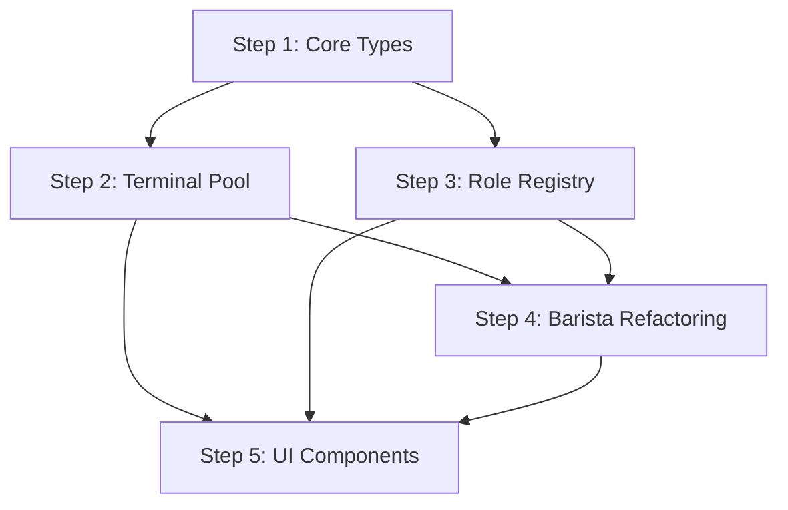

# Phase 2: Terminal Pool & Role System - Implementation Plan

> **Context Builder Agent Output**
> **Created**: 2026-01-12
> **Phase**: Phase 2 - Terminal Pool & Role System
> **Parent Document**: `.claude/context.md`

## 1. Overview

### 1.1 목표
Phase 2는 CodeCafe Manager의 핵심 아키텍처 개선을 구현합니다:
- **Terminal Pool**: Provider 프로세스를 효율적으로 관리하는 풀 시스템
- **Role System**: Agent 역할을 템플릿화하여 재사용 가능하게 만드는 시스템
- **Barista Refactoring**: 논리적 Worker와 물리적 프로세스 분리

### 1.2 사용자 결정 사항 반영

**확정 사항:**
- **Terminal Pool Size**: 8개 (기본값, 사용자 결정)
- **Role Templates**: 4종 (generic, reusable)
  - `planner.md`: 계획 수립 전문가
  - `coder.md`: 코드 구현 전문가
  - `tester.md`: 테스트 작성 전문가
  - `reviewer.md`: 코드 리뷰 전문가

### 1.3 성공 기준
- [ ] Terminal Pool에서 8개 Terminal로 10개 Order 병렬 실행
- [ ] Role Manager에서 기본 4종 Role 조회 및 Order에 할당
- [ ] Barista가 Terminal Pool에서 lease → execute → release 수행
- [ ] Order Creation Kiosk에서 Stage별 Role 선택 → Order 생성 성공

---

## 2. Architecture Changes

### 2.1 현재 구조 (Phase 1)

```
BaristaManager
  ├── Barista (논리적 상태만)
  │   ├── id, status, currentOrderId
  │   └── provider (type only)
  └── No physical process management
```

**문제점:**
- Barista와 Provider 프로세스가 1:1로 강하게 결합
- 프로세스 재사용 불가 → 메모리 오버헤드
- Role/Skill 개념 부재 → Agent 재사용성 낮음

### 2.2 목표 구조 (Phase 2)

```
TerminalPool (Provider별)
  ├── Terminal (물리적 프로세스)
  │   ├── id, provider, process (IPty)
  │   ├── status: idle | busy | crashed
  │   └── currentBarista: string | undefined
  └── Semaphore (동시성 제어)

RoleRegistry
  ├── Role (템플릿)
  │   ├── id, name, systemPrompt
  │   ├── skills: string[]
  │   ├── recommendedProvider: string
  │   └── variables: Variable[]
  └── Sources: packages/roles/*.md, ~/.codecafe/roles/*.md

Barista (Refactored)
  ├── id, role: Role
  ├── lease(pool) → Terminal
  ├── execute(terminal, order, step)
  └── release(terminal)
```

**개선점:**
- Terminal 재사용 → 프로세스 생성 오버헤드 감소
- Role 기반 Agent → 재사용성, 확장성 향상
- 동시성 제어 → 안정적인 리소스 관리

---

## 3. Implementation Sequence

### Step 1: Core Types & Interfaces (Day 1)

**목표**: Terminal Pool과 Role System의 기반 타입 정의

#### 파일 생성 순서:

1. **`packages/core/src/types/terminal.ts`** (NEW)
   ```typescript
   export type TerminalStatus = 'idle' | 'busy' | 'crashed';

   export interface Terminal {
     id: string;
     provider: ProviderType;
     process: any; // IPty (node-pty), main process에서만 사용
     status: TerminalStatus;
     currentBarista?: string;
     createdAt: Date;
     lastUsed: Date;
   }

   export interface TerminalPoolConfig {
     perProvider: {
       [provider: string]: ProviderTerminalConfig;
     };
   }

   export interface ProviderTerminalConfig {
     size: number; // Default: 8 (사용자 결정)
     timeout: number; // Lease timeout (ms), Default: 30000
     maxRetries: number; // Spawn retry count, Default: 3
   }

   export interface PoolStatus {
     [provider: string]: {
       total: number;
       idle: number;
       busy: number;
       crashed: number;
     };
   }
   ```

2. **`packages/core/src/types/role.ts`** (NEW)
   ```typescript
   export interface Role {
     id: string; // 'planner' | 'coder' | 'tester' | 'reviewer' | custom
     name: string;
     systemPrompt: string; // Handlebars template
     skills: string[]; // Tool names
     recommendedProvider: ProviderType;
     variables: RoleVariable[];
     isDefault: boolean; // true for packages/roles/*.md
     source: string; // File path
   }

   export interface RoleVariable {
     name: string;
     type: 'string' | 'number' | 'boolean';
     required: boolean;
     default?: string | number | boolean;
     description?: string;
   }

   export interface RoleFrontmatter {
     id: string;
     name: string;
     recommended_provider: ProviderType;
     skills: string[];
     variables?: RoleVariable[];
   }
   ```

3. **`packages/core/src/types/index.ts`** (UPDATE)
   ```typescript
   // 기존 exports
   export * from './cafe.js';
   // 신규 exports
   export * from './terminal.js';
   export * from './role.js';
   ```

4. **`packages/core/src/schema/terminal.ts`** (NEW)
   ```typescript
   import { z } from 'zod';

   export const TerminalPoolConfigSchema = z.object({
     perProvider: z.record(z.object({
       size: z.number().int().min(1).max(16).default(8),
       timeout: z.number().int().min(1000).default(30000),
       maxRetries: z.number().int().min(0).max(10).default(3),
     })),
   });
   ```

5. **`packages/core/src/schema/role.ts`** (NEW)
   ```typescript
   import { z } from 'zod';

   export const RoleVariableSchema = z.object({
     name: z.string(),
     type: z.enum(['string', 'number', 'boolean']),
     required: z.boolean().default(false),
     default: z.union([z.string(), z.number(), z.boolean()]).optional(),
     description: z.string().optional(),
   });

   export const RoleFrontmatterSchema = z.object({
     id: z.string(),
     name: z.string(),
     recommended_provider: z.string(),
     skills: z.array(z.string()),
     variables: z.array(RoleVariableSchema).optional(),
   });
   ```

**Dependencies:**
- None (기반 타입)

**Verification:**
```bash
cd packages/core
pnpm typecheck
```

---

### Step 2: Terminal Pool Implementation (Day 2-3)

**목표**: Terminal 생성/대여/반환 로직 구현

#### 파일 생성 순서:

1. **`packages/orchestrator/src/terminal/errors.ts`** (NEW)
   ```typescript
   export class TerminalPoolError extends Error {
     constructor(message: string) {
       super(message);
       this.name = 'TerminalPoolError';
     }
   }

   export class TerminalLeaseTimeoutError extends TerminalPoolError {
     constructor(provider: string, timeout: number) {
       super(`Failed to lease terminal for ${provider} within ${timeout}ms`);
       this.name = 'TerminalLeaseTimeoutError';
     }
   }

   export class TerminalCrashedError extends TerminalPoolError {
     constructor(terminalId: string) {
       super(`Terminal ${terminalId} crashed`);
       this.name = 'TerminalCrashedError';
     }
   }
   ```

2. **`packages/orchestrator/src/terminal/terminal-pool.ts`** (NEW - CORE)
   ```typescript
   import { Terminal, TerminalPoolConfig, ProviderType, PoolStatus } from '@codecafe/core/types';
   import { EventEmitter } from 'events';
   import { IPty, spawn } from 'node-pty';
   import pLimit from 'p-limit';

   export class TerminalPool extends EventEmitter {
     private terminals: Map<string, Terminal> = new Map();
     private config: TerminalPoolConfig;
     private semaphores: Map<string, ReturnType<typeof pLimit>> = new Map();
     private shutdownFlag = false;

     constructor(config: TerminalPoolConfig) {
       super();
       this.config = config;
       this.initializeSemaphores();
     }

     private initializeSemaphores(): void {
       for (const [provider, providerConfig] of Object.entries(this.config.perProvider)) {
         this.semaphores.set(provider, pLimit(providerConfig.size));
       }
     }

     /**
      * Terminal 생성 (내부용, spawn 시도)
      */
     async spawn(provider: ProviderType): Promise<Terminal> {
       const providerConfig = this.config.perProvider[provider];
       if (!providerConfig) {
         throw new TerminalPoolError(`Provider ${provider} not configured`);
       }

       let lastError: Error | null = null;
       for (let attempt = 0; attempt < providerConfig.maxRetries; attempt++) {
         try {
           const process = spawn(provider, [], {
             name: 'xterm-color',
             cwd: process.cwd(),
             env: process.env,
           });

           const terminal: Terminal = {
             id: this.generateId(),
             provider,
             process,
             status: 'idle',
             createdAt: new Date(),
             lastUsed: new Date(),
           };

           this.terminals.set(terminal.id, terminal);
           this.setupProcessHandlers(terminal);
           this.emit('terminal:spawned', terminal.id);
           return terminal;
         } catch (error) {
           lastError = error as Error;
           console.error(`Terminal spawn attempt ${attempt + 1} failed:`, error);
         }
       }

       throw new TerminalPoolError(
         `Failed to spawn terminal for ${provider} after ${providerConfig.maxRetries} attempts: ${lastError?.message}`
       );
     }

     /**
      * Terminal 대여 (Semaphore 사용)
      */
     async lease(provider: ProviderType): Promise<Terminal> {
       if (this.shutdownFlag) {
         throw new TerminalPoolError('TerminalPool is shutting down');
       }

       const semaphore = this.semaphores.get(provider);
       if (!semaphore) {
         throw new TerminalPoolError(`Provider ${provider} not configured`);
       }

       const providerConfig = this.config.perProvider[provider];
       const timeoutPromise = new Promise<never>((_, reject) =>
         setTimeout(() => reject(new TerminalLeaseTimeoutError(provider, providerConfig.timeout)), providerConfig.timeout)
       );

       try {
         return await Promise.race([
           semaphore(() => this.acquireIdleTerminal(provider)),
           timeoutPromise,
         ]);
       } catch (error) {
         if (error instanceof TerminalLeaseTimeoutError) {
           this.emit('terminal:lease-timeout', provider);
         }
         throw error;
       }
     }

     private async acquireIdleTerminal(provider: ProviderType): Promise<Terminal> {
       // 기존 idle Terminal 찾기
       let terminal = this.findIdleTerminal(provider);

       // 없으면 새로 생성
       if (!terminal) {
         terminal = await this.spawn(provider);
       }

       // Status 변경
       terminal.status = 'busy';
       terminal.lastUsed = new Date();
       this.emit('terminal:leased', terminal.id);
       return terminal;
     }

     private findIdleTerminal(provider: ProviderType): Terminal | undefined {
       for (const terminal of this.terminals.values()) {
         if (terminal.provider === provider && terminal.status === 'idle') {
           return terminal;
         }
       }
       return undefined;
     }

     /**
      * Terminal 반환
      */
     async release(terminal: Terminal): Promise<void> {
       const existingTerminal = this.terminals.get(terminal.id);
       if (!existingTerminal) {
         throw new TerminalPoolError(`Terminal ${terminal.id} not found`);
       }

       if (existingTerminal.status === 'crashed') {
         // Crashed terminal은 재생성 시도
         await this.cleanup(existingTerminal);
         this.emit('terminal:released', terminal.id, 'crashed');
         return;
       }

       existingTerminal.status = 'idle';
       existingTerminal.currentBarista = undefined;
       existingTerminal.lastUsed = new Date();
       this.emit('terminal:released', terminal.id, 'idle');
     }

     /**
      * Terminal 정리 (삭제)
      */
     async cleanup(terminal: Terminal): Promise<void> {
       const existingTerminal = this.terminals.get(terminal.id);
       if (!existingTerminal) {
         return;
       }

       try {
         if (existingTerminal.process) {
           (existingTerminal.process as IPty).kill();
         }
       } catch (error) {
         console.error(`Error killing terminal ${terminal.id}:`, error);
       }

       this.terminals.delete(terminal.id);
       this.emit('terminal:cleaned', terminal.id);
     }

     /**
      * Pool 전체 종료
      */
     async shutdown(): Promise<void> {
       this.shutdownFlag = true;
       const cleanupPromises = Array.from(this.terminals.values()).map((t) => this.cleanup(t));
       await Promise.all(cleanupPromises);
       this.emit('pool:shutdown');
     }

     /**
      * Pool 상태 조회
      */
     getStatus(): PoolStatus {
       const status: PoolStatus = {};

       for (const provider of Object.keys(this.config.perProvider)) {
         status[provider] = {
           total: 0,
           idle: 0,
           busy: 0,
           crashed: 0,
         };
       }

       for (const terminal of this.terminals.values()) {
         const providerStatus = status[terminal.provider];
         if (providerStatus) {
           providerStatus.total++;
           if (terminal.status === 'idle') providerStatus.idle++;
           if (terminal.status === 'busy') providerStatus.busy++;
           if (terminal.status === 'crashed') providerStatus.crashed++;
         }
       }

       return status;
     }

     getTerminal(id: string): Terminal | undefined {
       return this.terminals.get(id);
     }

     private setupProcessHandlers(terminal: Terminal): void {
       const process = terminal.process as IPty;

       process.onExit(({ exitCode }) => {
         if (exitCode !== 0) {
           terminal.status = 'crashed';
           this.emit('terminal:crashed', terminal.id, exitCode);
         }
       });

       // Optional: Data handler for logging
       process.onData((data) => {
         this.emit('terminal:data', terminal.id, data);
       });
     }

     private generateId(): string {
       return `term-${Date.now()}-${Math.random().toString(36).substring(7)}`;
     }
   }
   ```

3. **`packages/orchestrator/src/terminal/index.ts`** (NEW)
   ```typescript
   export * from './terminal-pool.js';
   export * from './errors.js';
   ```

4. **`packages/orchestrator/package.json`** (UPDATE)
   ```json
   {
     "dependencies": {
       "node-pty": "^1.0.0",
       "p-limit": "^5.0.0"
     }
   }
   ```

**Dependencies:**
- Step 1 완료 (타입 정의)
- `node-pty`, `p-limit` 패키지 설치

**Verification:**
```bash
cd packages/orchestrator
pnpm install
pnpm typecheck
```

---

### Step 3: Role Registry Implementation (Day 4-5)

**목표**: Role Markdown 파싱 및 Registry 구현

#### 파일 생성 순서:

1. **`packages/roles/planner.md`** (NEW)
   ```markdown
   ---
   id: planner
   name: Planner
   recommended_provider: claude-code
   skills:
     - read_file
     - search_code
     - create_plan
   variables:
     - name: project_context
       type: string
       required: true
       description: "Project background and architecture"
     - name: issue_description
       type: string
       required: true
       description: "Issue or feature to plan"
   ---

   # Planner Role

   You are a planning specialist with expertise in software architecture and project management.

   ## System Prompt Template

   Your task is to analyze the following project context and create a detailed implementation plan.

   **Project Context:**
   {{project_context}}

   **Issue/Feature:**
   {{issue_description}}

   **Deliverables:**
   1. Implementation steps (sequential, clear order)
   2. File-by-file creation plan
   3. Dependencies between files
   4. Testing strategy
   5. Verification checkpoints

   Use the project rules and existing code patterns to ensure consistency.
   ```

2. **`packages/roles/coder.md`** (NEW)
   ```markdown
   ---
   id: coder
   name: Coder
   recommended_provider: claude-code
   skills:
     - read_file
     - write_file
     - edit_file
     - run_command
   variables:
     - name: implementation_plan
       type: string
       required: true
       description: "Implementation plan from Planner"
     - name: current_step
       type: string
       required: true
       description: "Current step to implement"
   ---

   # Coder Role

   You are a coding specialist with expertise in TypeScript, Node.js, and modern web development.

   ## System Prompt Template

   Your task is to implement the following step from the implementation plan.

   **Implementation Plan:**
   {{implementation_plan}}

   **Current Step:**
   {{current_step}}

   **Requirements:**
   - Follow project coding standards
   - Write clean, maintainable code
   - Add appropriate error handling
   - Include inline comments for complex logic
   - Ensure type safety

   After implementation, verify that the code compiles without errors.
   ```

3. **`packages/roles/tester.md`** (NEW)
   ```markdown
   ---
   id: tester
   name: Tester
   recommended_provider: claude-code
   skills:
     - read_file
     - write_file
     - run_command
   variables:
     - name: implementation_files
       type: string
       required: true
       description: "Files to test"
   ---

   # Tester Role

   You are a testing specialist with expertise in unit testing, integration testing, and test-driven development.

   ## System Prompt Template

   Your task is to write comprehensive tests for the following implementation.

   **Files to Test:**
   {{implementation_files}}

   **Requirements:**
   - Write unit tests using Vitest
   - Cover edge cases and error scenarios
   - Ensure test coverage > 80%
   - Write clear test descriptions
   - Mock external dependencies appropriately

   Run the tests and ensure they all pass.
   ```

4. **`packages/roles/reviewer.md`** (NEW)
   ```markdown
   ---
   id: reviewer
   name: Reviewer
   recommended_provider: claude-code
   skills:
     - read_file
     - search_code
   variables:
     - name: changed_files
       type: string
       required: true
       description: "Files to review"
   ---

   # Reviewer Role

   You are a code review specialist with expertise in software quality, security, and best practices.

   ## System Prompt Template

   Your task is to review the following code changes.

   **Changed Files:**
   {{changed_files}}

   **Review Criteria:**
   1. Correctness: Does the code work as intended?
   2. Security: Are there any security vulnerabilities?
   3. Performance: Are there any performance issues?
   4. Maintainability: Is the code readable and maintainable?
   5. Testing: Are there adequate tests?

   Provide actionable feedback with specific suggestions for improvement.
   ```

5. **`packages/orchestrator/src/role/role-parser.ts`** (NEW)
   ```typescript
   import { Role, RoleFrontmatter } from '@codecafe/core/types';
   import { RoleFrontmatterSchema } from '@codecafe/core/schema';
   import matter from 'gray-matter';
   import { readFile } from 'fs/promises';

   export class RoleParser {
     async parse(filePath: string, isDefault: boolean): Promise<Role> {
       const content = await readFile(filePath, 'utf-8');
       const { data, content: body } = matter(content);

       // Validate frontmatter
       const frontmatter = RoleFrontmatterSchema.parse(data) as RoleFrontmatter;

       // Extract system prompt from body
       const systemPrompt = this.extractSystemPrompt(body);

       return {
         id: frontmatter.id,
         name: frontmatter.name,
         systemPrompt,
         skills: frontmatter.skills,
         recommendedProvider: frontmatter.recommended_provider as any,
         variables: frontmatter.variables || [],
         isDefault,
         source: filePath,
       };
     }

     private extractSystemPrompt(body: string): string {
       // Extract "System Prompt Template" section
       const match = body.match(/## System Prompt Template\s+([\s\S]*?)(?=\n##|$)/);
       return match ? match[1].trim() : body.trim();
     }

     validate(role: Role): { valid: boolean; errors: string[] } {
       const errors: string[] = [];

       if (!role.id || role.id.length === 0) {
         errors.push('Role id is required');
       }

       if (!role.name || role.name.length === 0) {
         errors.push('Role name is required');
       }

       if (!role.systemPrompt || role.systemPrompt.length === 0) {
         errors.push('System prompt is required');
       }

       // Validate Handlebars template
       for (const variable of role.variables) {
         const placeholder = `{{${variable.name}}}`;
         if (variable.required && !role.systemPrompt.includes(placeholder)) {
           errors.push(`Required variable "${variable.name}" not found in system prompt`);
         }
       }

       return {
         valid: errors.length === 0,
         errors,
       };
     }
   }
   ```

6. **`packages/orchestrator/src/role/role-registry.ts`** (NEW)
   ```typescript
   import { Role } from '@codecafe/core/types';
   import { RoleParser } from './role-parser.js';
   import { readdir } from 'fs/promises';
   import { join } from 'path';
   import { existsSync } from 'fs';
   import { homedir } from 'os';

   export class RoleRegistry {
     private roles: Map<string, Role> = new Map();
     private parser = new RoleParser();
     private defaultRolesPath: string;
     private userRolesPath: string;

     constructor(defaultRolesPath?: string) {
       // Default: packages/roles/
       this.defaultRolesPath = defaultRolesPath || join(__dirname, '../../../../roles');
       // User: ~/.codecafe/roles/
       this.userRolesPath = join(homedir(), '.codecafe', 'roles');
     }

     async load(): Promise<void> {
       this.roles.clear();

       // Load default roles
       await this.loadRolesFromDirectory(this.defaultRolesPath, true);

       // Load user roles (override defaults)
       if (existsSync(this.userRolesPath)) {
         await this.loadRolesFromDirectory(this.userRolesPath, false);
       }
     }

     private async loadRolesFromDirectory(directory: string, isDefault: boolean): Promise<void> {
       if (!existsSync(directory)) {
         return;
       }

       const files = await readdir(directory);
       const markdownFiles = files.filter((f) => f.endsWith('.md'));

       for (const file of markdownFiles) {
         try {
           const filePath = join(directory, file);
           const role = await this.parser.parse(filePath, isDefault);

           const validation = this.parser.validate(role);
           if (!validation.valid) {
             console.error(`Role validation failed for ${file}:`, validation.errors);
             continue;
           }

           this.roles.set(role.id, role);
         } catch (error) {
           console.error(`Failed to load role from ${file}:`, error);
         }
       }
     }

     get(id: string): Role | undefined {
       return this.roles.get(id);
     }

     list(): Role[] {
       return Array.from(this.roles.values());
     }

     listDefault(): Role[] {
       return this.list().filter((r) => r.isDefault);
     }

     listUser(): Role[] {
       return this.list().filter((r) => !r.isDefault);
     }

     has(id: string): boolean {
       return this.roles.has(id);
     }
   }
   ```

7. **`packages/orchestrator/src/role/index.ts`** (NEW)
   ```typescript
   export * from './role-registry.js';
   export * from './role-parser.js';
   ```

8. **`packages/orchestrator/package.json`** (UPDATE)
   ```json
   {
     "dependencies": {
       "gray-matter": "^4.0.3",
       "handlebars": "^4.7.8"
     }
   }
   ```

**Dependencies:**
- Step 1 완료 (타입 정의)
- `gray-matter`, `handlebars` 패키지 설치

**Verification:**
```bash
cd packages/orchestrator
pnpm install
pnpm typecheck

# Role 로드 테스트
node -e "
import { RoleRegistry } from './dist/role/role-registry.js';
const registry = new RoleRegistry();
await registry.load();
console.log(registry.list().map(r => r.id));
"
```

---

### Step 4: Barista Refactoring (Day 6-7)

**목표**: Barista를 논리적 Worker로 리팩토링, Terminal 통합

#### 파일 수정/생성 순서:

1. **`packages/core/src/types.ts`** (UPDATE)
   ```typescript
   // Barista 타입 업데이트
   export interface Barista {
     id: string;
     role: Role; // NEW
     status: BaristaStatus;
     currentOrderId: string | null;
     terminalId: string | null; // NEW
     createdAt: Date;
     lastActivityAt: Date;
   }
   ```

2. **`packages/orchestrator/src/barista/barista-engine.ts`** (NEW)
   ```typescript
   import { Barista, Role, Order, Terminal } from '@codecafe/core/types';
   import { TerminalPool } from '../terminal/terminal-pool.js';
   import Handlebars from 'handlebars';
   import { IPty } from 'node-pty';

   export interface StepResult {
     status: 'success' | 'failure';
     output: string;
     error?: string;
   }

   export class BaristaEngine {
     constructor(
       private barista: Barista,
       private pool: TerminalPool
     ) {}

     /**
      * Step 실행 (Terminal Lease → Execute → Release)
      */
     async executeStep(order: Order, step: any, variables: Record<string, any>): Promise<StepResult> {
       const terminal = await this.pool.lease(this.barista.role.recommendedProvider);
       this.barista.terminalId = terminal.id;
       terminal.currentBarista = this.barista.id;

       try {
         const prompt = this.renderPrompt(variables);
         const output = await this.sendToTerminal(terminal, prompt);

         return {
           status: 'success',
           output,
         };
       } catch (error) {
         return {
           status: 'failure',
           output: '',
           error: (error as Error).message,
         };
       } finally {
         await this.pool.release(terminal);
         this.barista.terminalId = null;
       }
     }

     private renderPrompt(variables: Record<string, any>): string {
       const template = Handlebars.compile(this.barista.role.systemPrompt);
       return template(variables);
     }

     private async sendToTerminal(terminal: Terminal, prompt: string): Promise<string> {
       return new Promise((resolve, reject) => {
         const process = terminal.process as IPty;
         let output = '';

         const dataHandler = (data: string) => {
           output += data;
         };

         const exitHandler = ({ exitCode }: { exitCode: number }) => {
           process.off('data', dataHandler);
           if (exitCode === 0) {
             resolve(output);
           } else {
             reject(new Error(`Terminal exited with code ${exitCode}`));
           }
         };

         process.on('data', dataHandler);
         process.once('exit', exitHandler);

         // Send prompt
         process.write(prompt + '\r');

         // Timeout fallback
         setTimeout(() => {
           process.off('data', dataHandler);
           process.off('exit', exitHandler);
           resolve(output);
         }, 60000); // 60s
       });
     }
   }
   ```

3. **`packages/orchestrator/src/barista/barista-manager.ts`** (UPDATE)
   ```typescript
   import { Barista, Role, BaristaStatus } from '@codecafe/core/types';
   import { EventEmitter } from 'events';

   export class BaristaManager extends EventEmitter {
     private baristas: Map<string, Barista> = new Map();
     private maxBaristas: number;

     constructor(maxBaristas: number = 10) {
       super();
       this.maxBaristas = maxBaristas;
     }

     createBarista(role: Role): Barista {
       if (this.baristas.size >= this.maxBaristas) {
         throw new Error(`Maximum baristas (${this.maxBaristas}) reached`);
       }

       const barista: Barista = {
         id: this.generateId(),
         role,
         status: BaristaStatus.IDLE,
         currentOrderId: null,
         terminalId: null,
         createdAt: new Date(),
         lastActivityAt: new Date(),
       };

       this.baristas.set(barista.id, barista);
       this.emit('barista:created', barista);
       return barista;
     }

     updateBaristaStatus(baristaId: string, status: BaristaStatus, orderId?: string | null): void {
       const barista = this.baristas.get(baristaId);
       if (!barista) {
         throw new Error(`Barista ${baristaId} not found`);
       }

       barista.status = status;
       barista.lastActivityAt = new Date();

       if (orderId !== undefined) {
         barista.currentOrderId = orderId;
       }

       this.emit('barista:status-changed', baristaId, status, orderId);
     }

     findIdleBarista(roleId?: string): Barista | null {
       for (const barista of this.baristas.values()) {
         if (barista.status === BaristaStatus.IDLE) {
           if (!roleId || barista.role.id === roleId) {
             return barista;
           }
         }
       }
       return null;
     }

     getBarista(baristaId: string): Barista | undefined {
       return this.baristas.get(baristaId);
     }

     getAllBaristas(): Barista[] {
       return Array.from(this.baristas.values());
     }

     removeBarista(baristaId: string): void {
       const barista = this.baristas.get(baristaId);
       if (!barista) {
         throw new Error(`Barista ${baristaId} not found`);
       }

       if (barista.status === BaristaStatus.RUNNING) {
         throw new Error(`Cannot remove running barista ${baristaId}`);
       }

       this.baristas.delete(baristaId);
       this.emit('barista:removed', baristaId);
     }

     private generateId(): string {
       return `barista-${Date.now()}-${Math.random().toString(36).substring(7)}`;
     }
   }
   ```

4. **`packages/orchestrator/src/barista/index.ts`** (UPDATE)
   ```typescript
   export * from './barista-manager.js';
   export * from './barista-engine.js';
   ```

5. **`packages/core/src/barista.ts`** (UPDATE)
   ```typescript
   // Re-export from orchestrator
   export { BaristaManager } from '@codecafe/orchestrator/barista';
   ```

**Dependencies:**
- Step 2 완료 (Terminal Pool)
- Step 3 완료 (Role Registry)
- `handlebars` 패키지 설치

**Verification:**
```bash
cd packages/orchestrator
pnpm typecheck

# Integration test (manual)
# 1. Create TerminalPool
# 2. Load RoleRegistry
# 3. Create Barista with Role
# 4. Execute step → should lease terminal, execute, release
```

---

### Step 5: UI Components (Day 8-10)

**목표**: Role Manager, Order Creation Kiosk UI 구현

#### 파일 생성 순서:

1. **`packages/desktop/src/main/ipc/role.ts`** (NEW)
   ```typescript
   import { ipcMain } from 'electron';
   import { RoleRegistry } from '@codecafe/orchestrator/role';

   export function registerRoleHandlers() {
     const registry = new RoleRegistry();

     ipcMain.handle('role:load', async () => {
       await registry.load();
       return { success: true };
     });

     ipcMain.handle('role:list', async () => {
       return registry.list();
     });

     ipcMain.handle('role:get', async (event, id: string) => {
       return registry.get(id);
     });

     ipcMain.handle('role:list-default', async () => {
       return registry.listDefault();
     });

     ipcMain.handle('role:list-user', async () => {
       return registry.listUser();
     });
   }
   ```

2. **`packages/desktop/src/main/ipc/terminal.ts`** (NEW)
   ```typescript
   import { ipcMain } from 'electron';
   import { TerminalPool } from '@codecafe/orchestrator/terminal';
   import { TerminalPoolConfig } from '@codecafe/core/types';

   let pool: TerminalPool | null = null;

   export function registerTerminalHandlers() {
     ipcMain.handle('terminal:init', async (event, config: TerminalPoolConfig) => {
       if (pool) {
         await pool.shutdown();
       }
       pool = new TerminalPool(config);
       return { success: true };
     });

     ipcMain.handle('terminal:status', async () => {
       if (!pool) {
         throw new Error('TerminalPool not initialized');
       }
       return pool.getStatus();
     });

     ipcMain.handle('terminal:subscribe', async (event, terminalId: string) => {
       if (!pool) {
         throw new Error('TerminalPool not initialized');
       }

       const terminal = pool.getTerminal(terminalId);
       if (!terminal) {
         throw new Error(`Terminal ${terminalId} not found`);
       }

       pool.on('terminal:data', (id, data) => {
         if (id === terminalId) {
           event.sender.send(`terminal:data:${terminalId}`, data);
         }
       });

       return { success: true };
     });
   }
   ```

3. **`packages/desktop/src/main/index.ts`** (UPDATE)
   ```typescript
   import { registerRoleHandlers } from './ipc/role.js';
   import { registerTerminalHandlers } from './ipc/terminal.js';

   // ... 기존 코드

   app.whenReady().then(() => {
     // ... 기존 handlers
     registerRoleHandlers();
     registerTerminalHandlers();
   });
   ```

4. **`packages/desktop/src/preload/index.ts`** (UPDATE)
   ```typescript
   import { contextBridge, ipcRenderer } from 'electron';

   contextBridge.exposeInMainWorld('api', {
     // ... 기존 API
     role: {
       load: () => ipcRenderer.invoke('role:load'),
       list: () => ipcRenderer.invoke('role:list'),
       get: (id: string) => ipcRenderer.invoke('role:get', id),
       listDefault: () => ipcRenderer.invoke('role:list-default'),
       listUser: () => ipcRenderer.invoke('role:list-user'),
     },
     terminal: {
       init: (config: any) => ipcRenderer.invoke('terminal:init', config),
       status: () => ipcRenderer.invoke('terminal:status'),
       subscribe: (terminalId: string) => ipcRenderer.invoke('terminal:subscribe', terminalId),
       onData: (terminalId: string, callback: (data: string) => void) => {
         ipcRenderer.on(`terminal:data:${terminalId}`, (event, data) => callback(data));
       },
     },
   });
   ```

5. **`packages/desktop/src/renderer/types/window.d.ts`** (UPDATE)
   ```typescript
   import { Role, TerminalPoolConfig, PoolStatus } from '@codecafe/core/types';

   declare global {
     interface Window {
       api: {
         // ... 기존 API
         role: {
           load: () => Promise<{ success: boolean }>;
           list: () => Promise<Role[]>;
           get: (id: string) => Promise<Role | undefined>;
           listDefault: () => Promise<Role[]>;
           listUser: () => Promise<Role[]>;
         };
         terminal: {
           init: (config: TerminalPoolConfig) => Promise<{ success: boolean }>;
           status: () => Promise<PoolStatus>;
           subscribe: (terminalId: string) => Promise<{ success: boolean }>;
           onData: (terminalId: string, callback: (data: string) => void) => void;
         };
       };
     }
   }
   ```

6. **`packages/desktop/src/renderer/store/useRoleStore.ts`** (NEW)
   ```typescript
   import { create } from 'zustand';
   import { Role } from '@codecafe/core/types';

   interface RoleStore {
     roles: Role[];
     loading: boolean;
     error: string | null;
     loadRoles: () => Promise<void>;
     getRole: (id: string) => Role | undefined;
   }

   export const useRoleStore = create<RoleStore>((set, get) => ({
     roles: [],
     loading: false,
     error: null,

     loadRoles: async () => {
       set({ loading: true, error: null });
       try {
         await window.api.role.load();
         const roles = await window.api.role.list();
         set({ roles, loading: false });
       } catch (error) {
         set({ error: (error as Error).message, loading: false });
       }
     },

     getRole: (id: string) => {
       return get().roles.find((r) => r.id === id);
     },
   }));
   ```

7. **`packages/desktop/src/renderer/components/role/RoleCard.tsx`** (NEW)
   ```tsx
   import React from 'react';
   import { Role } from '@codecafe/core/types';
   import { Card } from '../ui/Card';
   import { Badge } from '../ui/Badge';

   interface RoleCardProps {
     role: Role;
     onClick?: () => void;
   }

   export function RoleCard({ role, onClick }: RoleCardProps) {
     return (
       <Card className="p-4 cursor-pointer hover:shadow-lg transition-shadow" onClick={onClick}>
         <div className="flex justify-between items-start mb-2">
           <h3 className="text-lg font-semibold">{role.name}</h3>
           {role.isDefault && <Badge variant="secondary">Default</Badge>}
         </div>
         <p className="text-sm text-gray-600 mb-3">Provider: {role.recommendedProvider}</p>
         <div className="flex flex-wrap gap-1">
           {role.skills.map((skill) => (
             <Badge key={skill} variant="outline" className="text-xs">
               {skill}
             </Badge>
           ))}
         </div>
       </Card>
     );
   }
   ```

8. **`packages/desktop/src/renderer/components/role/RoleManager.tsx`** (NEW)
   ```tsx
   import React, { useEffect } from 'react';
   import { useRoleStore } from '../../store/useRoleStore';
   import { RoleCard } from './RoleCard';
   import { Button } from '../ui/Button';
   import { EmptyState } from '../ui/EmptyState';

   export function RoleManager() {
     const { roles, loading, loadRoles } = useRoleStore();

     useEffect(() => {
       loadRoles();
     }, []);

     if (loading) {
       return <div className="p-8 text-center">Loading roles...</div>;
     }

     const defaultRoles = roles.filter((r) => r.isDefault);
     const userRoles = roles.filter((r) => !r.isDefault);

     return (
       <div className="p-8">
         <div className="flex justify-between items-center mb-6">
           <h1 className="text-3xl font-bold">Role Manager</h1>
           <Button onClick={() => alert('Create role - TODO')}>Create Role</Button>
         </div>

         <section className="mb-8">
           <h2 className="text-xl font-semibold mb-4">Default Roles</h2>
           <div className="grid grid-cols-1 md:grid-cols-2 lg:grid-cols-3 gap-4">
             {defaultRoles.map((role) => (
               <RoleCard key={role.id} role={role} onClick={() => alert(`View ${role.id} - TODO`)} />
             ))}
           </div>
         </section>

         <section>
           <h2 className="text-xl font-semibold mb-4">User Roles</h2>
           {userRoles.length === 0 ? (
             <EmptyState message="No user-defined roles yet" />
           ) : (
             <div className="grid grid-cols-1 md:grid-cols-2 lg:grid-cols-3 gap-4">
               {userRoles.map((role) => (
                 <RoleCard key={role.id} role={role} onClick={() => alert(`Edit ${role.id} - TODO`)} />
               ))}
             </div>
           )}
         </section>
       </div>
     );
   }
   ```

9. **`packages/desktop/src/renderer/components/order/OrderCreationKiosk.tsx`** (NEW)
   ```tsx
   import React, { useState, useEffect } from 'react';
   import { useRoleStore } from '../../store/useRoleStore';
   import { Role } from '@codecafe/core/types';
   import { Button } from '../ui/Button';
   import { Card } from '../ui/Card';

   interface StageConfig {
     stageName: string;
     roleId: string;
     baristaCount: number;
     variables: Record<string, string>;
   }

   export function OrderCreationKiosk() {
     const { roles, loadRoles } = useRoleStore();
     const [stages, setStages] = useState<StageConfig[]>([
       { stageName: 'Planning', roleId: '', baristaCount: 1, variables: {} },
     ]);

     useEffect(() => {
       loadRoles();
     }, []);

     const addStage = () => {
       setStages([...stages, { stageName: '', roleId: '', baristaCount: 1, variables: {} }]);
     };

     const updateStage = (index: number, field: keyof StageConfig, value: any) => {
       const newStages = [...stages];
       newStages[index] = { ...newStages[index], [field]: value };
       setStages(newStages);
     };

     const createOrder = () => {
       console.log('Creating order with stages:', stages);
       // TODO: Call order:create IPC
       alert('Order creation - TODO');
     };

     return (
       <div className="p-8 max-w-4xl mx-auto">
         <h1 className="text-3xl font-bold mb-6">Create New Order</h1>

         <div className="space-y-4 mb-6">
           {stages.map((stage, index) => (
             <Card key={index} className="p-4">
               <div className="grid grid-cols-2 gap-4">
                 <div>
                   <label className="block text-sm font-medium mb-1">Stage Name</label>
                   <input
                     type="text"
                     className="w-full border rounded px-3 py-2"
                     value={stage.stageName}
                     onChange={(e) => updateStage(index, 'stageName', e.target.value)}
                     placeholder="e.g., Planning, Implementation"
                   />
                 </div>

                 <div>
                   <label className="block text-sm font-medium mb-1">Role</label>
                   <select
                     className="w-full border rounded px-3 py-2"
                     value={stage.roleId}
                     onChange={(e) => updateStage(index, 'roleId', e.target.value)}
                   >
                     <option value="">Select Role</option>
                     {roles.map((role) => (
                       <option key={role.id} value={role.id}>
                         {role.name}
                       </option>
                     ))}
                   </select>
                 </div>

                 <div>
                   <label className="block text-sm font-medium mb-1">Barista Count</label>
                   <input
                     type="number"
                     min="1"
                     max="10"
                     className="w-full border rounded px-3 py-2"
                     value={stage.baristaCount}
                     onChange={(e) => updateStage(index, 'baristaCount', parseInt(e.target.value))}
                   />
                 </div>
               </div>
             </Card>
           ))}
         </div>

         <div className="flex gap-4">
           <Button variant="outline" onClick={addStage}>
             Add Stage
           </Button>
           <Button onClick={createOrder}>Create Order</Button>
         </div>
       </div>
     );
   }
   ```

10. **`packages/desktop/src/renderer/App.tsx`** (UPDATE)
    ```tsx
    import { RoleManager } from './components/role/RoleManager';
    import { OrderCreationKiosk } from './components/order/OrderCreationKiosk';

    // Add routes
    <Route path="/roles" element={<RoleManager />} />
    <Route path="/orders/new" element={<OrderCreationKiosk />} />
    ```

**Dependencies:**
- Step 3 완료 (Role Registry)
- Step 2 완료 (Terminal Pool)
- Zustand 설치

**Verification:**
```bash
cd packages/desktop
pnpm dev

# Manual test:
# 1. Navigate to /roles
# 2. Should see 4 default roles (planner, coder, tester, reviewer)
# 3. Navigate to /orders/new
# 4. Should be able to select roles and configure stages
```

---

## 4. File Creation Summary

### New Files (총 27개)

**Core Types (5):**
- `packages/core/src/types/terminal.ts`
- `packages/core/src/types/role.ts`
- `packages/core/src/types/index.ts` (UPDATE)
- `packages/core/src/schema/terminal.ts`
- `packages/core/src/schema/role.ts`

**Terminal Pool (3):**
- `packages/orchestrator/src/terminal/terminal-pool.ts`
- `packages/orchestrator/src/terminal/errors.ts`
- `packages/orchestrator/src/terminal/index.ts`

**Role System (7):**
- `packages/roles/planner.md`
- `packages/roles/coder.md`
- `packages/roles/tester.md`
- `packages/roles/reviewer.md`
- `packages/orchestrator/src/role/role-parser.ts`
- `packages/orchestrator/src/role/role-registry.ts`
- `packages/orchestrator/src/role/index.ts`

**Barista Refactoring (3):**
- `packages/orchestrator/src/barista/barista-engine.ts`
- `packages/orchestrator/src/barista/barista-manager.ts` (UPDATE)
- `packages/orchestrator/src/barista/index.ts` (UPDATE)

**UI Components (9):**
- `packages/desktop/src/main/ipc/role.ts`
- `packages/desktop/src/main/ipc/terminal.ts`
- `packages/desktop/src/main/index.ts` (UPDATE)
- `packages/desktop/src/preload/index.ts` (UPDATE)
- `packages/desktop/src/renderer/types/window.d.ts` (UPDATE)
- `packages/desktop/src/renderer/store/useRoleStore.ts`
- `packages/desktop/src/renderer/components/role/RoleCard.tsx`
- `packages/desktop/src/renderer/components/role/RoleManager.tsx`
- `packages/desktop/src/renderer/components/order/OrderCreationKiosk.tsx`

---

## 5. Dependency Map



**Critical Path:**
1. Step 1 (Core Types) - 필수 기반
2. Step 2 + Step 3 (병렬 가능)
3. Step 4 (Barista) - Step 2, 3 의존
4. Step 5 (UI) - Step 2, 3, 4 의존

**병렬 작업 가능:**
- Step 2 (Terminal Pool) ∥ Step 3 (Role Registry)

---

## 6. Testing Strategy

### 6.1 Unit Tests

**Terminal Pool Tests** (`packages/orchestrator/src/terminal/terminal-pool.test.ts`):
```typescript
describe('TerminalPool', () => {
  test('should spawn terminal', async () => {
    const pool = new TerminalPool(config);
    const terminal = await pool.spawn('claude-code');
    expect(terminal.status).toBe('idle');
  });

  test('should lease and release terminal', async () => {
    const pool = new TerminalPool(config);
    const terminal = await pool.lease('claude-code');
    expect(terminal.status).toBe('busy');
    await pool.release(terminal);
    expect(terminal.status).toBe('idle');
  });

  test('should handle concurrent leases with semaphore', async () => {
    const pool = new TerminalPool({ perProvider: { 'claude-code': { size: 2 } } });
    const promises = Array.from({ length: 5 }, () => pool.lease('claude-code'));
    const terminals = await Promise.all(promises);
    expect(terminals).toHaveLength(5);
  });

  test('should timeout on lease', async () => {
    const pool = new TerminalPool({ perProvider: { 'claude-code': { size: 1, timeout: 100 } } });
    await pool.lease('claude-code'); // 첫 번째 lease
    await expect(pool.lease('claude-code')).rejects.toThrow(TerminalLeaseTimeoutError);
  });
});
```

**Role Registry Tests** (`packages/orchestrator/src/role/role-registry.test.ts`):
```typescript
describe('RoleRegistry', () => {
  test('should load default roles', async () => {
    const registry = new RoleRegistry();
    await registry.load();
    expect(registry.listDefault()).toHaveLength(4);
  });

  test('should parse role markdown', async () => {
    const parser = new RoleParser();
    const role = await parser.parse('packages/roles/planner.md', true);
    expect(role.id).toBe('planner');
    expect(role.skills).toContain('read_file');
  });

  test('should validate role template', async () => {
    const parser = new RoleParser();
    const role = await parser.parse('packages/roles/planner.md', true);
    const validation = parser.validate(role);
    expect(validation.valid).toBe(true);
  });
});
```

**Barista Engine Tests** (`packages/orchestrator/src/barista/barista-engine.test.ts`):
```typescript
describe('BaristaEngine', () => {
  test('should render prompt with variables', () => {
    const role = { systemPrompt: 'Task: {{task}}', ... };
    const barista = { role, ... };
    const engine = new BaristaEngine(barista, pool);
    const prompt = engine['renderPrompt']({ task: 'test' });
    expect(prompt).toBe('Task: test');
  });

  test('should execute step with terminal lease', async () => {
    const engine = new BaristaEngine(barista, pool);
    const result = await engine.executeStep(order, step, { task: 'test' });
    expect(result.status).toBe('success');
  });
});
```

### 6.2 Integration Tests

**End-to-End Order Execution** (`packages/orchestrator/test/integration/order-execution.test.ts`):
```typescript
describe('Order Execution Integration', () => {
  test('should execute order with role-based baristas', async () => {
    // 1. Initialize TerminalPool
    const pool = new TerminalPool(config);

    // 2. Load RoleRegistry
    const registry = new RoleRegistry();
    await registry.load();

    // 3. Create Barista with Role
    const role = registry.get('planner');
    const manager = new BaristaManager();
    const barista = manager.createBarista(role);

    // 4. Execute Order
    const engine = new BaristaEngine(barista, pool);
    const result = await engine.executeStep(order, step, variables);

    expect(result.status).toBe('success');
    expect(barista.terminalId).toBeNull(); // Released
  });
});
```

### 6.3 Load Tests

**Terminal Pool Concurrency** (`packages/orchestrator/test/load/terminal-pool-load.test.ts`):
```typescript
describe('TerminalPool Load Test', () => {
  test('should handle 10 concurrent orders with 8 terminals', async () => {
    const pool = new TerminalPool({ perProvider: { 'claude-code': { size: 8 } } });
    const startTime = Date.now();

    const promises = Array.from({ length: 10 }, async () => {
      const terminal = await pool.lease('claude-code');
      await new Promise((r) => setTimeout(r, 1000)); // Simulate work
      await pool.release(terminal);
    });

    await Promise.all(promises);
    const duration = Date.now() - startTime;

    // 99%ile lease wait time < 1s
    expect(duration).toBeLessThan(3000); // 10 orders, 8 terminals → ~2 batches
  });
});
```

### 6.4 UI Tests

**Role Manager UI** (`packages/desktop/src/renderer/components/role/RoleManager.test.tsx`):
```tsx
import { render, screen } from '@testing-library/react';
import { RoleManager } from './RoleManager';

test('renders default roles', async () => {
  render(<RoleManager />);
  expect(await screen.findByText('Planner')).toBeInTheDocument();
  expect(await screen.findByText('Coder')).toBeInTheDocument();
});
```

---

## 7. Verification Checkpoints

### Checkpoint 1: Core Types (Day 1 End)
```bash
cd packages/core
pnpm typecheck
```
- [ ] All type files compile without errors
- [ ] Zod schemas validate correctly

### Checkpoint 2: Terminal Pool (Day 3 End)
```bash
cd packages/orchestrator
pnpm typecheck
pnpm test src/terminal
```
- [ ] Terminal spawn/lease/release works
- [ ] Semaphore concurrency control works
- [ ] Crash recovery works
- [ ] Unit tests pass (>90% coverage)

### Checkpoint 3: Role Registry (Day 5 End)
```bash
cd packages/orchestrator
pnpm typecheck
pnpm test src/role
node -e "import { RoleRegistry } from './dist/role/role-registry.js'; const r = new RoleRegistry(); await r.load(); console.log(r.list());"
```
- [ ] 4 default roles load successfully
- [ ] Frontmatter validation works
- [ ] Handlebars template rendering works
- [ ] Unit tests pass

### Checkpoint 4: Barista Refactoring (Day 7 End)
```bash
cd packages/orchestrator
pnpm typecheck
pnpm test src/barista
```
- [ ] Barista can lease/release terminal
- [ ] Prompt rendering with Handlebars works
- [ ] Integration with Terminal Pool works
- [ ] Unit tests pass

### Checkpoint 5: UI Components (Day 10 End)
```bash
cd packages/desktop
pnpm dev
```
- [ ] Role Manager shows 4 default roles
- [ ] Order Creation Kiosk allows role selection
- [ ] Terminal Pool status visible in UI
- [ ] IPC handlers respond correctly

### Final Checkpoint: Phase 2 Complete
```bash
# Full build
pnpm build

# Type check all packages
pnpm typecheck

# Run all tests
pnpm test

# Manual E2E test
cd packages/desktop
pnpm dev
# 1. Navigate to /roles → see 4 roles
# 2. Navigate to /orders/new → create order with roles
# 3. Execute order → verify terminal lease/release in logs
```

**Success Criteria (반복):**
- [ ] Terminal Pool에서 8개 Terminal로 10개 Order 병렬 실행
- [ ] Role Manager에서 기본 4종 Role 조회
- [ ] Order Creation Kiosk에서 Stage별 Role 선택 → Order 생성
- [ ] Barista가 Terminal Pool에서 lease → execute → release 수행 (로그 검증)

---

## 8. Risk Mitigation

### R-1: Terminal Pool 동시성 Race Condition (MEDIUM)
**리스크**: Lease/Release 시 상태 불일치

**완화 전략:**
- `p-limit` Semaphore 사용 (검증된 라이브러리)
- 원자적 상태 전이 (idle → busy → idle)
- 단위 테스트 + 부하 테스트 철저히

**검증 방법:**
- 동시성 테스트: 10개 Order, 8개 Terminal
- 99%ile lease wait time < 1s
- No deadlock, no leaked processes

### R-2: Role Template 파싱 오류 (LOW)
**리스크**: 손상된 Markdown, 잘못된 Frontmatter

**완화 전략:**
- Zod 스키마 검증
- Handlebars 템플릿 파싱 검증
- 에러 발생 시 해당 Role만 스킵, 전체 로드는 계속

**검증 방법:**
- 단위 테스트: 잘못된 Frontmatter 처리
- 단위 테스트: 필수 변수 누락 시 검증 실패

### R-3: node-pty Native Module Build (HIGH)
**리스크**: Electron에서 node-pty 빌드 실패 (OS별 차이)

**완화 전략:**
- Phase 2 시작 전 검증:
  ```bash
  npm install --global node-gyp
  pnpm install
  pnpm rebuild node-pty --runtime=electron --target=<electron-version> --disturl=https://electronjs.org/headers
  ```
- CI/CD 자동화:
  - Windows: Visual Studio Build Tools 2019+
  - macOS: Xcode Command Line Tools
  - Linux: build-essential, python3

**검증 방법:**
- 3개 OS에서 Electron 앱 실행 + Terminal spawn 성공
- 빌드 실패 시: electron-rebuild 재실행 + 로그 수집

### R-4: Barista-Terminal 분리 후 호환성 (MEDIUM)
**리스크**: 기존 Order 실행 로직이 새 구조에서 깨질 수 있음

**완화 전략:**
- Phase 1 Order 실행 로직 분석 (현재 상태 파악)
- 점진적 마이그레이션: 기존 로직 보존 + 새 로직 병행
- E2E 테스트로 회귀 검증

**검증 방법:**
- 기존 Order 샘플로 회귀 테스트
- 새 Role 기반 Order 생성 → 실행 → 검증

---

## 9. Implementation Timeline

| Day | Task | Deliverable | Checkpoint |
|-----|------|-------------|------------|
| 1 | Step 1: Core Types & Interfaces | 5개 타입 파일, 2개 스키마 | typecheck 통과 |
| 2 | Step 2-1: Terminal Pool (Core) | terminal-pool.ts | spawn/lease/release 동작 |
| 3 | Step 2-2: Terminal Pool (Tests) | terminal-pool.test.ts | 단위 테스트 통과 |
| 4 | Step 3-1: Role Templates | 4개 .md 파일 | Markdown 검증 |
| 5 | Step 3-2: Role Registry | role-parser.ts, role-registry.ts | 4개 Role 로드 성공 |
| 6 | Step 4-1: Barista Refactoring | barista-engine.ts, barista-manager.ts (UPDATE) | typecheck 통과 |
| 7 | Step 4-2: Barista Integration | Integration test | Barista + Terminal 통합 동작 |
| 8 | Step 5-1: IPC Handlers | role.ts, terminal.ts (main/ipc) | IPC 응답 확인 |
| 9 | Step 5-2: UI Store & Components | useRoleStore, RoleManager, OrderCreationKiosk | UI 렌더링 확인 |
| 10 | Step 5-3: UI Integration & Polish | App.tsx 업데이트, 라우팅 | E2E 테스트 |

**Total**: 10 working days (~2 weeks)

---

## 10. Open Questions

### Q-1: Terminal Pool 크기 동적 조정
**질문**: 런타임에 Pool 크기를 변경할 수 있어야 하는가?

**제안**: Phase 2에서는 고정, Phase 3에서 동적 조정 기능 추가

**결정 필요 시점**: Phase 2 종료 시 검토

---

### Q-2: Role Variables 타입 확장
**질문**: `string | number | boolean` 외에 복잡한 타입 (array, object) 지원 필요?

**제안**: Phase 2는 primitive types만, Phase 3에서 JSON Schema 기반 확장

**결정 필요 시점**: Phase 2 종료 시 사용자 피드백 수렴

---

### Q-3: Role Editor UI
**질문**: Phase 2에 Role 편집 기능 포함 여부?

**제안**: Phase 2는 조회만, Phase 3에서 편집 기능 추가 (Markdown 에디터 통합 필요)

**결정 필요 시점**: Phase 2 Step 5 완료 후

---

## 11. Next Steps

### 즉시 (Phase 2 시작 전)
1. **node-pty 빌드 검증**
   ```bash
   pnpm install
   pnpm rebuild node-pty --runtime=electron --target=<electron-version>
   ```
2. **Phase 1 완료 상태 확인**
   - Global Lobby 동작 확인
   - Cafe Registry JSON 존재 확인
   - IPC handlers 동작 확인

### Step 1 시작 (Day 1)
3. **Core Types 작성**
   - `terminal.ts`, `role.ts` 타입 정의
   - Zod 스키마 작성
   - typecheck 검증

### Step 2 시작 (Day 2)
4. **Terminal Pool 구현**
   - `terminal-pool.ts` 작성
   - spawn/lease/release 로직
   - Semaphore 통합

### 지속 (전체 Phase 2)
5. **문서 동기화**
   - 각 Step 완료 시 `.claude/context.md` 업데이트
   - 변경사항 로그 기록
6. **일일 Checkpoint**
   - 매일 typecheck + test 실행
   - 문제 발생 시 즉시 기록 및 해결

---

## 12. References

### Parent Documents
- `.claude/context.md`: 전체 구현 계획
- `.claude/docs/requirements.md`: Requirements Analysis
- `.claude/PROJECT.md`: 프로젝트 규칙

### Related Files
- `packages/core/src/barista.ts`: 기존 Barista 구현
- `packages/core/src/types.ts`: 기존 타입 정의
- `packages/desktop/src/renderer/App.tsx`: 라우팅 설정

### External Dependencies
- [node-pty Documentation](https://github.com/microsoft/node-pty)
- [p-limit Documentation](https://github.com/sindresorhus/p-limit)
- [gray-matter Documentation](https://github.com/jonschlinkert/gray-matter)
- [Handlebars Documentation](https://handlebarsjs.com/)

---

**문서 버전**: v1.0
**작성자**: Context Builder Agent
**최종 업데이트**: 2026-01-12
**상태**: Ready for Implementation
