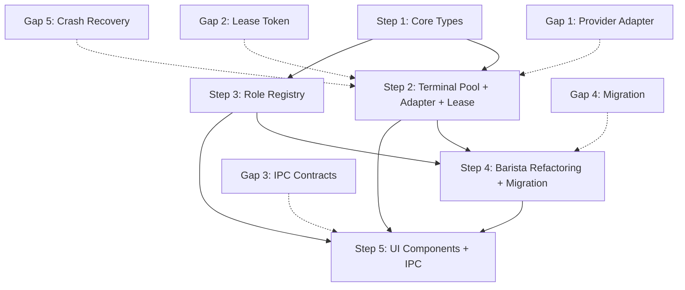

# File Creation Summary

## 4. File Creation Summary

### New Files (총 34개, Gap 해결용 추가 7개)

**Core Types (5):**
- `packages/core/src/types/terminal.ts`
- `packages/core/src/types/role.ts`
- `packages/core/src/types/index.ts` (UPDATE)
- `packages/core/src/schema/terminal.ts`
- `packages/core/src/schema/role.ts`

**Terminal Pool (10):** ← **7개 추가 (Gap 1, 2, 5)**
- `packages/orchestrator/src/terminal/terminal-pool.ts` (UPDATED for Gap 2, 5)
- `packages/orchestrator/src/terminal/errors.ts`
- `packages/orchestrator/src/terminal/index.ts`
- **`packages/orchestrator/src/terminal/lease-token.ts` (NEW - Gap 2)**
- **`packages/orchestrator/src/terminal/provider-adapter.ts` (NEW - Gap 1)**
- **`packages/orchestrator/src/terminal/adapters/claude-code-adapter.ts` (NEW - Gap 1)**
- **`packages/orchestrator/src/terminal/adapters/codex-adapter.ts` (NEW - Gap 1)**
- **`packages/orchestrator/src/terminal/adapter-registry.ts` (NEW - Gap 1)**
- **`packages/orchestrator/src/terminal/terminal-pool.crash.test.ts` (NEW - Gap 5)**
- **`packages/orchestrator/test/load/terminal-pool-load.test.ts` (NEW - Gap 2)**

**Role System (7):**
- `packages/roles/planner.md`
- `packages/roles/coder.md`
- `packages/roles/tester.md`
- `packages/roles/reviewer.md`
- **`packages/roles/generic-agent.md` (NEW - Gap 4)** ← **Gap 4 추가**
- `packages/orchestrator/src/role/role-parser.ts`
- `packages/orchestrator/src/role/role-registry.ts`
- `packages/orchestrator/src/role/index.ts`

**Barista Refactoring (5):** ← **2개 추가 (Gap 4)**
- **`packages/orchestrator/src/barista/barista-engine-v2.ts` (NEW - Gap 4)**
- **`packages/orchestrator/src/barista/legacy-barista-adapter.ts` (NEW - Gap 4)**
- `packages/orchestrator/src/barista/barista-manager.ts` (UPDATE)
- `packages/orchestrator/src/barista/index.ts` (UPDATE)

**UI Components (9):** ← **IPC handlers updated for Gap 3**
- `packages/desktop/src/main/ipc/role.ts` (UPDATED - Gap 3)
- `packages/desktop/src/main/ipc/terminal.ts` (UPDATED - Gap 3)
- `packages/desktop/src/main/index.ts` (UPDATE)
- `packages/desktop/src/preload/index.ts` (UPDATE - Gap 3)
- `packages/desktop/src/renderer/types/window.d.ts` (UPDATE - Gap 3)
- `packages/desktop/src/renderer/store/useRoleStore.ts`
- `packages/desktop/src/renderer/components/role/RoleCard.tsx`
- `packages/desktop/src/renderer/components/role/RoleManager.tsx`
- `packages/desktop/src/renderer/components/order/OrderCreationKiosk.tsx`

---

## 5. Dependency Map

**Critical Path:**
1. Step 1 (Core Types) - 필수 기반
2. Step 2 + Step 3 (병렬 가능)
3. Step 4 (Barista) - Step 2, 3 의존
4. Step 5 (UI) - Step 2, 3, 4 의존

**병렬 작업 가능:**
- Step 2 (Terminal Pool) ∥ Step 3 (Role Registry)

---

**다음 문서:** [09-testing-strategy.md](09-testing-strategy.md) - Testing Strategy