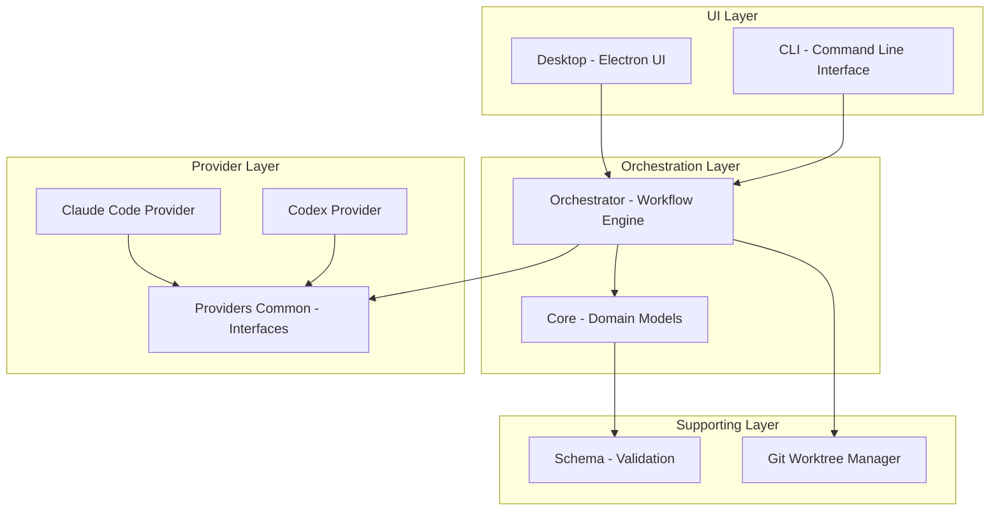
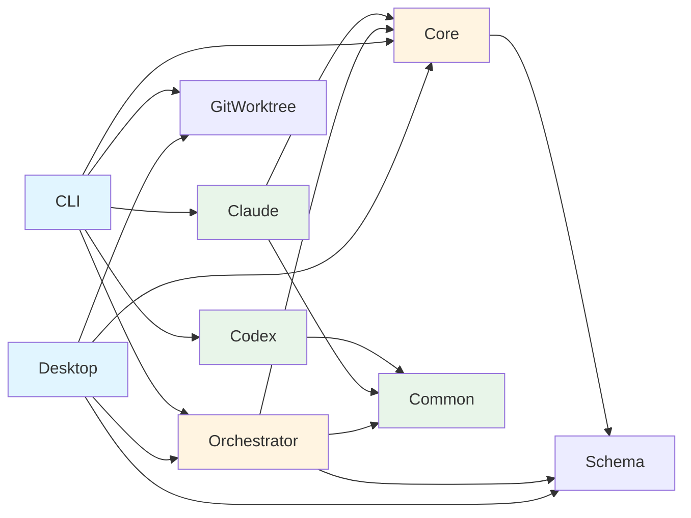
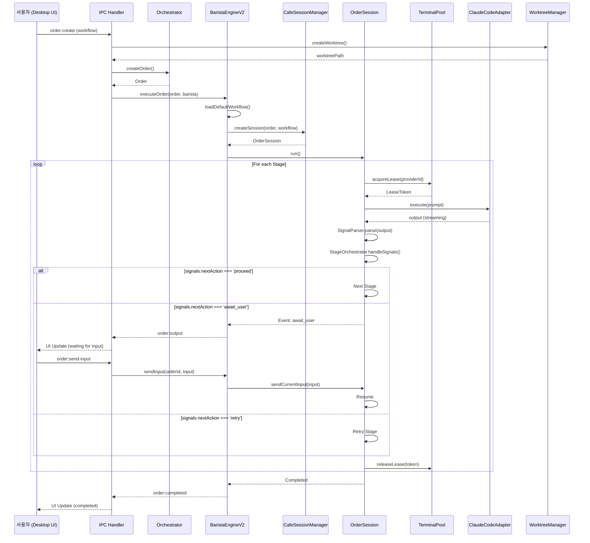
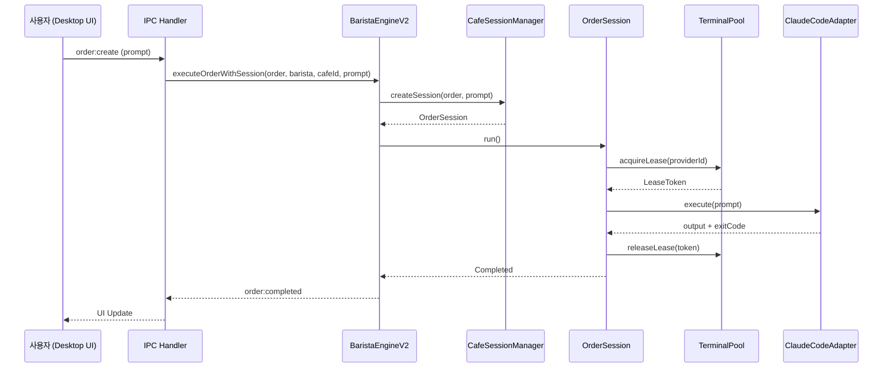
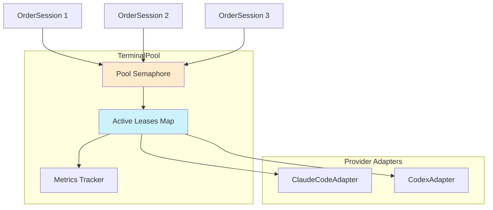
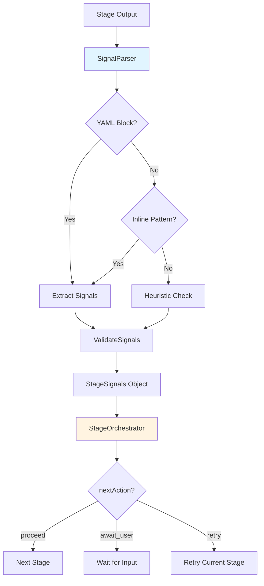
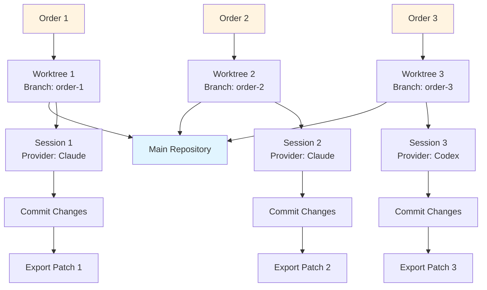
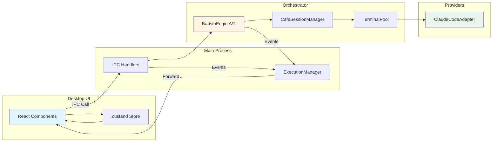

# CodeCafe 코드베이스 분석

## 📋 목차
1. [전체 아키텍처 개요](#전체-아키텍처-개요)
2. [패키지별 상세 분석](#패키지별-상세-분석)
3. [기능 단위 및 연결 관계](#기능-단위-및-연결-관계)
4. [구버전/미사용 코드 분석](#구버전미사용-코드-분석)
5. [개선 권장사항](#개선-권장사항)

---

## 전체 아키텍처 개요

### 프로젝트 개요
**CodeCafe**는 Claude Code, Codex 등의 AI CLI를 "바리스타"로 관리하며 워크플로우 기반으로 병렬 실행/관측/관리하는 크로스플랫폼 오케스트레이터입니다.

### 아키텍처 레이어



### 패키지 의존성 관계



---

## 패키지별 상세 분석

### 1. `packages/schema` - 스키마 정의 및 검증

**역할**: YAML/JSON 스키마 정의와 Zod 기반 검증

**주요 의존성**:
- `zod` ^3.22.4 - 스키마 검증
- `yaml` ^2.3.4 - YAML 파싱

**핵심 파일**:
- `src/index.ts` - 스키마 내보내기

**기능**:
- WorkflowConfig, Order, Cafe 등의 타입 스키마 정의
- 런타임 검증 및 타입 안전성 제공

**연결 관계**:
- Core, Orchestrator, Desktop에서 임포트하여 사용
- 전체 시스템의 타입 기반 역할

---

### 2. `packages/core` - 핵심 도메인 모델

**역할**: CodeCafe의 도메인 모델 및 핵심 타입 정의

**주요 의존성**:
- `@codecafe/schema` (workspace) - 스키마 검증
- `yaml` ^2.3.4
- `zod` ^3.22.4

**핵심 파일**:
```
src/
├── barista.ts           # Barista 모델
├── order.ts             # Order 모델
├── orchestrator.ts      # Orchestrator 모델
├── storage.ts           # 저장소 인터페이스
├── log-manager.ts       # 로그 관리
├── types/
│   ├── cafe.ts         # Cafe 타입
│   ├── role.ts         # Role 타입
│   ├── step.ts         # Step 타입
│   └── terminal.ts     # Terminal 타입
└── schema/
    ├── cafe.ts         # Cafe 스키마
    ├── role.ts         # Role 스키마
    └── terminal.ts     # Terminal 스키마
```

**주요 인터페이스**:
- `Barista` - AI CLI 실행 유닛
- `Order` - 워크플로우 실행 인스턴스
- `Orchestrator` - 전체 오케스트레이션 관리자
- `Terminal` - 터미널 추상화
- `Role` - 역할 기반 템플릿

**연결 관계**:
- Orchestrator, Desktop, CLI에서 핵심 모델로 사용
- Schema 패키지를 사용하여 검증

**중요사항**: 
> [!NOTE]
> **@deprecated** 마커 발견: `types.ts` 일부 타입에서 deprecated 마커 존재 (구체적 확인 필요)

---

### 3. `packages/orchestrator` - 오케스트레이션 엔진 (핵심)

**역할**: 워크플로우 실행, 터미널 풀 관리, 세션 오케스트레이션

**주요 의존성**:
- `@codecafe/core` (workspace)
- `@codecafe/providers-common` (workspace)
- `@codecafe/schema` (workspace)
- `node-pty` ^1.0.0 - 터미널 제어
- `chokidar` ^3.5.3 - 파일 감시
- `handlebars` ^4.7.8 - 템플릿 엔진
- `yaml` ^2.8.2

**디렉토리 구조**:
```
src/
├── barista/
│   ├── barista-engine-v2.ts      # ⭐ 핵심 엔진 (Session 기반)
│   └── barista-manager.ts        # Barista 관리
├── session/
│   ├── cafe-session-manager.ts   # Session 관리
│   ├── order-session.ts          # Order 세션
│   ├── signal-parser.ts          # ⭐ 시그널 파싱 (YAML signals)
│   ├── stage-orchestrator.ts     # Stage 오케스트레이션
│   ├── stage-signals.ts          # Stage 시그널 타입
│   ├── terminal-group.ts         # 멀티 터미널 그룹
│   └── shared-context.ts         # 공유 컨텍스트
├── terminal/
│   ├── terminal-pool.ts          # ⭐ 터미널 풀 (동시성 관리)
│   ├── provider-adapter.ts       # Provider 어댑터 래퍼
│   ├── pool-semaphore.ts         # 세마포어
│   └── errors.ts                 # 에러 정의
├── workflow/
│   ├── workflow-executor.ts      # ⭐ 워크플로우 실행기
│   └── run-registry.ts           # 실행 레지스트리
├── engine/
│   ├── fsm.ts                    # FSM 엔진
│   └── dag-executor.ts           # DAG 실행기
├── provider/
│   ├── adapter.ts                # Provider 어댑터
│   ├── executor.ts               # Provider 실행기
│   ├── assisted.ts               # Assisted 모드
│   └── headless.ts               # Headless 모드
├── role/
│   ├── role-manager.ts           # Role 관리
│   └── template.ts               # Handlebars 템플릿
├── recipe/
│   ├── recipe-executor.ts        # Recipe 실행
│   └── recipe-context.ts         # Recipe 컨텍스트
├── storage/
│   ├── run-state.ts              # 실행 상태 저장
│   └── event-logger.ts           # 이벤트 로깅
├── ui/
│   ├── electron-api.ts           # Electron IPC 핸들러
│   └── types.ts                  # UI 타입
└── cli/
    └── commands/                 # CLI 명령어
```

**핵심 컴포넌트**:

#### 1. **BaristaEngineV2** (`barista/barista-engine-v2.ts`)
- **역할**: 세션 기반 멀티 터미널 오케스트레이션
- **Phase**: Phase 3 구현
- **주요 기능**:
  - Order 실행 (Workflow/Prompt 모드)
  - Session 관리 (`CafeSessionManager` 통합)
  - Skill 로딩 (`desktop/skills/*.json`)
  - 재시도 로직 (Stage별 재시도, 처음부터 재시도)
  - Order 취소 및 입력 전송
- **주요 메서드**:
  - `executeOrder(order, barista)` - Order 실행
  - `executeWithSession(order, barista, cafeId, cwd, workflowConfig)` - Session 기반 실행
  - `cancelOrder(orderId)` - Order 취소
  - `sendInput(orderId, message)` - 터미널 입력 전송
  - `retryFromStage(orderId, fromStageId)` - Stage부터 재시도
  - `retryFromBeginning(orderId)` - 처음부터 재시도

#### 2. **SignalParser** (`session/signal-parser.ts`)
- **역할**: Stage 출력에서 YAML signals 블록 추출 및 파싱
- **파싱 패턴**:
  - YAML 코드 블록 (`\`\`\`yaml\n signals: ...`)
  - 인라인 패턴 (`signals:\n  nextAction: ...`)
- **신호 타입**:
  - `nextAction`: proceed | await_user | retry
  - `needsUserInput`: boolean
  - `uncertainties`: string[]
  - `complexity`: low | medium | high
  - `skipStages`: string[]
- **휴리스틱**: 질문 마크 5개 이상 + 짧은 출력 → `await_user` 추론

#### 3. **TerminalPool** (`terminal/terminal-pool.ts`)
- **역할**: 터미널 리소스의 동시성 관리 및 풀링
- **기능**:
  - Provider별 동시성 제한
  - Lease 기반 터미널 대여
  - 자동 타임아웃 및 정리
  - 통계 및 메트릭 제공

#### 4. **WorkflowExecutor** (`workflow/workflow-executor.ts`)
- **역할**: 워크플로우 YAML 기반 실행
- **기능**:
  - Stage별 순차 실행
  - Stage 입출력 파싱
  - 실행 상태 추적

**연결 관계**:
- Desktop → IPC 핸들러 → BaristaEngineV2
- CLI → WorkflowExecutor
- BaristaEngineV2 → TerminalPool → ProviderAdapter → ClaudeCodeAdapter/CodexAdapter

**TODO 항목**:
- `cli/commands/role.ts`, `cli/commands/init.ts`: 일부 TODO 주석 발견
- `desktop/src/renderer/components/role/RoleManager.tsx`: TODO 주석

---

### 4. `packages/git-worktree` - Git Worktree 관리

**역할**: Git worktree 생성/삭제/관리로 병렬 실행 격리 환경 제공

**주요 의존성**:
- 없음 (순수 Node.js 표준 라이브러리)

**핵심 파일**:
```
src/
├── worktree-manager.ts  # ⭐ WorktreeManager 클래스
├── types.ts             # 타입 정의
└── index.ts
```

**주요 기능** (`WorktreeManager`):
- `createWorktree(options)` - Worktree 생성
- `removeWorktree(options)` - Worktree 삭제 (강제 삭제 지원)
- `listWorktrees(repoPath)` - Worktree 목록 조회
- `exportPatch(options)` - 변경사항을 패치로 내보내기
- `hasUncommittedChanges(worktreePath)` - 미커밋 변경사항 확인
- `getUniqueBranchName()` - 중복되지 않는 브랜치명 생성
- `ensureSafeDirectory()` - Windows "dubious ownership" 에러 방지

**보안**:
- `execFile` 사용으로 command injection 방지
- 경로 정규화로 Windows 호환성 확보

**연결 관계**:
- Desktop, CLI에서 Order 실행 시 worktree 생성하여 격리 환경 제공
- BaristaEngineV2와 함께 병렬 실행 지원

**참고**:
> [!IMPORTANT]
> Windows에서 Worktree 삭제 시 "Permission denied" 에러 발생 가능. `removeWorktree`에서 프로세스 종료 후 대기 로직 필요 (과거 대화에서 해결됨).

---

### 5. `packages/providers/common` - 공통 Provider 인터페이스

**역할**: Provider 구현의 공통 인터페이스 정의

**주요 의존성**:
- 없음

**핵심 파일**:
- `src/index.ts` - IProviderAdapter, ProviderConfig 등 인터페이스

**주요 인터페이스**:
```typescript
interface IProviderAdapter {
  execute(options: ExecutionOptions): Promise<ExecutionResult>;
  sendInput?(input: string): Promise<void>;
  cancel?(): Promise<void>;
  // 스트리밍 콜백 지원
  onStreamData?(callback: (data: string) => void): void;
}
```

**연결 관계**:
- Claude Code, Codex Provider가 이 인터페이스 구현
- Orchestrator의 ProviderAdapter가 이를 래핑

---

### 6. `packages/providers/claude-code` - Claude Code Provider

**역할**: Claude CLI 연동 Provider

**주요 의존성**:
- `@codecafe/core` (workspace)
- `@codecafe/providers-common` (workspace)
- `node-pty` ^1.0.0

**핵심 파일**:
- `src/claude-code-adapter.ts` - ClaudeCodeAdapter 구현
- `src/index.ts`

**주요 기능**:
- PTY 기반 Claude CLI 스폰
- CI=true 환경 변수 설정
- 프롬프트 대기 및 입력 전송
- 스트리밍 데이터 콜백 지원
- Permission 감지 (`dangerously-skip-permissions` 플래그 처리)

**개선 이력**:
> [!NOTE]
> 과거 대화에서 다음 개선 수행:
> - OS별 개행 처리 추가
> - `waitForPrompt` 개선 (다양한 프롬프트 형식 지원)
> - 프롬프트 sanitization (CLI 플래그 제거)
> - False-positive permission 에러 수정

**연결 관계**:
- Orchestrator의 TerminalPool → ProviderAdapter → ClaudeCodeAdapter

---

### 7. `packages/providers/codex` - Codex Provider

**역할**: Codex CLI 연동 Provider

**주요 의존성**:
- `@codecafe/providers-common` (workspace)
- `node-pty` ^1.0.0

**핵심 파일**:
- `src/codex-adapter.ts` - CodexAdapter 구현 (추정)
- `src/index.ts`

**연결 관계**:
- ClaudeCodeAdapter와 유사한 구조
- Orchestrator에서 선택적으로 사용

**상태**: M2 진행 중 (README 기준)

---

### 8. `packages/desktop` - Electron 데스크톱 앱 (UI)

**역할**: CodeCafe Manager - Electron 기반 관리 및 관측 UI

**주요 의존성**:
- `@codecafe/core`, `@codecafe/orchestrator`, `@codecafe/git-worktree`, `@codecafe/schema` (workspace)
- `electron` ^28.0.0
- `react` ^18.2.0, `react-dom` ^18.2.0
- `zustand` ^4.4.7 - 상태 관리
- `framer-motion` ^10.16.16 - 애니메이션
- `lucide-react` ^0.303.0 - 아이콘
- `@radix-ui/*` - UI 컴포넌트
- `tailwindcss` ^3.4.1
- `ansi-to-html` ^0.7.2 - 터미널 출력 렌더링

**디렉토리 구조**:
```
src/
├── main/
│   ├── index.ts                    # ⭐ Electron Main 프로세스
│   ├── execution-manager.ts        # ⭐ BaristaEngineV2 연동
│   └── ipc/
│       ├── cafe.ts                 # Cafe IPC 핸들러
│       ├── orchestrator.ts         # Orchestrator IPC 핸들러
│       ├── order.ts                # ⭐ Order IPC 핸들러
│       ├── provider.ts             # Provider IPC 핸들러
│       ├── role.ts                 # Role IPC 핸들러
│       ├── skill.ts                # Skill IPC 핸들러
│       ├── terminal.ts             # Terminal IPC 핸들러
│       ├── workflow.ts             # Workflow IPC 핸들러
│       └── worktree.ts             # Worktree IPC 핸들러
├── preload/
│   └── index.ts                    # Preload 스크립트
└── renderer/
    ├── App.tsx                     # React 앱 루트
    ├── index.tsx                   # 엔트리 포인트
    ├── components/                 # React 컴포넌트
    ├── stores/                     # Zustand 스토어
    └── types/                      # 타입 정의
```

**핵심 컴포넌트**:

#### 1. **Main Process** (`main/index.ts`)
- **역할**: Electron 메인 프로세스, Orchestrator 초기화 및 IPC 핸들러 설정
- **주요 기능**:
  - Orchestrator 초기화 (데이터: `~/.codecafe/data`, 로그: `~/.codecafe/logs`)
  - ExecutionManager 초기화 (BaristaEngineV2 연동)
  - IPC 핸들러 등록
  - 창 생성 (1600x900 기본 해상도)
  - Dev 서버 대기 (개발 모드)

#### 2. **ExecutionManager** (`main/execution-manager.ts`)
- **역할**: BaristaEngineV2와 UI 간 브릿지
- **주요 기능**:
  - Order 실행 이벤트 수신 (`order:output`, `order:completed`, `order:failed`)
  - Renderer에 이벤트 포워딩
  - 스트리밍 터미널 출력 전송

#### 3. **Order IPC Handlers** (`main/ipc/order.ts`)
- **역할**: Order 관련 IPC 핸들러
- **주요 핸들러**:
  - `order:create` - Order 생성 및 실행
  - `order:list` - Order 목록 조회
  - `order:get` - Order 상세 조회
  - `order:delete` - Order 삭제 (worktree 정리 포함)
  - `order:cancel` - Order 취소
  - `order:send-input` - Order에 입력 전송
  - `order:retry` - Order 재시도

**기능**:
- Dashboard (Kanban/List 뷰)
- Order 생성 키오스크
- Order 상세 모달 (터미널 출력, Stage 진행 상황)
- Barista 관리
- Role 관리
- Workflow 관리
- Skill 관리

**연결 관계**:
- Main Process → Orchestrator → BaristaEngineV2
- Renderer → IPC → Main Process IPC Handlers
- ExecutionManager: BaristaEngineV2 이벤트 → Renderer

**TODO 항목**:
- `main/index.ts`: "TODO: Add run handlers if needed" (L168)
- `renderer/components/role/RoleManager.tsx`: TODO 주석
- `renderer/components/order/OrderCreationKiosk.tsx`: TODO 주석

**개선 이력**:
> [!NOTE]
> 과거 대화에서 다음 개선 수행:
> - 기본 해상도 1600x900 설정
> - 칸반 뷰 기본 설정
> - 주문 영속성 수정
> - 실시간 터미널 스트리밍 구현
> - Order 상태 UI 개선
> - Worktree 삭제 Permission 에러 수정

---

### 9. `packages/cli` - CLI 인터페이스

**역할**: `codecafe` 명령줄 도구

**주요 의존성**:
- `@codecafe/core`, `@codecafe/orchestrator`, `@codecafe/git-worktree` (workspace)
- `@codecafe/provider-claude-code`, `@codecafe/providers-codex` (workspace)
- `commander` ^11.1.0 - CLI 프레임워크
- `chalk` ^5.3.0 - 색상 출력
- `ora` ^8.0.1 - 로딩 스피너
- `inquirer` ^9.2.12 - 인터랙티브 프롬프트

**핵심 파일**:
- `src/index.ts` - CLI 엔트리 포인트
- `src/commands/` - 하위 명령어

**주요 명령어**:
- `codecafe init` - 초기화
- `codecafe run --issue "..."` - 실행
- `codecafe doctor` - 환경 점검
- `codecafe ui` - Desktop UI 실행 (M2+)

**연결 관계**:
- Orchestrator를 직접 임포트하여 사용
- Provider 직접 연동

**TODO 항목**:
- `commands/ui.ts`: TODO 주석

---

## 기능 단위 및 연결 관계

### 1. Order 실행 플로우 (Workflow 모드)



### 2. Order 실행 플로우 (Simple Prompt 모드)



### 3. 터미널 풀 및 동시성 관리



**동시성 제한**:
- Provider별 동시 실행 수 제한 (`TerminalPoolConfig`)
- Semaphore를 통한 대기열 관리
- Lease 타임아웃 자동 정리

### 4. 시그널 기반 Stage 제어



**시그널 타입**:
- `nextAction`: `proceed` | `await_user` | `retry`
- `needsUserInput`: boolean
- `uncertainties`: string[]
- `complexity`: `low` | `medium` | `high`
- `skipStages`: string[]
- `retryReason`: string (optional)

### 5. Git Worktree 병렬 실행



**격리 환경**:
- 각 Order는 독립적인 worktree에서 실행
- 브랜치명: `order-{orderId}` (중복 시 suffix 추가)
- 완료 후 패치 export 가능
- Worktree 삭제로 정리

### 6. 패키지 간 데이터 흐름



---

## 구버전/미사용 코드 분석

### 1. @deprecated 마커

**발견 위치**:
- `packages/core/src/types.ts` - 일부 타입에 `@deprecated` 주석 존재
- `packages/desktop/src/renderer/types/window.d.ts` - `@deprecated` 마커

> [!WARNING]
> **권장사항**: Deprecated 타입의 사용처를 찾아 마이그레이션 계획 수립 필요

### 2. 구버전 BaristaEngine

**상태**: BaristaEngineV2 도입으로 이전 BaristaEngine은 미사용 추정

**확인 필요**:
```bash
# 구버전 바리스타 엔진 참조 확인
grep -r "barista-engine.ts" packages/
grep -r "import.*barista-engine[^-v2]" packages/
```

**결과**: 현재 `barista-engine.ts` 파일 참조 없음 → V2가 현재 표준

> [!NOTE]
> BaristaEngine (V1)이 존재했을 가능성 있으나 현재 코드베이스에서는 제거된 것으로 보임.

### 3. TODO/FIXME 주석

**발견된 TODO 항목**:

| 파일 | 내용 | 우선순위 |
|------|------|----------|
| `orchestrator/src/cli/commands/role.ts` | TODO 주석 | 중간 |
| `orchestrator/src/cli/commands/init.ts` | TODO 주석 | 중간 |
| `desktop/src/main/index.ts` | "TODO: Add run handlers if needed" | 낮음 |
| `desktop/src/renderer/components/role/RoleManager.tsx` | TODO 주석 | 중간 |
| `desktop/src/renderer/components/order/OrderCreationKiosk.tsx` | TODO 주석 | 중간 |
| `cli/src/commands/ui.ts` | TODO 주석 | 낮음 |

**FIXME 항목**: 발견되지 않음

### 4. 미사용 파일/함수 후보

**분석 방법**:
- Export되지 않는 내부 함수
- 테스트 파일에서만 사용되는 코드
- 주석 처리된 코드

**주석 처리된 코드**:
```typescript
// packages/orchestrator/src/index.ts:77
// export { renderInteractiveRunner } from './ui/InteractiveRunner';
```
→ `InteractiveRunner`가 사용되지 않는 것으로 보임

**추가 확인 필요**:
- `packages/orchestrator/src/ui/InteractiveRunner.ts` 파일 존재 여부
- 사용되지 않는 경우 제거 고려

### 5. Recipe 기능 사용 현황

**상태**: README에 "Phase 4: Recipe context and parallel execution"으로 명시

**확인**:
- `packages/orchestrator/src/recipe/` 디렉토리 존재
- Export는 되어 있으나 Desktop/CLI에서 실제 사용 여부 불명확

**권장사항**: Recipe 기능의 실사용 여부 확인 필요

---

## 개선 권장사항

### 1. 아키텍처 개선

#### 1.1 순환 의존성 해결
> [!IMPORTANT]
> `packages/orchestrator/src/barista/barista-engine-v2.ts`에서 "core 패키지의 순환 의존성을 피하기 위해" `OrderWithWorkflow` 인터페이스를 확장하고 있음.

**권장사항**:
- Core 패키지에 `WorkflowConfig` 타입을 추가하거나
- Orchestrator 전용 타입 패키지 분리 고려

#### 1.2 Provider 플러그인 아키텍처
**현재**: Provider는 workspace 의존성으로 하드코딩

**개선안**:
- Provider 동적 로딩 메커니즘
- Provider 레지스트리 및 디스커버리
- `~/.codecafe/providers/` 디렉토리에서 플러그인 로드

### 2. 코드 품질 개선

#### 2.1 Deprecated 코드 제거
- `@deprecated` 마커가 있는 타입 마이그레이션
- 사용처 찾아 새로운 API로 교체
- Deprecated 코드 제거

#### 2.2 TODO 해결
- 우선순위별 TODO 해결 계획 수립
- 특히 Role, Init 관련 TODO는 기능 완성도에 영향

#### 2.3 테스트 커버리지
**현재**: Orchestrator에 테스트 존재 (`__tests__/`)

**개선안**:
- Core, Git Worktree, Provider에도 단위 테스트 추가
- Desktop UI E2E 테스트 (Playwright 등)
- Integration 테스트 (실제 Claude CLI 없이 Mock Provider 사용)

### 3. 문서화 개선

#### 3.1 API 문서
- 각 패키지의 `README.md` 추가
- 주요 클래스/함수에 JSDoc 주석
- 사용 예제 추가

#### 3.2 아키텍처 문서
- 현재 분석 문서를 `docs/architecture.md`로 저장
- 워크플로우 DSL 문서화 (`docs/workflow-dsl.md`)
- Signal 스펙 문서화 (`docs/signals-spec.md`)

#### 3.3 개발자 가이드
- 새로운 Provider 추가 가이드
- 커스텀 Workflow 작성 가이드
- 로컬 개발 환경 설정 가이드

### 4. 성능 최적화

#### 4.1 TerminalPool 최적화
**개선안**:
- 터미널 재사용 (warm pool)
- Provider별 최적 동시성 값 자동 조정
- Lease 타임아웃 튜닝

#### 4.2 Desktop UI 최적화
**개선안**:
- 대량 Order 목록 가상화 (react-window)
- 터미널 출력 렌더링 최적화 (xterm.js 고려)
- Zustand 스토어 선택적 구독 (selectors)

### 5. 기능 확장

#### 5.1 M2 완료
- [ ] Codex Provider 완성
- [ ] DAG 시각화

#### 5.2 M3 준비
- [ ] Gemini/Grok Provider 추가
- [ ] API 모드 (REST API 서버)
- [ ] 템플릿 레지스트리 (공유 Workflow)

#### 5.3 모니터링 및 관측성
- [ ] 실행 메트릭 대시보드
- [ ] 에러 추적 및 알림
- [ ] 성능 프로파일링

### 6. 보안 개선

#### 6.1 Worktree 권한 관리
- Windows 권한 문제 완전 해결
- Worktree 삭제 실패 시 retry 로직

#### 6.2 Provider Sandbox
- Provider 실행 환경 격리
- 리소스 제한 (메모리, CPU)
- 네트워크 접근 제어

### 7. 사용성 개선

#### 7.1 CLI UX
- 인터랙티브 모드 개선 (Inquirer)
- 진행 상황 실시간 표시
- 컬러풀한 출력

#### 7.2 Desktop UI UX
- Order 템플릿 (자주 사용하는 Workflow 저장)
- Workflow 비주얼 에디터
- 터미널 출력 검색 기능

---

## 부록: 주요 타입 및 인터페이스

### Order 타입
```typescript
interface Order {
  id: string;
  cafeId: string;
  prompt: string;
  status: 'PENDING' | 'RUNNING' | 'COMPLETED' | 'FAILED' | 'CANCELLED';
  baristaId: string | null;
  createdAt: Date;
  completedAt: Date | null;
  error?: string;
  result?: string;
  workflowConfig?: WorkflowConfig; // Orchestrator 확장
}
```

### WorkflowConfig 타입
```typescript
interface WorkflowConfig {
  name: string;
  description?: string;
  stages: StageConfig[];
  metadata?: Record<string, any>;
}

interface StageConfig {
  id: string;
  name: string;
  provider: string; // 'claude-code', 'codex', etc.
  prompt: string;
  skills?: string[]; // Skill names to load
  timeout?: number;
  retries?: number;
}
```

### StageSignals 타입
```typescript
interface StageSignals {
  nextAction: 'proceed' | 'await_user' | 'retry';
  needsUserInput: boolean;
  uncertainties: string[];
  complexity: 'low' | 'medium' | 'high';
  skipStages?: string[];
  retryReason?: string;
  maxRetries?: number;
  metadata?: Record<string, any>;
}
```

### TerminalPoolConfig 타입
```typescript
interface TerminalPoolConfig {
  providers: ProviderTerminalConfig[];
}

interface ProviderTerminalConfig {
  id: string;
  maxConcurrency: number;
  timeout?: number;
}
```

---

## 결론

CodeCafe 코드베이스는 다음과 같이 구성되어 있습니다:

**강점**:
- ✅ 명확한 레이어 분리 (UI / Orchestration / Provider / Supporting)
- ✅ 세션 기반 멀티 터미널 오케스트레이션 (Phase 3)
- ✅ Git Worktree를 활용한 병렬 실행 격리
- ✅ 시그널 기반 동적 Stage 제어
- ✅ Electron Desktop UI와 CLI 모두 지원

**개선 필요 영역**:
- ⚠️ Deprecated 코드 마이그레이션
- ⚠️ TODO 항목 해결
- ⚠️ 테스트 커버리지 확대
- ⚠️ Provider 플러그인 아키텍처
- ⚠️ 문서화 강화

**다음 단계**:
1. M2 완료 (Codex Provider, DAG 시각화)
2. TODO 및 Deprecated 코드 정리
3. 테스트 커버리지 50% 이상 목표
4. API 모드 및 Provider 확장 (M3)

이 분석이 코드베이스 이해와 향후 개발 방향 설정에 도움이 되기를 바랍니다.
