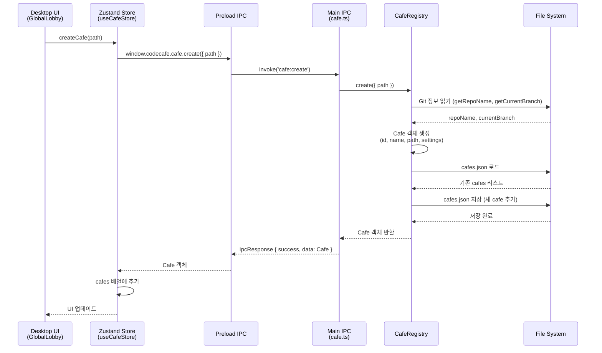
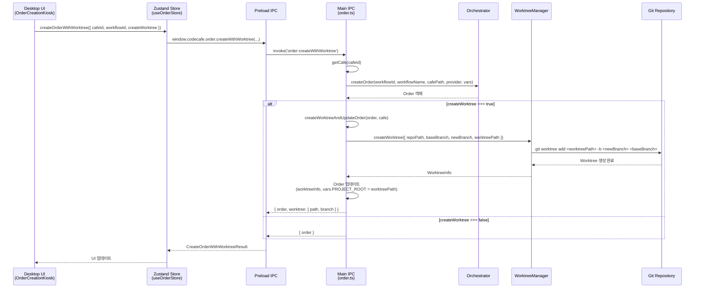
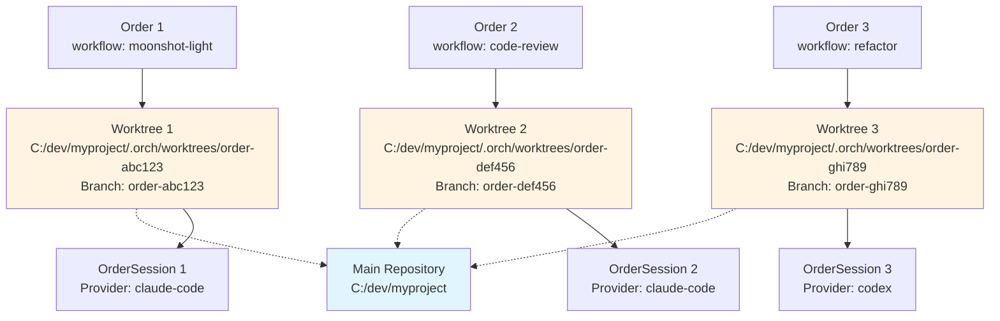
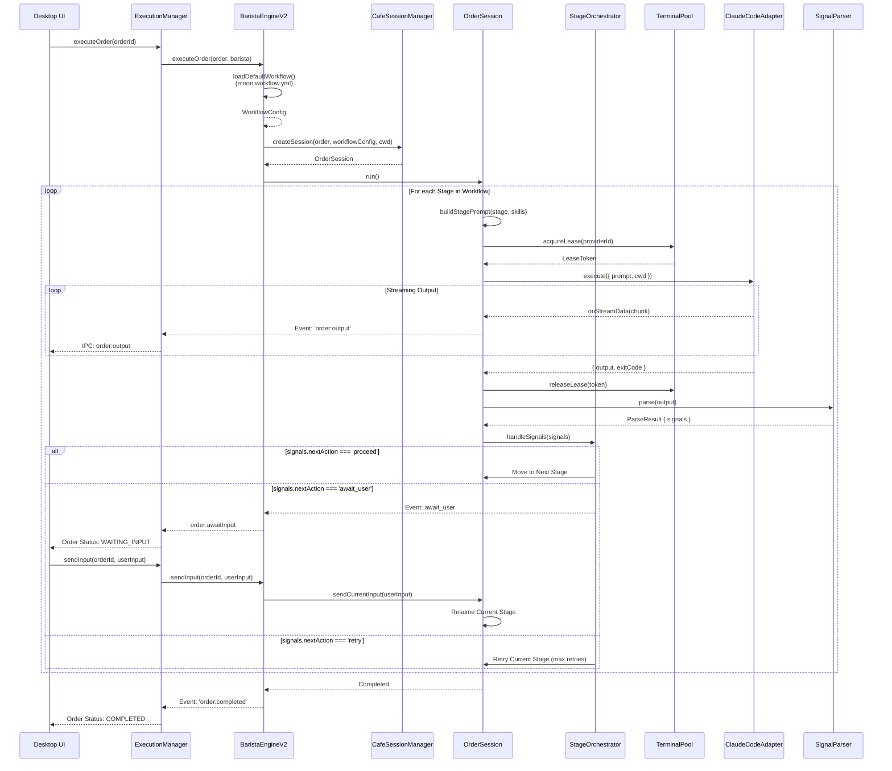
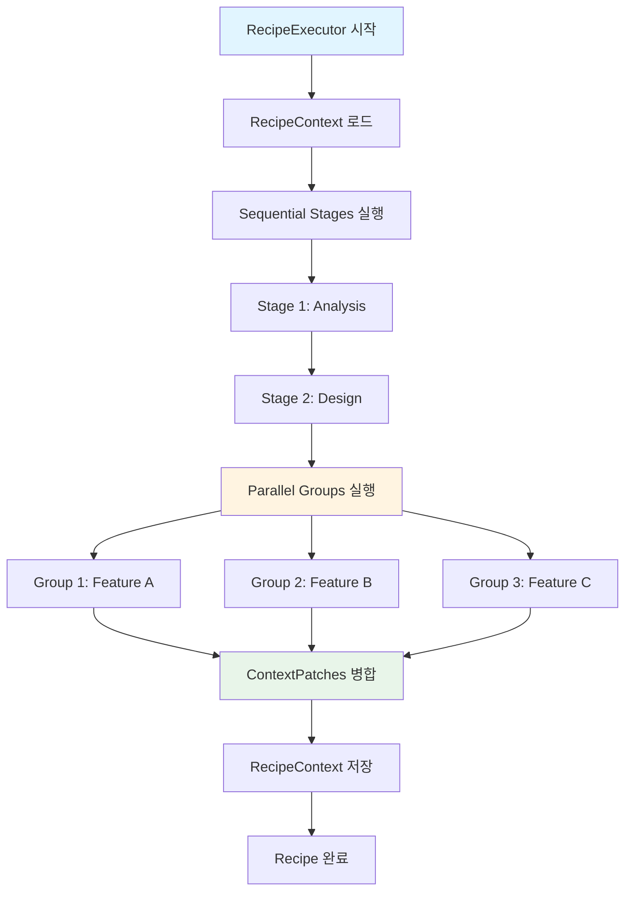
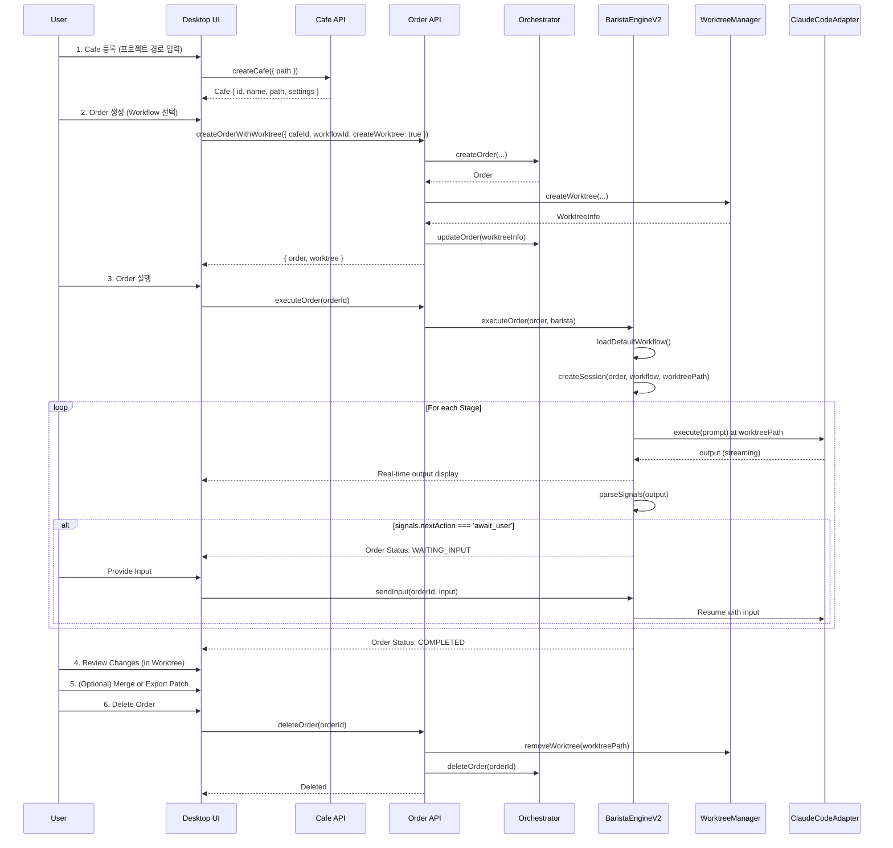

# CodeCafe 메인 사용 흐름 분석

## 📌 개요

CodeCafe의 핵심 사용 흐름은 다음과 같습니다:

```
1️⃣ Cafe 등록 (프로젝트 저장소 연결)
     ↓
2️⃣ Order 생성 (Workflow 선택 + Worktree 생성)
     ↓
3️⃣ Recipe/Workflow 실행 (AI Provider가 순차/병렬 작업 수행)
```

이 문서는 이 세 단계의 상세한 흐름을 분석합니다.

---

## 1. Cafe 등록 흐름

### 1.1 개념

**Cafe**는 CodeCafe가 관리하는 **프로젝트 저장소 (Git Repository)**입니다.
- 사용자는 여러 개의 프로젝트(Cafe)를 등록할 수 있습니다
- 각 Cafe는 독립적인 설정(baseBranch, worktreeRoot 등)을 가집니다
- Cafe 메타데이터는 `~/.codecafe/cafes.json`에 저장됩니다

### 1.2 Cafe 등록 시퀀스



### 1.3 Cafe 데이터 구조

```typescript
interface Cafe {
  id: string;                  // nanoid로 생성된 고유 ID
  name: string;                // Git repo 이름
  path: string;                // 절대 경로 (예: "C:/dev/my-project")
  createdAt: string;           // ISO 타임스탬프
  lastAccessedAt?: string;     // 마지막 접근 시간
  settings: {
    baseBranch: string;        // 기본 브랜치 (예: "main", "develop")
    worktreeRoot: string;      // Worktree 루트 (상대/절대 경로)
  };
}
```

### 1.4 핵심 코드

**파일**: `packages/desktop/src/main/ipc/cafe.ts`

```typescript
class CafeRegistry {
  async create(params: CreateCafeParams): Promise<Cafe> {
    await this.ensureDir();
    const registry = await this.load();

    // Git 정보 읽기
    const repoName = await this.getRepoName(params.path);
    const currentBranch = await this.getCurrentBranch(params.path);

    // Cafe 객체 생성
    const cafe: Cafe = {
      id: nanoid(),
      name: params.name || repoName,
      path: resolve(params.path),
      createdAt: new Date().toISOString(),
      settings: {
        baseBranch: currentBranch,
        worktreeRoot: params.worktreeRoot || '.orch/worktrees',
      },
    };

    // Registry에 추가 및 저장
    registry.cafes.push(cafe);
    await this.save(registry);

    return cafe;
  }
}
```

---

## 2. Order 생성 흐름 (+ Worktree 자동 생성)

### 2.1 개념

**Order**는 **Workflow 실행의 한 인스턴스**입니다.
- 사용자가 Workflow를 선택하고 실행을 요청하면 Order가 생성됩니다
- Order는 선택적으로 **Git Worktree**를 생성하여 격리된 환경에서 실행됩니다
- Worktree를 사용하면 동일한 프로젝트에서 여러 Order를 병렬 실행할 수 있습니다

### 2.2 Order 생성 + Worktree 생성 시퀀스



### 2.3 Worktree 병렬 실행 메커니즘



**특징**:
- 각 Order는 독립적인 Git 브랜치와 작업 디렉토리를 가집니다
- 동시에 여러 AI Provider가 서로 간섭 없이 작업 가능
- Order 완료 후 변경사항을 메인 브랜치로 머지하거나 패치로 export 가능

### 2.4 Order 데이터 구조

```typescript
interface Order {
  id: string;                    // Order ID (nanoid)
  workflowId: string;            // Workflow ID
  workflowName: string;          // Workflow 이름 (예: "moonshot-light")
  status: OrderStatus;           // PENDING | RUNNING | COMPLETED | FAILED | CANCELLED
  counter: string;               // Cafe 경로 (원본)
  
  // Provider 정보
  provider?: string;             // 주요 Provider (workflow stage별로 다를 수 있음)
  
  // Variables
  vars: Record<string, string>;  // { PROJECT_ROOT: worktreePath, ... }
  
  // Worktree 정보 (선택적)
  worktreeInfo?: {
    path: string;                // Worktree 절대 경로
    branch: string;              // Worktree 브랜치명
    baseBranch: string;          // 기반 브랜치
    repoPath: string;            // 원본 Repo 경로
  };
  
  // 시간 정보
  createdAt: Date;
  startedAt?: Date;
  completedAt?: Date;
  
  // 결과
  error?: string;
  result?: string;
}
```

### 2.5 핵심 코드

**파일**: `packages/desktop/src/main/ipc/order.ts`

```typescript
async function createWorktreeAndUpdateOrder(
  order: any,
  cafe: Cafe,
  worktreeOptions?: { baseBranch?: string; branchPrefix?: string }
): Promise<WorktreeCreationResult> {
  const baseBranch = worktreeOptions?.baseBranch || cafe.settings.baseBranch;
  const branchName = `order-${order.id}`;
  const worktreeRoot = /* 절대 경로 계산 */;
  const worktreePath = join(worktreeRoot, branchName);

  // Worktree 생성
  await WorktreeManager.createWorktree({
    repoPath: cafe.path,
    baseBranch,
    newBranch: branchName,
    worktreePath,
  });

  // Order 업데이트
  order.worktreeInfo = {
    path: worktreePath,
    branch: branchName,
    baseBranch,
    repoPath: cafe.path,
  };
  order.vars = { ...order.vars, PROJECT_ROOT: worktreePath };

  return { path: worktreePath, branch: branchName, baseBranch };
}
```

---

## 3. Recipe/Workflow 실행 흐름

### 3.1 Recipe vs Workflow

CodeCafe는 두 가지 실행 모드를 지원합니다:

| 항목 | **Recipe** | **Workflow** |
|------|-----------|-------------|
| **정의** | `RecipeExecutor` 기반, 순차/병렬 Stage 실행 | YAML 기반 Workflow 정의, DAG 또는 FSM 방식 |
| **Context 공유** | `RecipeContext` (YAML 파일로 저장) | `OrderSession` + `SharedContext` |
| **사용 현황** | 구현되어 있으나 Desktop에서 직접 사용 안 함 | **메인 실행 방식** (BaristaEngineV2) |
| **Provider 연동** | `ClaudeCodeAdapter` 직접 사용 | `TerminalPool` → `ProviderAdapter` → AI CLI |
| **신호 처리** | ContextPatch 추출 | `SignalParser` (YAML signals 블록) |

> [!IMPORTANT]
> **현재 Desktop UI의 메인 흐름은 Workflow 기반입니다.** Recipe는 추후 확장을 위한 기반으로 보입니다.

### 3.2 Workflow 실행 시퀀스 (메인 흐름)



### 3.3 Stage 신호(Signals) 처리

**SignalParser**는 AI Provider의 출력에서 YAML signals 블록을 추출합니다.

**예시 출력**:
```markdown
분석을 완료했습니다. 다음 단계로 진행할 수 있습니다.

\`\`\`yaml
signals:
  nextAction: proceed
  needsUserInput: false
  complexity: medium
  uncertainties: []
\`\`\`
```

**파싱 결과**:
```typescript
{
  success: true,
  signals: {
    nextAction: 'proceed',
    needsUserInput: false,
    complexity: 'medium',
    uncertainties: [],
  }
}
```

**StageOrchestrator의 처리**:
- `proceed`: 다음 Stage로 이동
- `await_user`: Order를 일시정지하고 사용자 입력 대기
- `retry`: 현재 Stage를 재시도 (최대 재시도 횟수까지)

### 3.4 Recipe 실행 흐름 (보조 메커니즘)

Recipe는 순차 및 병렬 Stage 실행을 지원하는 별도 시스템입니다.



**RecipeContext 데이터 구조**:
```typescript
interface ContextData {
  schemaVersion: string;
  request: {
    prompt: string;
    taskType: string;
    keywords: string[];
  };
  signals: Record<string, boolean>;      // 전역 시그널
  estimates: {
    estimatedFiles: number;
    estimatedLines: number;
    estimatedTime: string;
  };
  phase: string;                         // 현재 Phase
  complexity: string;
  notes: string[];                       // Stage별 노트
  sessionId?: string;
}
```

**Context 병합 메커니즘**:
- **Sequential Stages**: Context를 순차적으로 업데이트
- **Parallel Stages**: Snapshot을 각 Stage에 전달 → 결과 ContextPatch를 모두 병합
- **Token 제한**: Context 크기가 MAX_TOKENS 초과 시 자동으로 archive하고 reset

---

## 4. 전체 메인 흐름 통합

### 4.1 엔드-투-엔드 시퀀스



### 4.2 코드 흐름 요약

```
[Desktop UI]
    ↓ (1) Cafe 등록
[useCafeStore] → [cafe.ts IPC] → [CafeRegistry] → cafes.json 저장
    ↓
    ↓ (2) Order 생성
[useOrderStore] → [order.ts IPC] → [Orchestrator.createOrder()]
    ↓
    ↓ (2-1) Worktree 생성
[order.ts IPC] → [WorktreeManager.createWorktree()] → Git Worktree 생성
    ↓
    ↓ (3) Order 실행
[ExecutionManager] → [BaristaEngineV2.executeOrder()]
    ↓
    ↓ (3-1) Workflow 로드
[BaristaEngineV2] → [loadDefaultWorkflow()] → WorkflowConfig
    ↓
    ↓ (3-2) Session 생성
[CafeSessionManager.createSession()] → [OrderSession]
    ↓
    ↓ (3-3) Stage 실행
[OrderSession.run()] → Loop Stages
    ↓
    ↓ (3-4) Provider 실행
[TerminalPool.acquireLease()] → [ProviderAdapter] → [ClaudeCodeAdapter.execute()]
    ↓
    ↓ (3-5) 출력 파싱
[SignalParser.parse()] → StageSignals
    ↓
    ↓ (3-6) 신호 처리
[StageOrchestrator.handleSignals()] → proceed | await_user | retry
    ↓
[OrderSession] → 다음 Stage 또는 완료
    ↓
[ExecutionManager] → UI에 완료 이벤트 전송
    ↓
[Desktop UI] → Order 상태 업데이트 (COMPLETED)
```

---

## 5. 실무 예시

### 5.1 예시 시나리오: "Add User Authentication" Order

```
1. Cafe 등록
   - 경로: C:/dev/my-app
   - 이름: my-app
   - baseBranch: main
   - worktreeRoot: .orch/worktrees

2. Order 생성
   - Workflow: moonshot-light
   - createWorktree: true
   → Worktree 생성: C:/dev/my-app/.orch/worktrees/order-abc123
   → Branch: order-abc123 (from main)

3. Order 실행
   Stage 1: Analysis
     - Prompt: "현재 프로젝트 구조를 분석하고 인증 시스템 추가 계획 수립"
     - Provider: claude-code
     - Output: 분석 결과 + signals { nextAction: 'proceed' }
   
   Stage 2: Implementation
     - Prompt: "Stage 1 분석을 바탕으로 인증 시스템 구현"
     - Provider: claude-code
     - Output: 코드 작성 + signals { nextAction: 'await_user', needsUserInput: true }
     - [일시정지] 사용자 입력 대기
     - 사용자: "OAuth2.0으로 구현해주세요"
     - [재개] Provider에 추가 입력 전달
   
   Stage 3: Testing
     - Prompt: "구현된 인증 시스템 테스트"
     - Provider: claude-code
     - Output: 테스트 결과 + signals { nextAction: 'proceed' }
   
   → Order 완료 (COMPLETED)

4. 결과 확인
   - Worktree 경로에서 변경사항 확인
   - 새 파일: src/auth/oauth.ts, src/auth/middleware.ts
   - 수정 파일: src/app.ts
   → Git: 변경사항이 order-abc123 브랜치에 커밋됨

5. 병합
   (사용자가 직접)
   $ cd C:/dev/my-app
   $ git merge order-abc123
   또는
   $ git worktree remove .orch/worktrees/order-abc123

6. Order 삭제
   - Desktop UI에서 Order 삭제
   → Worktree 자동 삭제
   → Order 메타데이터 삭제
```

---

## 6. 주요 설계 포인트

### 6.1 격리된 실행 환경 (Worktree)

**장점**:
- ✅ 여러 Order를 병렬로 실행 가능
- ✅ 메인 브랜치에 영향 없이 실험 가능
- ✅ Order별 독립적인 브랜치 관리

**단점**:
- ⚠️ Disk 공간 사용 증가
- ⚠️ Worktree 삭제 시 Permission 문제 (Windows)

### 6.2 신호 기반 동적 제어 (Signals)

**장점**:
- ✅ AI Provider가 실행 흐름을 동적으로 제어
- ✅ 사용자 입력 필요 시 자동 대기
- ✅ 에러 시 자동 재시도 가능

**단점**:
- ⚠️ AI가 signals를 올바르게 출력하지 않으면 흐름 깨짐
- ⚠️ Heuristic (질문 마크 개수) 의존도가 높음

### 6.3 Recipe vs Workflow 이원화

**현재 상태**:
- **Workflow (BaristaEngineV2)**: Desktop UI의 메인 실행 방식
- **Recipe (RecipeExecutor)**: 구현되어 있으나 Desktop에서 직접 사용 안 함

**추천**:
- Recipe를 CLI 전용 또는 고급 사용자 전용으로 명확히 분리
- 또는 Workflow를 Recipe 기반으로 내부 통합

---

## 7. 개선 제안

### 7.1 Cafe 등록 UX 개선
- [ ] Cafe 등록 시 자동으로 `.orch/` 디렉토리 생성 및 gitignore 추가
- [ ] Cafe 설정 UI 추가 (baseBranch, worktreeRoot 변경 가능)

### 7.2 Order 관리 기능 강화
- [ ] Order 템플릿 기능 (자주 사용하는 Workflow + 변수 저장)
- [ ] Order 태그/라벨 기능 (카테고리별 분류)
- [ ] Order 검색 및 필터링

### 7.3 Workflow 작성 도구
- [ ] Workflow Visual Editor (드래그 앤 드롭으로 Stage 구성)
- [ ] Workflow 템플릿 마켓플레이스
- [ ] Workflow 검증 도구 (YAML 문법 체크, Stage 의존성 확인)

### 7.4 Recipe 시스템 활용
- [ ] Desktop UI에서 Recipe 실행 지원
- [ ] RecipeContext 시각화 (현재 Context 상태 표시)
- [ ] Recipe 템플릿 라이브러리

---

## 8. 결론

CodeCafe의 메인 사용 흐름은 다음과 같이 요약됩니다:

```
1. Cafe 등록
   → Git Repository를 CodeCafe에 등록
   → Settings (baseBranch, worktreeRoot) 설정

2. Order 생성
   → Workflow 선택
   → Worktree 자동 생성 (병렬 실행 격리)

3. Workflow 실행
   → BaristaEngineV2가 Session 생성
   → OrderSession이 Stage별 순차 실행
   → SignalParser가 AI 출력에서 signals 추출
   → StageOrchestrator가 신호에 따라 제어
      - proceed: 다음 Stage
      - await_user: 사용자 입력 대기
      - retry: 재시도

4. 결과 확인 및 병합
   → Worktree에서 변경사항 확인
   → Git merge 또는 Patch export

5. Order 삭제
   → Worktree 자동 정리
```

**핵심 강점**:
- 🚀 **병렬 실행**: Worktree 기반 격리 환경
- 🤖 **동적 제어**: AI가 signals로 실행 흐름 제어
- 🎯 **확장성**: Workflow/Recipe 이원 시스템

**개선 영역**:
- 🔧 **Recipe 활용도**: 현재 Desktop에서 미사용
- 📝 **Workflow 작성 UX**: YAML 수동 작성 필요
- 🎨 **UI/UX**: Order 관리 기능 부족

이 분석을 바탕으로 CodeCafe의 메인 흐름을 이해하고 개선 방향을 설정할 수 있습니다.
