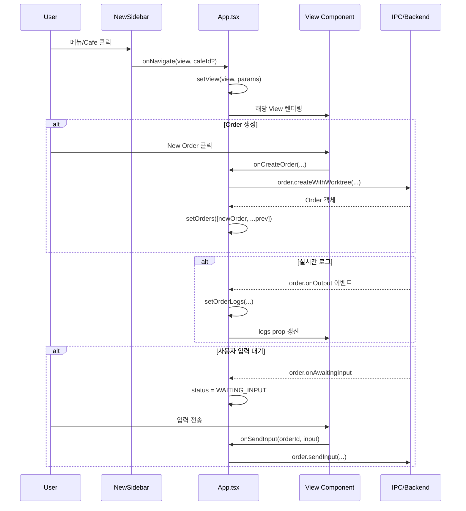

# CodeCafe 사용자 흐름 및 코드 매핑

## 📌 개요

이 문서는 디자인 마이그레이션 완료 후의 CodeCafe Desktop 애플리케이션에서 **사용자 관점의 흐름**을 분석하고, 각 화면과 기능을 **실제 코드 파일과 매핑**합니다.

---

## 1. 전체 아키텍처 구조

```
┌─────────────────────────────────────────────────────────────────────────┐
│                              App.tsx                                     │
│  (중앙 상태 관리 + VIEW_MAP 라우팅 + Data Conversion)                    │
├─────────────────────────────────────────────────────────────────────────┤
│                                                                          │
│  ┌─────────────┐   ┌──────────────────────────────────────────────────┐ │
│  │  NewSidebar │   │                 Main Content Area                │ │
│  │  (좌측 Nav) │   │                                                  │ │
│  │             │   │  VIEW_MAP = {                                    │ │
│  │ • Lobby     │──▶│    cafes:     NewGlobalLobby                     │ │
│  │ • Recipes   │──▶│    dashboard: NewCafeDashboard                   │ │
│  │ • Skills    │──▶│    workflows: NewWorkflows                       │ │
│  │ • Cafe List │──▶│    skills:    NewSkills                          │ │
│  │             │   │  }                                               │ │
│  └─────────────┘   └──────────────────────────────────────────────────┘ │
│                                                                          │
└─────────────────────────────────────────────────────────────────────────┘
```

---

## 2. 핵심 코드 파일 구조

### 2.1 라우팅 및 상태 관리

| 파일 | 역할 |
|------|------|
| [`App.tsx`](file:///c:/dev/code-cafe-manager/packages/desktop/src/renderer/App.tsx) | 중앙 상태 관리, VIEW_MAP 라우팅, 데이터 변환 |
| [`useViewStore.ts`](file:///c:/dev/code-cafe-manager/packages/desktop/src/renderer/store/useViewStore.ts) | 현재 View 상태 관리 (Zustand) |
| [`useCafeStore.ts`](file:///c:/dev/code-cafe-manager/packages/desktop/src/renderer/store/useCafeStore.ts) | Cafe 목록 및 현재 선택된 Cafe 관리 |

### 2.2 레이아웃 컴포넌트

| 파일 | 역할 |
|------|------|
| [`NewSidebar.tsx`](file:///c:/dev/code-cafe-manager/packages/desktop/src/renderer/components/layout/NewSidebar.tsx) | 좌측 네비게이션 (Global Menu + Cafe 목록) |

### 2.3 View 컴포넌트 (New Design)

| 파일 | 역할 |
|------|------|
| [`NewGlobalLobby.tsx`](file:///c:/dev/code-cafe-manager/packages/desktop/src/renderer/components/views/NewGlobalLobby.tsx) | Cafe 목록 및 등록 화면 |
| [`NewCafeDashboard.tsx`](file:///c:/dev/code-cafe-manager/packages/desktop/src/renderer/components/views/NewCafeDashboard.tsx) | Order 관리 대시보드 |
| [`NewWorkflows.tsx`](file:///c:/dev/code-cafe-manager/packages/desktop/src/renderer/components/views/NewWorkflows.tsx) | Recipe(Workflow) 관리 |
| [`NewSkills.tsx`](file:///c:/dev/code-cafe-manager/packages/desktop/src/renderer/components/views/NewSkills.tsx) | Skill 관리 |

### 2.4 타입 정의

| 파일 | 역할 |
|------|------|
| [`types/design.ts`](file:///c:/dev/code-cafe-manager/packages/desktop/src/renderer/types/design.ts) | 새 디자인용 타입 (DesignOrder, Recipe, Skill 등) |
| [`types/models.ts`](file:///c:/dev/code-cafe-manager/packages/desktop/src/renderer/types/models.ts) | 백엔드 연동 타입 (Order, Workflow 등) |

---

## 3. 사용자 흐름별 코드 매핑

### 3.1 앱 시작 → Global Lobby

```
사용자 흐름:
  앱 실행 → Global Lobby 표시 → Cafe 목록 확인

코드 흐름:
  App.tsx
    ├─ useEffect: loadCafes(), workflow.list(), skill.list()
    ├─ currentView === 'cafes'
    └─ <NewGlobalLobby cafes={...} onCreateCafe={...} onSelectCafe={...} />
```

**관련 파일:**
- [`App.tsx`](file:///c:/dev/code-cafe-manager/packages/desktop/src/renderer/App.tsx#L106-L124) - 초기 데이터 로드
- [`NewGlobalLobby.tsx`](file:///c:/dev/code-cafe-manager/packages/desktop/src/renderer/components/views/NewGlobalLobby.tsx) - Lobby UI 렌더링

---

### 3.2 Cafe 등록

```
사용자 흐름:
  "Register Cafe" 클릭 → 경로 입력 → Connect

코드 흐름:
  NewGlobalLobby.tsx
    ├─ setIsCreating(true) → 입력 폼 표시
    ├─ handleSubmit(e) → onCreateCafe(newPath)
    └─ App.tsx: handleCreateCafe(path)
         └─ window.codecafe.cafe.create({ path })
```

**관련 파일:**
- [`NewGlobalLobby.tsx`](file:///c:/dev/code-cafe-manager/packages/desktop/src/renderer/components/views/NewGlobalLobby.tsx#L15-L22) - handleSubmit
- [`App.tsx`](file:///c:/dev/code-cafe-manager/packages/desktop/src/renderer/App.tsx#L232-L238) - handleCreateCafe

---

### 3.3 Cafe 선택 → Dashboard

```
사용자 흐름:
  Cafe 카드 클릭 → Dashboard 진입 → Order 목록 확인

코드 흐름:
  NewGlobalLobby.tsx / NewSidebar.tsx
    └─ onSelectCafe(cafe.id) / onNavigate('dashboard', cafe.id)
         └─ App.tsx: handleNavigate → setView('dashboard', { cafeId })
              └─ useEffect: loadOrders() → 해당 Cafe의 Order 필터링
                   └─ <NewCafeDashboard cafe={...} orders={...} workflows={...} />
```

**관련 파일:**
- [`NewSidebar.tsx`](file:///c:/dev/code-cafe-manager/packages/desktop/src/renderer/components/layout/NewSidebar.tsx#L85-L107) - Cafe 버튼 클릭
- [`App.tsx`](file:///c:/dev/code-cafe-manager/packages/desktop/src/renderer/App.tsx#L128-L141) - Order 로드
- [`NewCafeDashboard.tsx`](file:///c:/dev/code-cafe-manager/packages/desktop/src/renderer/components/views/NewCafeDashboard.tsx) - Dashboard UI

---

### 3.4 Order 생성

```
사용자 흐름:
  Dashboard → "New Order" 클릭 → Workflow 선택 → Description 입력 → Create

코드 흐름:
  NewCafeDashboard.tsx
    ├─ setNewOrder({ workflowId, description, useWorktree })
    ├─ handleCreate(e)
    │    └─ onCreateOrder(cafeId, workflowId, description, useWorktree)
    └─ App.tsx: handleCreateOrder
         └─ window.codecafe.order.createWithWorktree({...})
              └─ 백엔드: Worktree 생성 + Order 생성
```

**관련 파일:**
- [`NewCafeDashboard.tsx`](file:///c:/dev/code-cafe-manager/packages/desktop/src/renderer/components/views/NewCafeDashboard.tsx#L84-L89) - handleCreate
- [`App.tsx`](file:///c:/dev/code-cafe-manager/packages/desktop/src/renderer/App.tsx#L241-L258) - handleCreateOrder

---

### 3.5 Order 실행 및 모니터링

```
사용자 흐름:
  Order 카드 클릭 → 상세 보기 → 실시간 로그 확인 → (사용자 입력 필요 시) 응답

코드 흐름:
  NewCafeDashboard.tsx
    ├─ setActiveOrder(order) → 우측 패널에 상세 표시
    ├─ 실시간 로그: App.tsx의 order.onOutput 이벤트 구독
    │    └─ setOrderLogs(prev => {...}) → logs prop으로 전달
    ├─ 사용자 입력 대기: order.onAwaitingInput 이벤트
    │    └─ status를 WAITING_INPUT으로 변경
    └─ 입력 전송: handleTerminalSubmit → onSendInput(orderId, input)
         └─ App.tsx: handleSendInput → window.codecafe.order.sendInput
```

**관련 파일:**
- [`NewCafeDashboard.tsx`](file:///c:/dev/code-cafe-manager/packages/desktop/src/renderer/components/views/NewCafeDashboard.tsx#L91-L96) - handleTerminalSubmit
- [`App.tsx`](file:///c:/dev/code-cafe-manager/packages/desktop/src/renderer/App.tsx#L143-L173) - 이벤트 구독
- [`App.tsx`](file:///c:/dev/code-cafe-manager/packages/desktop/src/renderer/App.tsx#L267-L274) - handleSendInput

---

### 3.6 Recipe(Workflow) 관리

```
사용자 흐름:
  Sidebar "Recipes" 클릭 → Recipe 목록 → 생성/수정/삭제

코드 흐름:
  NewSidebar.tsx: onNavigate('workflows')
    └─ App.tsx: currentView === 'workflows'
         └─ <NewWorkflows 
              recipes={...}
              skills={...}
              onAddRecipe={handleAddRecipe}
              onUpdateRecipe={handleUpdateRecipe}
              onDeleteRecipe={handleDeleteRecipe}
            />
```

**주요 기능:**
| 기능 | NewWorkflows 함수 | App.tsx 핸들러 | IPC API |
|------|------------------|----------------|---------|
| 생성 | handleSave (isEditing=false) | handleAddRecipe | workflow.create |
| 수정 | handleSave (isEditing=true) | handleUpdateRecipe | workflow.update |
| 삭제 | onDeleteRecipe(id) | handleDeleteRecipe | workflow.delete |
| Stage 추가 | addStage() | - | - |
| Stage 삭제 | removeStage(index) | - | - |
| Skill 할당 | addSkillToStage() | - | - |

**관련 파일:**
- [`NewWorkflows.tsx`](file:///c:/dev/code-cafe-manager/packages/desktop/src/renderer/components/views/NewWorkflows.tsx)
- [`App.tsx`](file:///c:/dev/code-cafe-manager/packages/desktop/src/renderer/App.tsx#L176-L195) - Recipe CRUD

---

### 3.7 Skill 관리

```
사용자 흐름:
  Sidebar "Skills" 클릭 → Skill 목록 → 생성/수정/삭제

코드 흐름:
  NewSidebar.tsx: onNavigate('skills')
    └─ App.tsx: currentView === 'skills'
         └─ <NewSkills 
              skills={...}
              onAddSkill={handleAddSkill}
              onUpdateSkill={handleUpdateSkill}
              onDeleteSkill={handleDeleteSkill}
            />
```

**주요 기능:**
| 기능 | NewSkills 함수 | App.tsx 핸들러 | IPC API |
|------|---------------|----------------|---------|
| 생성 | handleSubmit (editingSkill=null) | handleAddSkill | skill.create |
| 수정 | handleSubmit (editingSkill!=null) | handleUpdateSkill | skill.update |
| 삭제 | onDeleteSkill(id) | handleDeleteSkill | skill.delete |

**카테고리:**
- `planning` - 파란색
- `implementation` - 브랜드 색상 (주황)
- `verification` - 보라색
- `review` - 에메랄드색

**관련 파일:**
- [`NewSkills.tsx`](file:///c:/dev/code-cafe-manager/packages/desktop/src/renderer/components/views/NewSkills.tsx)
- [`App.tsx`](file:///c:/dev/code-cafe-manager/packages/desktop/src/renderer/App.tsx#L208-L229) - Skill CRUD

---

## 4. 데이터 변환 레이어

App.tsx에서 백엔드 타입과 디자인 타입 간의 변환을 담당합니다:

```typescript
// Backend → Design 변환
convertToDesignOrder(order: Order): DesignOrder
convertToDesignRecipe(wf: Workflow): Recipe
convertToDesignCafe(cafe: Cafe): DesignCafe
convertToDesignSkill(skill: Skill): DesignSkill

// Design → Backend 변환
convertToBackendSkill(skill: DesignSkill): Skill
```

**주요 매핑:**
| Backend 타입 | Design 타입 | 비고 |
|-------------|-------------|------|
| Order.counter | DesignOrder.cafeId | Cafe 식별자 |
| Order.endedAt | DesignOrder.completedAt | 시간 필드명 |
| Skill.skillCommand | DesignSkill.instructions | 명령/지침 필드 |
| Workflow | Recipe | 동일 구조, 이름만 다름 |

---

## 5. 이벤트 흐름 다이어그램



---

## 6. 화면별 주요 Props 요약

### 6.1 NewGlobalLobby

```typescript
interface NewGlobalLobbyProps {
  cafes: Cafe[];
  onCreateCafe: (path: string) => void;
  onSelectCafe: (id: string) => void;
}
```

### 6.2 NewCafeDashboard

```typescript
interface NewCafeDashboardProps {
  cafe: Cafe;
  orders: DesignOrder[];
  workflows: Recipe[];
  onCreateOrder: (cafeId, workflowId, description, useWorktree) => void;
  onDeleteOrder: (orderId: string) => void;
  onSendInput: (orderId: string, input: string) => void;
}
```

### 6.3 NewWorkflows

```typescript
interface NewWorkflowsProps {
  recipes: Recipe[];
  skills: Skill[];
  onAddRecipe: (recipe: Recipe) => void;
  onUpdateRecipe: (recipe: Recipe) => void;
  onDeleteRecipe: (id: string) => void;
}
```

### 6.4 NewSkills

```typescript
interface NewSkillsProps {
  skills: Skill[];
  onAddSkill: (skill: Skill) => void;
  onUpdateSkill: (skill: Skill) => void;
  onDeleteSkill: (id: string) => void;
}
```

---

## 7. 결론

디자인 마이그레이션 후의 CodeCafe는 다음과 같은 구조를 가집니다:

1. **App.tsx**: 중앙 상태 관리 + VIEW_MAP 기반 라우팅 + 데이터 변환
2. **NewSidebar**: 전역 네비게이션 (Lobby, Recipes, Skills) + Cafe 목록
3. **4개의 주요 View**:
   - `NewGlobalLobby` - Cafe 관리
   - `NewCafeDashboard` - Order 관리 + 실행 모니터링
   - `NewWorkflows` - Recipe(Workflow) CRUD
   - `NewSkills` - Skill CRUD

핵심 흐름:
```
Lobby → Cafe 선택 → Dashboard → Order 생성 → 실행 → 로그 모니터링 → (입력 대기) → 완료
```
