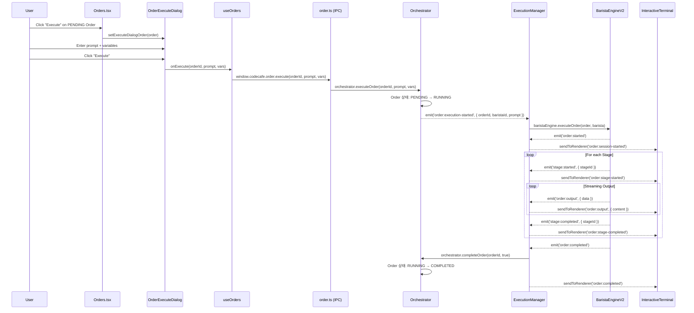

# Order 실행 흐름 분석 (마이그레이션 이전 버전)

## 📌 개요

이 문서는 **디자인 마이그레이션 이전**의 Order 실행 흐름을 Desktop 관점에서 분석합니다.
신규 디자인 컴포넌트 개발 시 참고 자료로 활용됩니다.

---

## 1. Order 실행 전체 흐름도

```
┌───────────────────────────────────────────────────────────────────────────────────────┐
│                           RENDERER (Frontend)                                          │
├───────────────────────────────────────────────────────────────────────────────────────┤
│                                                                                        │
│  ① Orders.tsx                 ② OrderExecuteDialog.tsx       ③ useOrders.ts          │
│  ┌──────────────────┐         ┌──────────────────────┐       ┌───────────────────┐   │
│  │ PENDING Order    │ click   │ Prompt 입력 Dialog   │ submit│ executeOrder()    │   │
│  │ [Execute] 버튼   │────────▶│  • Task Description  │──────▶│  window.codecafe  │   │
│  │                  │         │  • Variables (K=V)   │       │   .order.execute  │   │
│  └──────────────────┘         └──────────────────────┘       └─────────┬─────────┘   │
│                                                                         │             │
│  ⑥ 실시간 이벤트 구독                                                   │ IPC invoke  │
│  ┌────────────────────────────┐                                         │             │
│  │ window.codecafe.order      │                                         │             │
│  │  .onOutput(callback)       │◀─────── order:output ───────────────────┤             │
│  │  .onStageStarted(cb)       │◀─────── order:stage-started             │             │
│  │  .onStageCompleted(cb)     │◀─────── order:stage-completed           │             │
│  │  .onCompleted(cb)          │◀─────── order:completed                 │             │
│  │  .onFailed(cb)             │◀─────── order:failed                    │             │
│  │  .onAwaitingInput(cb)      │◀─────── order:awaiting-input            │             │
│  └────────────────────────────┘                                         │             │
│                                                                         │             │
└─────────────────────────────────────────────────────────────────────────┼─────────────┘
                                                                          │
                                                         ─────────────────┼──────────────
                                                                          │ preload/IPC
                                                         ─────────────────┼──────────────
                                                                          │
┌─────────────────────────────────────────────────────────────────────────┼─────────────┐
│                           MAIN PROCESS (Backend)                        │             │
├─────────────────────────────────────────────────────────────────────────┼─────────────┤
│                                                                         ▼             │
│  ④ order.ts (IPC Handler)                                                             │
│  ┌───────────────────────────────────────────────────────────────────────────────┐   │
│  │ ipcMain.handle('order:execute', (_, orderId, prompt, vars) => {               │   │
│  │   await orchestrator.executeOrder(orderId, prompt, vars || {});               │   │
│  │   return { started: true };                                                   │   │
│  │ })                                                                            │   │
│  └───────────────────────────────────────────────────────────────────────────────┘   │
│                                        │                                             │
│                                        ▼                                             │
│  ⑤ Orchestrator (@codecafe/core)                                                     │
│  ┌───────────────────────────────────────────────────────────────────────────────┐   │
│  │ executeOrder(orderId, prompt, vars)                                           │   │
│  │   1. Order 조회 및 상태 검증 (PENDING → RUNNING)                               │   │
│  │   2. 사용 가능한 Barista 할당                                                  │   │
│  │   3. emit('order:execution-started', { orderId, baristaId, prompt })          │   │
│  └────────────────────────────────┬──────────────────────────────────────────────┘   │
│                                   │ event                                            │
│                                   ▼                                                  │
│  ⑥ ExecutionManager                                                                  │
│  ┌───────────────────────────────────────────────────────────────────────────────┐   │
│  │ on('order:execution-started', async (data) => {                               │   │
│  │   await handleOrderExecution(orderId, baristaId, prompt)                      │   │
│  │ })                                                                            │   │
│  │                                                                               │   │
│  │ handleOrderExecution:                                                         │   │
│  │   1. Order, Barista 조회                                                      │   │
│  │   2. sendToRenderer('order:execution-progress', { stage: 'starting' })        │   │
│  │   3. baristaEngine.executeOrder(order, barista)                               │   │
│  │   4. 완료/실패에 따라 orchestrator.completeOrder() 호출                        │   │
│  └────────────────────────────────┬──────────────────────────────────────────────┘   │
│                                   │                                                  │
│                                   ▼                                                  │
│  ⑦ BaristaEngineV2 (@codecafe/orchestrator)                                         │
│  ┌───────────────────────────────────────────────────────────────────────────────┐   │
│  │ executeOrder(order, barista):                                                 │   │
│  │   1. OrderSession 생성/조회                                                   │   │
│  │   2. Workflow 로드 (moon.workflow.yml)                                        │   │
│  │   3. Session.run() → Stage별 순차 실행                                        │   │
│  │   4. TerminalPool → ProviderAdapter → Claude CLI 실행                         │   │
│  │   5. SignalParser로 AI 출력 파싱 (proceed/await_user/retry)                   │   │
│  │                                                                               │   │
│  │ 이벤트 발생:                                                                   │   │
│  │   emit('order:started', { orderId })                                          │   │
│  │   emit('order:output', { orderId, data })                                     │   │
│  │   emit('stage:started', { orderId, stageId, provider })                       │   │
│  │   emit('stage:completed', { orderId, stageId, output, duration })             │   │
│  │   emit('stage:failed', { orderId, stageId, error })                           │   │
│  │   emit('order:completed', { orderId })                                        │   │
│  │   emit('order:failed', { orderId, error })                                    │   │
│  └───────────────────────────────────────────────────────────────────────────────┘   │
│                                                                                      │
└──────────────────────────────────────────────────────────────────────────────────────┘
```

---

## 2. 컴포넌트별 코드 매핑

### 2.1 Renderer (Frontend)

#### ① Orders.tsx (Order 목록 및 카드)

**파일:** [`packages/desktop/src/renderer/components/views/Orders.tsx`](file:///c:/dev/code-cafe-manager/packages/desktop/src/renderer/components/views/Orders.tsx)

```typescript
// PENDING Order에 Execute 버튼 표시
{activeOrder.status === OrderStatus.PENDING && (
  <button onClick={() => handleOpenExecuteDialog(activeOrder)}>
    Execute
  </button>
)}

// Execute Dialog 열기
function handleOpenExecuteDialog(order: Order): void {
  setExecuteDialogOrder(order);
}

// 실행 핸들러 (OrderExecuteDialog에서 호출)
async function handleExecuteOrder(
  orderId: string,
  prompt: string,
  vars: Record<string, string>
): Promise<void> {
  await executeOrder(orderId, prompt, vars);  // useOrders hook
  setActiveOrderId(orderId);
  setActiveTab('summary');
}
```

**핵심 상태:**
- `executeDialogOrder`: 실행 대화상자에 표시할 Order
- `activeOrderId`: 현재 선택된 Order (상세 보기)
- `workflowStages`: Workflow별 Stage 정보 캐시

---

#### ② OrderExecuteDialog.tsx (실행 대화상자)

**파일:** [`packages/desktop/src/renderer/components/order/OrderExecuteDialog.tsx`](file:///c:/dev/code-cafe-manager/packages/desktop/src/renderer/components/order/OrderExecuteDialog.tsx)

```typescript
interface OrderExecuteDialogProps {
  isOpen: boolean;
  onClose: () => void;
  onExecute: (orderId: string, prompt: string, vars: Record<string, string>) => Promise<void>;
  order: Order | null;
}

// 사용자 입력
const [prompt, setPrompt] = useState('');           // Task Description (필수)
const [vars, setVars] = useState<Record<string, string>>({});  // Variables (key=value)

// 제출 핸들러
const handleSubmit = async () => {
  if (!prompt.trim()) {
    setError('Please enter a task description');
    return;
  }
  setIsSubmitting(true);
  try {
    await onExecute(order.id, prompt, vars);
    onClose();
  } catch (err) {
    setError(err.message);
  }
};
```

**UI 구성:**
1. Order 정보 표시 (Workflow명, ID, Provider, Branch)
2. Task Description 입력 (필수)
3. Variables 입력 (key=value 형태, 선택)
4. Execute 버튼

---

#### ③ useOrders.ts (Hook)

**파일:** [`packages/desktop/src/renderer/hooks/useOrders.ts`](file:///c:/dev/code-cafe-manager/packages/desktop/src/renderer/hooks/useOrders.ts)

```typescript
const executeOrder = async (orderId: string, prompt: string, vars: Record<string, string>) => {
  try {
    const response = await window.codecafe.order.execute(orderId, prompt, vars);
    if (!response.success) {
      throw new Error(response.error?.message || 'Failed to execute order');
    }
    await fetchOrders();  // Order 목록 갱신
    return response.data;
  } catch (error) {
    console.error('Failed to execute order:', error);
    throw error;
  }
};
```

---

#### ⑥ 실시간 이벤트 구독 (preload)

**파일:** [`packages/desktop/src/preload/index.cts`](file:///c:/dev/code-cafe-manager/packages/desktop/src/preload/index.cts)

```typescript
order: {
  execute: createIpcInvoker('order:execute'),
  sendInput: createIpcInvoker('order:sendInput'),
  subscribeOutput: createIpcInvoker('order:subscribeOutput'),
  unsubscribeOutput: createIpcInvoker('order:unsubscribeOutput'),
  
  // 이벤트 구독
  onOutput: (callback) => createIpcListener('order:output', callback),
  onStageStarted: (callback) => createIpcListener('order:stage-started', callback),
  onStageCompleted: (callback) => createIpcListener('order:stage-completed', callback),
  onCompleted: (callback) => createIpcListener('order:completed', callback),
  onFailed: (callback) => createIpcListener('order:failed', callback),
  onAwaitingInput: (callback) => createIpcListener('order:awaiting-input', callback),
}
```

---

### 2.2 Main Process (Backend)

#### ④ order.ts (IPC Handler)

**파일:** [`packages/desktop/src/main/ipc/order.ts`](file:///c:/dev/code-cafe-manager/packages/desktop/src/main/ipc/order.ts#L519-L530)

```typescript
ipcMain.handle(
  'order:execute',
  async (_, orderId: string, prompt: string, vars?: Record<string, string>) =>
    handleIpc(async () => {
      console.log('[Order IPC] Executing order:', orderId);
      console.log('[Order IPC] Prompt:', prompt);
      console.log('[Order IPC] Vars:', vars);

      await orchestrator.executeOrder(orderId, prompt, vars || {});
      return { started: true };
    }, 'order:execute')
);
```

---

#### ⑤ Orchestrator (@codecafe/core)

**역할:**
- Order 상태 관리 (PENDING → RUNNING → COMPLETED/FAILED)
- Barista 할당
- 이벤트 발생: `order:execution-started`

---

#### ⑥ ExecutionManager

**파일:** [`packages/desktop/src/main/execution-manager.ts`](file:///c:/dev/code-cafe-manager/packages/desktop/src/main/execution-manager.ts)

```typescript
// Orchestrator 이벤트 리스너
this.orchestrator.on('order:execution-started', async (data) => {
  await this.handleOrderExecution(data.orderId, data.baristaId, data.prompt);
});

// Order 실행 처리
private async handleOrderExecution(orderId: string, baristaId: string, prompt: string) {
  // 1. Order, Barista 조회
  const order = this.orchestrator.getOrder(orderId);
  const barista = this.orchestrator.getBarista(baristaId);
  
  // 2. UI에 시작 알림
  this.sendToRenderer('order:execution-progress', {
    orderId,
    stage: 'starting',
    message: 'Execution started',
  });
  
  // 3. BaristaEngine을 통해 실행
  const executionOrder = { ...order, prompt };
  await this.baristaEngine.executeOrder(executionOrder, barista);
  
  // 4. 완료 처리
  await this.orchestrator.completeOrder(orderId, true);
}
```

**BaristaEngine 이벤트 전달:**
```typescript
// order:output → UI 전송
this.baristaEngine.on('order:output', (data) => {
  this.sendToRenderer('order:output', {
    orderId: data.orderId,
    timestamp: new Date().toISOString(),
    type: 'stdout',
    content: convertAnsiToHtml(data.data),  // ANSI → HTML
  });
});

// stage:started → UI 전송
this.baristaEngine.on('stage:started', (data) => {
  this.sendToRenderer('order:stage-started', {
    orderId: data.orderId,
    stageId: data.stageId,
    provider: data.provider,
  });
});

// stage:completed → UI 전송
this.baristaEngine.on('stage:completed', (data) => {
  this.sendToRenderer('order:stage-completed', {
    orderId: data.orderId,
    stageId: data.stageId,
    output: data.output,
    duration: data.duration,
  });
});
```

---

#### ⑦ BaristaEngineV2 (@codecafe/orchestrator)

**역할:**
- OrderSession 관리
- Workflow 로드 및 Stage별 실행
- TerminalPool → ProviderAdapter → Claude CLI
- SignalParser로 AI 출력 파싱 (proceed/await_user/retry)

---

## 3. 이벤트 시퀀스 다이어그램



---

## 4. 핵심 UI 컴포넌트

### 4.1 InteractiveTerminal (실시간 출력)

**파일:** [`packages/desktop/src/renderer/components/order/InteractiveTerminal.tsx`](file:///c:/dev/code-cafe-manager/packages/desktop/src/renderer/components/order/InteractiveTerminal.tsx)

**기능:**
- 실시간 출력 스트리밍 (`window.codecafe.order.onOutput`)
- ANSI escape 코드 처리
- 사용자 입력 전송 (`window.codecafe.order.sendInput`)
- 명령어 히스토리 (↑/↓)

### 4.2 OrderStageProgress (Stage 진행)

**파일:** [`packages/desktop/src/renderer/components/order/OrderStageProgress.tsx`](file:///c:/dev/code-cafe-manager/packages/desktop/src/renderer/components/order/OrderStageProgress.tsx)

**기능:**
- Stage별 상태 뱃지 (pending/running/completed/failed)
- 진행률 바 + 상태 메시지

---

## 5. 신규 디자인 컴포넌트 요구사항

신규 디자인 컴포넌트에서 지원해야 할 기능:

### 5.1 Execute Dialog (실행 대화상자)
- [ ] Task Description 입력 (필수)
- [ ] Variables 입력 (key=value, 선택)
- [ ] Order 정보 표시 (Workflow명, Provider, Branch)
- [ ] 로딩 상태 + 에러 표시

### 5.2 실시간 Term Output (터미널 출력)
- [ ] `order:output` 이벤트 구독/처리
- [ ] ANSI → HTML 변환 (색상/스타일 유지)
- [ ] 자동 스크롤 + 일시정지 토글
- [ ] 사용자 입력 필드 (RUNNING 상태)

### 5.3 Stage Progress (진행 상황)
- [ ] `order:stage-started` / `order:stage-completed` / `order:stage-failed` 이벤트 구독
- [ ] Stage별 상태 아이콘 (pending/running/completed/failed)
- [ ] 진행률 바 + 상태 메시지

### 5.4 Order Status Events (상태 이벤트)
- [ ] `order:completed` 이벤트 → 상태 업데이트
- [ ] `order:failed` 이벤트 → 에러 표시
- [ ] `order:awaiting-input` 이벤트 → 입력 요청 UI 표시

---

## 6. IPC API 요약

| API | 용도 |
|-----|------|
| `order.execute(orderId, prompt, vars)` | Order 실행 시작 |
| `order.sendInput(orderId, message)` | 사용자 입력 전송 |
| `order.subscribeOutput(orderId)` | 출력 스트림 구독 |
| `order.unsubscribeOutput(orderId)` | 출력 스트림 구독 해제 |
| `order.onOutput(callback)` | 출력 이벤트 리스너 |
| `order.onStageStarted(callback)` | Stage 시작 이벤트 |
| `order.onStageCompleted(callback)` | Stage 완료 이벤트 |
| `order.onCompleted(callback)` | Order 완료 이벤트 |
| `order.onFailed(callback)` | Order 실패 이벤트 |
| `order.onAwaitingInput(callback)` | 입력 대기 이벤트 |
