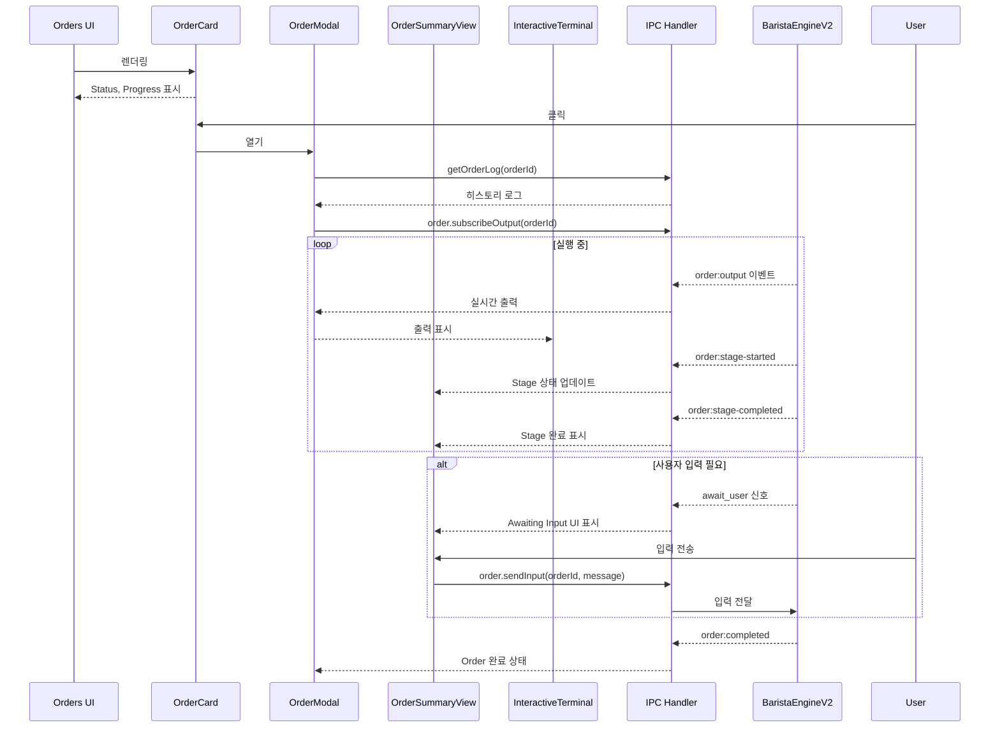

# Order 실행 UI 분석

## 📌 개요

`main-user-flow.md`에서 **Order 실행 이후의 UI**에 대한 상세 문서가 누락되어 있음을 확인했습니다. 이 문서는 Order 실행 시 UI가 어떻게 동작하는지를 분석한 결과입니다.

---

## 1. 분석 결과 요약

### 1.1 main-user-flow.md의 누락 사항

현재 `main-user-flow.md`는 다음을 다루고 있습니다:
- ✅ Cafe 등록 흐름
- ✅ Order 생성 + Worktree 생성 흐름
- ✅ Workflow/Recipe 실행 시퀀스 (백엔드)
- ❌ **Order 실행 중/후 UI 컴포넌트** (누락)
- ❌ **Stage 진행 상황 표시 UI** (누락)
- ❌ **터미널 출력 표시 UI** (누락)
- ❌ **사용자 입력 처리 UI** (누락)

---

## 2. Order 실행 UI 컴포넌트 구조

```
Order 실행 시 UI 흐름
=====================

┌─────────────────────────────────────────────────────────────────┐
│                        Orders View (KanbanBoard)                 │
│  ┌─────────────┐  ┌─────────────┐  ┌─────────────┐              │
│  │ OrderCard   │  │ OrderCard   │  │ OrderCard   │  ...         │
│  │ (PENDING)   │  │ (RUNNING)   │  │ (COMPLETED) │              │
│  │ [Execute]   │  │ [Cancel]    │  │ [Delete]    │              │
│  └──────┬──────┘  └──────┬──────┘  └─────────────┘              │
└─────────┼────────────────┼──────────────────────────────────────┘
          │                │
          ▼ click          ▼ click
┌─────────────────────────────────────────────────────────────────┐
│                      OrderModal (Dialog)                         │
│  ┌───────────────────────────────────────────────────────────┐  │
│  │ Header: WorkflowName | Order ID | [Summary] [Timeline]    │  │
│  └───────────────────────────────────────────────────────────┘  │
│  ┌───────────────────────────────────────────────────────────┐  │
│  │ Tab: Summary                                               │  │
│  │  ┌─────────────────────────────────────────────────────┐  │  │
│  │  │ OrderSummaryView                                     │  │  │
│  │  │  ├─ OrderStageProgressBar (진행률 바)                │  │  │
│  │  │  ├─ OrderStageProgress (Stage 뱃지)                  │  │  │
│  │  │  └─ User Input Section (입력 대기 시)                │  │  │
│  │  └─────────────────────────────────────────────────────┘  │  │
│  │  ┌─────────────────────────────────────────────────────┐  │  │
│  │  │ Terminal Output (하단 고정)                          │  │  │
│  │  │  └─ 실시간 출력 스트리밍                             │  │  │
│  │  └─────────────────────────────────────────────────────┘  │  │
│  └───────────────────────────────────────────────────────────┘  │
│  ┌───────────────────────────────────────────────────────────┐  │
│  │ Tab: Timeline                                              │  │
│  │  ┌─────────────────────────────────────────────────────┐  │  │
│  │  │ OrderTimelineView                                    │  │  │
│  │  │  ├─ stage_start 이벤트                              │  │  │
│  │  │  ├─ log 그룹 (접을 수 있음)                         │  │  │
│  │  │  ├─ stage_complete 이벤트                           │  │  │
│  │  │  └─ input 이벤트 (사용자 입력)                      │  │  │
│  │  └─────────────────────────────────────────────────────┘  │  │
│  └───────────────────────────────────────────────────────────┘  │
└─────────────────────────────────────────────────────────────────┘

                    또는

┌─────────────────────────────────────────────────────────────────┐
│                   OrderDetailView (Full Page)                    │
│  ┌────────────────────────┬──────────────────────────────────┐  │
│  │     Left Panel         │         Right Panel              │  │
│  │  ┌──────────────────┐  │  ┌────────────────────────────┐  │  │
│  │  │ Order Info Card  │  │  │   InteractiveTerminal      │  │  │
│  │  │  - Provider      │  │  │   ├─ Output 영역           │  │  │
│  │  │  - Created       │  │  │   │   (스트리밍 출력)      │  │  │
│  │  │  - Started       │  │  │   │                        │  │  │
│  │  │  - Branch        │  │  │   └─ Input 영역            │  │  │
│  │  └──────────────────┘  │  │       [텍스트 입력] [Send] │  │  │
│  │  ┌──────────────────┐  │  └────────────────────────────┘  │  │
│  │  │ Prompt Card      │  │                                  │  │
│  │  └──────────────────┘  │                                  │  │
│  │  ┌──────────────────┐  │                                  │  │
│  │  │ Variables Card   │  │                                  │  │
│  │  └──────────────────┘  │                                  │  │
│  │  ┌──────────────────┐  │                                  │  │
│  │  │ Stage Progress   │  │                                  │  │
│  │  │  - ProgressBar   │  │                                  │  │
│  │  │  - Stage Badges  │  │                                  │  │
│  │  └──────────────────┘  │                                  │  │
│  │  ┌──────────────────┐  │                                  │  │
│  │  │ Error Card       │  │                                  │  │
│  │  │ (실패 시)        │  │                                  │  │
│  │  └──────────────────┘  │                                  │  │
│  │  ┌──────────────────┐  │                                  │  │
│  │  │ Retry Options    │  │                                  │  │
│  │  │ (실패 시)        │  │                                  │  │
│  │  │ [Retry] [Close]  │  │                                  │  │
│  │  └──────────────────┘  │                                  │  │
│  └────────────────────────┴──────────────────────────────────┘  │
└─────────────────────────────────────────────────────────────────┘
```

---

## 3. 컴포넌트별 상세 기능

### 3.1 OrderCard

> 파일: `components/orders/OrderCard.tsx`

| 기능 | 설명 |
|------|------|
| **상태 표시** | `StatusBadge`로 PENDING/RUNNING/COMPLETED/FAILED/CANCELLED 표시 |
| **진행률 표시** | `OrderStageProgressBar`로 현재 진행 상황 시각화 |
| **Execute 버튼** | PENDING 상태에서만 표시, Order 실행 트리거 |
| **Cancel 버튼** | PENDING/RUNNING 상태에서 Order 취소 |
| **Delete 버튼** | COMPLETED/FAILED/CANCELLED 상태에서 Order 삭제 |
| **클릭 이벤트** | 카드 클릭 시 `OrderModal` 또는 `OrderDetailView` 열기 |

---

### 3.2 OrderStageProgress / OrderStageProgressBar

> 파일: `components/order/OrderStageProgress.tsx`

#### StageStatus 타입
```typescript
type StageStatus = 'pending' | 'running' | 'completed' | 'failed' | 'skipped';
```

#### OrderStageProgress (뱃지 형태)
- Stage별 상태 아이콘 (CheckCircle, Loader2, XCircle, Circle)
- 현재 Stage 하이라이트 (ring-2 ring-coffee/30)
- Stage 간 연결선 표시

#### OrderStageProgressBar (진행바 형태)
| 색상 | 의미 |
|------|------|
| 🟢 Green | 완료된 Stage |
| 🟠 Coffee (Orange) | 실행 중인 Stage |
| 🔴 Red | 실패한 Stage |

**진행 상태 메시지 형식**:
- 실패 시: `"Stage X/N failed: {stageName}"`
- 실행 중: `"Stage X/N: {stageName}"`
- 완료 시: `"All N stages completed"`
- 기본: `"X/N completed"`

---

### 3.3 OrderModal

> 파일: `components/orders/OrderModal.tsx`

**탭 구조**:
1. **Summary** 탭: `OrderSummaryView` + Terminal Output
2. **Timeline** 탭: `OrderTimelineView`

**주요 기능**:
- 실시간 로그 구독 (`window.codecafe.order.onOutput`)
- 히스토리 로그 로드 (`window.codecafe.getOrderLog`)
- 자동 스크롤 (새 출력 시)
- 사용자 입력 전송 (RUNNING 상태에서만)

---

### 3.4 OrderSummaryView

> 파일: `components/orders/OrderSummaryView.tsx`

**구성 요소**:
1. **Pipeline Progress**: Stage 진행률 바 + 뱃지
2. **Awaiting Input Section** (노란색 강조):
   - `awaitingInput.required === true`일 때만 표시
   - ⚠️ "Action Required" 헤더
   - 프롬프트 메시지 표시
   - 입력 필드 + Send 버튼
3. **General Input Section** (RUNNING 상태):
   - 실행 중 언제든 메시지 전송 가능
   - MessageSquare 아이콘

---

### 3.5 OrderTimelineView

> 파일: `components/orders/OrderTimelineView.tsx`

**이벤트 타입**:
```typescript
type TimelineEventType = 'stage_start' | 'stage_complete' | 'stage_fail' | 'log' | 'input' | 'system';
```

**이벤트별 시각화**:
| 타입 | 아이콘 | 배경색 |
|------|--------|--------|
| stage_start | ▶️ Play (Blue) | Blue 10% |
| stage_complete | ✅ CheckCircle (Green) | Green 10% |
| stage_fail | ❌ XCircle (Red) | Red 10% |
| input | 💬 MessageSquare (Yellow) | Yellow 10% |
| system | 🖥️ Terminal (Gray) | Gray |
| log | ⭕ Circle (Gray) | Gray |

**로그 그룹화**:
- 연속된 `log` 이벤트는 접을 수 있는 그룹으로 표시
- 기본 3개까지 미리보기
- "Show X more lines..." 버튼으로 확장

---

### 3.6 InteractiveTerminal

> 파일: `components/order/InteractiveTerminal.tsx`

**기능**:
- 실시간 출력 스트리밍 표시
- ANSI escape 코드 처리/제거
- 출력 타입별 색상 구분:
  - stdout: Gray
  - stderr: Red
  - system: Blue
  - user-input: Coffee (Orange)
- 자동 스크롤 (토글 가능)
- 명령어 히스토리 (↑/↓ 화살표)
- 입력 필드 + Send 버튼 (RUNNING 상태에서만)

---

### 3.7 OrderDetailView (Full Page)

> 파일: `components/order/OrderDetailView.tsx`

**레이아웃**:
- **Left Panel** (320px): Order 정보, Prompt, Variables, Stage Progress, Error, Retry Options
- **Right Panel** (flex-1): InteractiveTerminal

**주요 기능**:

1. **실시간 Order 상태 갱신**:
   - 3초 간격 폴링 (`ORDER_REFRESH_INTERVAL_MS`)
   
2. **실시간 Stage 이벤트 리스너**:
   - `onStageStarted`: currentStageIndex 업데이트
   - `onStageCompleted`: completedStages Set에 추가
   
3. **Retry Options** (FAILED 상태):
   - "특정 Stage부터" 재시도
   - "처음부터 (컨텍스트 유지)" 재시도
   - Stage 선택 드롭다운

---

### 3.8 TerminalOutputPanel

> 파일: `components/terminal/TerminalOutputPanel.tsx`

**상태 표시**:
```typescript
type OutputStatus = 'initializing' | 'ready' | 'running' | 'completed' | 'failed';
```

**기능**:
- 구독 기반 출력 스트리밍 (`subscribeOutput`/`unsubscribeOutput`)
- 출력 상태 표시 (Initializing/Running/Completed/Failed)
- 자동 스크롤 토글
- ANSI 코드 → HTML 변환 (`ansi-to-html`)
- 타임스탬프 + 라인 수 표시

---

## 4. 데이터 흐름 다이어그램



---

## 5. 이벤트 흐름 정리

### 5.1 IPC 이벤트 (Main → Renderer)

| 이벤트 | 발생 시점 | 핸들러 |
|--------|----------|--------|
| `order:output` | AI Provider 출력 시 | OrderModal, InteractiveTerminal |
| `order:stage-started` | Stage 시작 시 | OrderDetailView |
| `order:stage-completed` | Stage 완료 시 | OrderDetailView |
| `order:completed` | Order 완료 시 | TerminalOutputPanel |
| `order:failed` | Order 실패 시 | TerminalOutputPanel |

### 5.2 IPC API (Renderer → Main)

| API | 용도 |
|-----|------|
| `order.get(orderId)` | Order 정보 조회 |
| `order.execute(orderId)` | Order 실행 |
| `order.cancel(orderId)` | Order 취소 |
| `order.delete(orderId)` | Order 삭제 |
| `order.sendInput(orderId, message)` | 사용자 입력 전송 |
| `order.subscribeOutput(orderId)` | 출력 스트림 구독 |
| `order.unsubscribeOutput(orderId)` | 출력 스트림 구독 해제 |
| `order.onOutput(callback)` | 출력 이벤트 리스너 |
| `order.onStageStarted(callback)` | Stage 시작 이벤트 리스너 |
| `order.onStageCompleted(callback)` | Stage 완료 이벤트 리스너 |
| `order.getRetryOptions(orderId)` | 재시도 옵션 조회 |
| `order.retryFromStage(orderId, stageId)` | 특정 Stage부터 재시도 |
| `order.retryFromBeginning(orderId, includeContext)` | 처음부터 재시도 |
| `getOrderLog(orderId)` | 히스토리 로그 조회 |

---

## 6. 결론

`main-user-flow.md`에 추가되어야 할 내용:
1. **Order 실행 UI 컴포넌트 구조** (섹션 3 이후)
2. **Stage 진행 상황 표시 UI** (OrderStageProgress)
3. **터미널 출력 표시 UI** (InteractiveTerminal, TerminalOutputPanel)
4. **사용자 입력 처리 UI** (OrderSummaryView의 Awaiting Input)
5. **Timeline 이벤트 표시** (OrderTimelineView)
6. **실패 시 재시도 UI** (OrderDetailView의 Retry Options)
