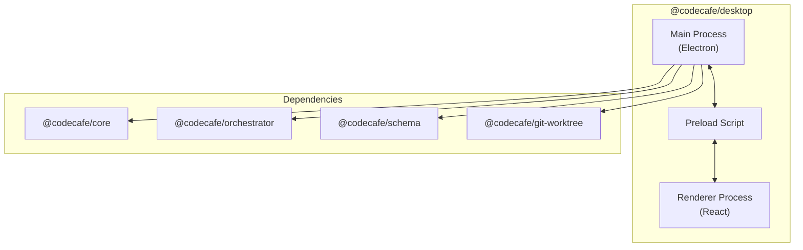
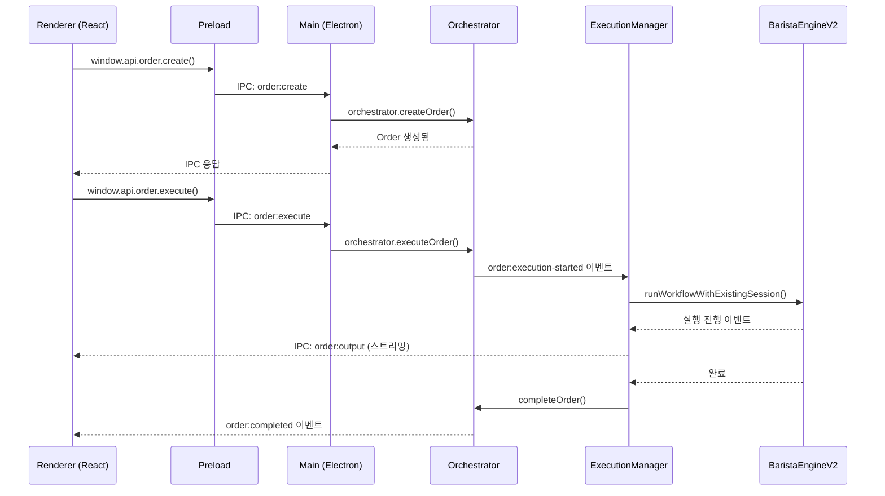

# Desktop 모듈 아키텍처 분석

## 개요

`@codecafe/desktop`은 Electron 기반의 데스크톱 애플리케이션으로, CodeCafe Manager의 UI 레이어를 담당합니다.



---

## Main Process (Electron)

### 진입점: [index.ts](file:///c:/dev/code-cafe-manager/packages/desktop/src/main/index.ts)

| 기능 | 설명 |
|------|------|
| **Orchestrator 초기화** | `@codecafe/core`의 `Orchestrator` 인스턴스 생성 및 시작 |
| **ExecutionManager 초기화** | `BaristaEngineV2`와 연동하여 실제 Provider 실행 관리 |
| **IPC 핸들러 등록** | Renderer와의 통신을 위한 9개 핸들러 등록 |
| **BrowserWindow 생성** | 1600x900 해상도의 메인 윈도우 생성 |

### ExecutionManager: [execution-manager.ts](file:///c:/dev/code-cafe-manager/packages/desktop/src/main/execution-manager.ts)

Provider 실행을 관리하는 핵심 컴포넌트:

- `BaristaEngineV2` 통합 (세션 기반 실행)
- 터미널 풀 관리
- Orchestrator 이벤트 수신 → Renderer 전달
- Order 실행/입력 처리

### IPC 핸들러 모듈

| 핸들러 | 파일 | 역할 |
|--------|------|------|
| **cafe** | [cafe.ts](file:///c:/dev/code-cafe-manager/packages/desktop/src/main/ipc/cafe.ts) | Cafe(프로젝트) CRUD |
| **order** | [order.ts](file:///c:/dev/code-cafe-manager/packages/desktop/src/main/ipc/order.ts) | 주문 생성/실행/취소/삭제 |
| **workflow** | [workflow.ts](file:///c:/dev/code-cafe-manager/packages/desktop/src/main/ipc/workflow.ts) | 워크플로우 YAML 관리 |
| **skill** | [skill.ts](file:///c:/dev/code-cafe-manager/packages/desktop/src/main/ipc/skill.ts) | 스킬 관리 |
| **role** | [role.ts](file:///c:/dev/code-cafe-manager/packages/desktop/src/main/ipc/role.ts) | 역할 관리 |
| **terminal** | [terminal.ts](file:///c:/dev/code-cafe-manager/packages/desktop/src/main/ipc/terminal.ts) | 터미널 세션 관리 |
| **worktree** | [worktree.ts](file:///c:/dev/code-cafe-manager/packages/desktop/src/main/ipc/worktree.ts) | Git Worktree 관리 |
| **provider** | [provider.ts](file:///c:/dev/code-cafe-manager/packages/desktop/src/main/ipc/provider.ts) | AI Provider 설정 |
| **orchestrator** | [orchestrator.ts](file:///c:/dev/code-cafe-manager/packages/desktop/src/main/ipc/orchestrator.ts) | Orchestrator 상태 조회 |

---

## Renderer Process (React)

### 진입점: [App.tsx](file:///c:/dev/code-cafe-manager/packages/desktop/src/renderer/App.tsx)

React 애플리케이션의 루트 컴포넌트로, 뷰 라우팅을 담당합니다.

### Views (화면)

| View | 파일 | 설명 |
|------|------|------|
| **GlobalLobby** | [GlobalLobby.tsx](file:///c:/dev/code-cafe-manager/packages/desktop/src/renderer/components/views/GlobalLobby.tsx) | Cafe 목록 (온보딩) |
| **CafeDashboard** | [CafeDashboard.tsx](file:///c:/dev/code-cafe-manager/packages/desktop/src/renderer/components/views/CafeDashboard.tsx) | Cafe 대시보드 (Kanban) |
| **Dashboard** | [Dashboard.tsx](file:///c:/dev/code-cafe-manager/packages/desktop/src/renderer/components/views/Dashboard.tsx) | 일반 대시보드 |
| **NewOrder** | [NewOrder.tsx](file:///c:/dev/code-cafe-manager/packages/desktop/src/renderer/components/views/NewOrder.tsx) | 새 주문 생성 |
| **OrderDetail** | [OrderDetail.tsx](file:///c:/dev/code-cafe-manager/packages/desktop/src/renderer/components/views/OrderDetail.tsx) | 주문 상세 보기 |
| **Workflows** | [Workflows.tsx](file:///c:/dev/code-cafe-manager/packages/desktop/src/renderer/components/views/Workflows.tsx) | 워크플로우 목록 |
| **WorkflowDetail** | [WorkflowDetail.tsx](file:///c:/dev/code-cafe-manager/packages/desktop/src/renderer/components/views/WorkflowDetail.tsx) | 워크플로우 상세/편집 |
| **Skills** | [Skills.tsx](file:///c:/dev/code-cafe-manager/packages/desktop/src/renderer/components/views/Skills.tsx) | 스킬 관리 |
| **Worktrees** | [Worktrees.tsx](file:///c:/dev/code-cafe-manager/packages/desktop/src/renderer/components/views/Worktrees.tsx) | Git Worktree 관리 |
| **RoleManager** | [RoleManager.tsx](file:///c:/dev/code-cafe-manager/packages/desktop/src/renderer/components/role/RoleManager.tsx) | 역할 관리 |
| **OrderTerminals** | [OrderTerminals.tsx](file:///c:/dev/code-cafe-manager/packages/desktop/src/renderer/components/terminal/OrderTerminals.tsx) | 주문 터미널 |

### Zustand Stores (상태 관리)

| Store | 파일 | 역할 |
|-------|------|------|
| **useCafeStore** | [useCafeStore.ts](file:///c:/dev/code-cafe-manager/packages/desktop/src/renderer/store/useCafeStore.ts) | Cafe 상태 (선택, 목록) |
| **useViewStore** | [useViewStore.ts](file:///c:/dev/code-cafe-manager/packages/desktop/src/renderer/store/useViewStore.ts) | 현재 뷰/라우팅 |
| **useOrderStore** | [useOrderStore.ts](file:///c:/dev/code-cafe-manager/packages/desktop/src/renderer/store/useOrderStore.ts) | 주문 상태 |
| **useBaristaStore** | [useBaristaStore.ts](file:///c:/dev/code-cafe-manager/packages/desktop/src/renderer/store/useBaristaStore.ts) | 바리스타 상태 |
| **useRoleStore** | [useRoleStore.ts](file:///c:/dev/code-cafe-manager/packages/desktop/src/renderer/store/useRoleStore.ts) | 역할 상태 |
| **useTerminalStore** | [useTerminalStore.ts](file:///c:/dev/code-cafe-manager/packages/desktop/src/renderer/store/useTerminalStore.ts) | 터미널 상태 |

---

## 의존 모듈 매핑

### @codecafe/core

**역할**: 도메인 모델 및 코어 로직

| 컴포넌트 | Desktop에서 사용 위치 |
|----------|----------------------|
| `Orchestrator` | Main Process - 초기화 및 Order/Barista 관리 |
| `OrderManager` | Orchestrator 내부 - 주문 큐 관리 |
| `BaristaManager` | Orchestrator 내부 - Barista Pool 관리 |
| `Storage` | Orchestrator 내부 - 상태 영속화 |
| Types (`Order`, `Barista`, `OrderStatus`, etc.) | 전체 - 타입 정의 |
| `CafeConfig`, `CafeSchema` | IPC/cafe.ts - Cafe 설정 관리 |
| `TerminalPoolConfig` | ExecutionManager - 터미널 풀 설정 |
| `RoleSchema` | IPC/role.ts - 역할 스키마 |

### @codecafe/orchestrator

**역할**: 실행 엔진 및 세션 관리

| 컴포넌트 | Desktop에서 사용 위치 |
|----------|----------------------|
| `BaristaEngineV2` | ExecutionManager - Provider 실행 |
| `TerminalPool` | ExecutionManager - 터미널 인스턴스 풀링 |
| Session Events (`OrderStartedEvent`, etc.) | ExecutionManager - 이벤트 처리 |
| `RoleManager` | IPC/role.ts - 역할 관리 |
| `WorkflowExecutor` | IPC/workflow.ts (간접) |
| `ProviderAdapter` | 터미널 어댑터 |

### @codecafe/schema

**역할**: YAML/JSON 스키마 검증

- Workflow YAML 검증
- Cafe 설정 검증

### @codecafe/git-worktree

**역할**: Git Worktree 관리

| 기능 | Desktop에서 사용 위치 |
|------|----------------------|
| Worktree 생성/삭제 | IPC/worktree.ts |
| Worktree 목록 조회 | Worktrees View |

---

## 데이터 흐름



---

## 주요 이벤트 채널

### Main → Renderer (Push)

| 채널 | 설명 |
|------|------|
| `barista:event` | 바리스타 상태 변경 |
| `order:event` | 주문 상태 변경 |
| `order:assigned` | 주문 할당됨 |
| `order:completed` | 주문 완료 |
| `order:output` | 실행 출력 스트리밍 |

### Renderer → Main (Request/Response)

각 IPC 핸들러별로 `invoke` 채널이 존재합니다. 예:
- `cafe:list`, `cafe:create`, `cafe:delete`
- `order:create`, `order:execute`, `order:cancel`
- `workflow:list`, `workflow:get`, `workflow:create`
- 등등

---

## 빌드 구조

```
packages/desktop/
├── src/
│   ├── main/           # Electron Main Process (TypeScript → ESM)
│   ├── preload/        # Preload Script (contextBridge)
│   └── renderer/       # React App (Webpack 번들)
├── dist/               # 빌드 결과물
├── webpack.renderer.config.cjs
├── tsconfig.json       # Main/Preload용
└── tsconfig.renderer.json  # Renderer용
```
