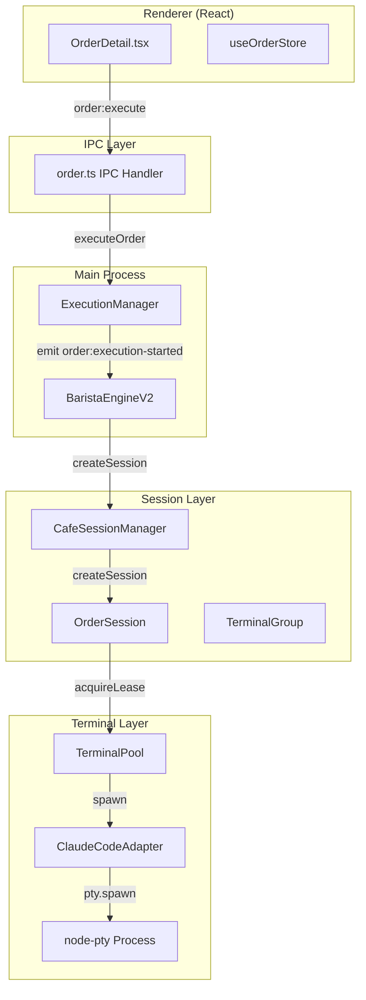
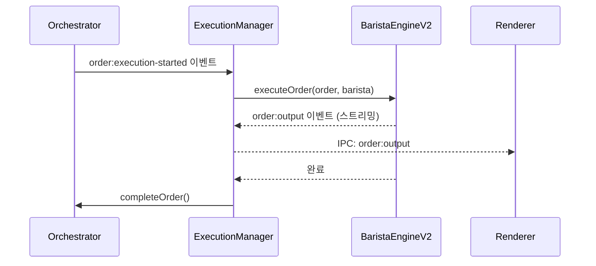
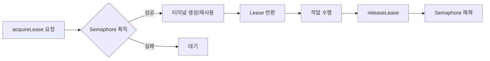
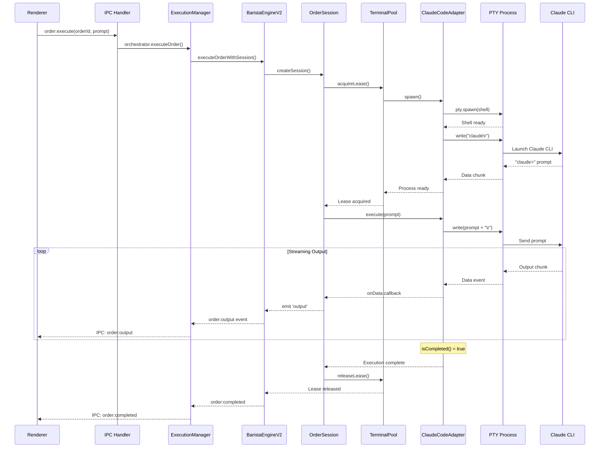
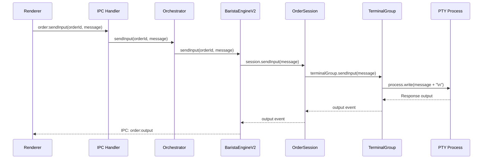

# 터미널 실행 흐름 분석 (Claude CLI)

## 개요

CodeCafe Manager에서 터미널로 Claude CLI를 실행하고, 프롬프트를 입력하고, 사용자와 상호작용하는 전체 흐름을 분석합니다.



---

## 1. 실행 요청 (UI → Main)

### 1.1 UI에서 주문 실행 요청

```typescript
// OrderDetail.tsx에서 실행 버튼 클릭
window.api.order.execute(orderId, prompt, vars);
```

### 1.2 IPC 핸들러: [order.ts](file:///c:/dev/code-cafe-manager/packages/desktop/src/main/ipc/order.ts)

```typescript
ipcMain.handle('order:execute', async (_, orderId, prompt, vars) => {
  await orchestrator.executeOrder(orderId, prompt, vars || {});
  return { started: true };
});
```

---

## 2. ExecutionManager

### [execution-manager.ts](file:///c:/dev/code-cafe-manager/packages/desktop/src/main/execution-manager.ts)

Orchestrator의 이벤트를 받아 `BaristaEngineV2`를 통해 실제 실행을 관리합니다.



**주요 기능:**
- Orchestrator 이벤트 리스닝
- BaristaEngineV2로 실행 위임
- 출력 스트리밍을 Renderer로 전달

---

## 3. BaristaEngineV2

### [barista-engine-v2.ts](file:///c:/dev/code-cafe-manager/packages/orchestrator/src/barista/barista-engine-v2.ts)

터미널 풀 기반 실행 엔진입니다. 두 가지 실행 모드가 있습니다:

| 모드 | 설명 |
|------|------|
| **Session 모드** | 워크플로우 설정이 있는 경우 (다단계 실행) |
| **Legacy 모드** | 단순 프롬프트 실행 |

### Session 모드 실행

```typescript
async executeOrderWithSession(order, barista, cafeId, prompt) {
  // 1. Session 생성
  const session = this.sessionManager.createSession(order, barista, cafeId, cwd);
  
  // 2. 프롬프트 실행
  await session.executePrompt(prompt, cwd);
}
```

### 사용자 입력 전달

```typescript
async sendInput(orderId: string, message: string) {
  const execution = this.activeExecutions.get(orderId);
  
  if (execution.session) {
    await execution.session.sendInput(message);
  } else if (execution.lease) {
    execution.lease.terminal.process.write(message + '\n');
  }
}
```

---

## 4. OrderSession

### [order-session.ts](file:///c:/dev/code-cafe-manager/packages/orchestrator/src/session/order-session.ts)

주문의 전체 라이프사이클을 관리합니다.

**주요 역할:**
- 워크플로우 Stage 분석
- Provider별 터미널 할당
- Stage 순차/병렬 실행
- 결과 동기화 및 전달

### 프롬프트 실행 흐름

```typescript
async executePrompt(prompt: string, cwd: string) {
  // 1. 터미널 그룹 초기화
  this.terminalGroup = new TerminalGroup(this.orderId, this.barista.provider, this.terminalPool);
  await this.terminalGroup.initialize(cwd);
  
  // 2. 출력 콜백 설정
  this.terminalGroup.on('output', (data) => {
    this.emit('output', { orderId: this.orderId, data });
  });
  
  // 3. 프롬프트 실행
  await this.terminalGroup.execute(prompt);
}
```

### 사용자 입력 전달

```typescript
async sendInput(message: string): Promise<void> {
  if (this.terminalGroup) {
    await this.terminalGroup.sendInput(message);
  }
}
```

---

## 5. TerminalPool

### [terminal-pool.ts](file:///c:/dev/code-cafe-manager/packages/orchestrator/src/terminal/terminal-pool.ts)

터미널 인스턴스 풀링 및 동시성 제어를 담당합니다.

### Lease 시스템



### 핵심 코드

```typescript
async acquireLease(provider, baristaId, cwd?, timeoutMs?): Promise<TerminalLease> {
  // 1. Semaphore로 동시성 제어
  const semaphore = this.semaphores.get(provider);
  await semaphore.acquire(timeout);
  
  // 2. 터미널 생성 또는 재사용
  const terminal = await this.getOrCreateTerminal(provider, cwd);
  
  // 3. Lease 생성 및 반환
  return this.createActiveLease(terminal, baristaId, provider, timeout);
}
```

---

## 6. ClaudeCodeAdapter

### [claude-code-adapter.ts](file:///c:/dev/code-cafe-manager/packages/orchestrator/src/terminal/adapters/claude-code-adapter.ts)

Claude CLI와의 실제 통신을 담당하는 어댑터입니다.

### 6.1 프로세스 생성 (`spawn`)

```typescript
async spawn(options?: { cwd?: string }): Promise<IPtyProcess> {
  // 1. 셸 설정
  const { shell, args } = this.getShellConfig();
  // Windows: powershell.exe -NoLogo -NoProfile -ExecutionPolicy Bypass
  // Linux/Mac: /bin/bash --login -i
  
  // 2. 환경변수 필터링 (VS Code 관련 제거)
  const env = { ...process.env };
  delete env.ELECTRON_RUN_AS_NODE;
  env.CI = 'true';  // 비대화형 모드 강제
  
  // 3. PTY 프로세스 생성
  const ptyProcess = pty.spawn(shell, args, {
    name: 'xterm-color',
    cwd: options?.cwd || process.cwd(),
    env: { ...env, TERM: 'xterm-256color' },
    cols: 120,
    rows: 30,
  });
  
  // 4. 셸 초기화 대기
  await this.waitForShellReady(ptyProcess, 10000);
  
  // 5. Claude CLI 시작
  ptyProcess.write(`${claudeCmd}\r`);
  
  // 6. Claude CLI 초기화 대기
  await this.waitForPrompt(ptyProcess, 10000);
  
  return ptyProcess;
}
```

### 6.2 프롬프트 전송 (`sendPrompt`)

```typescript
async sendPrompt(ptyProcess, prompt: string): Promise<boolean> {
  // 프롬프트 + 캐리지 리턴 전송
  const dataToWrite = prompt + '\r';
  ptyProcess.write(dataToWrite);
  
  // 에코 확인 (optional)
  // ...
  return true;
}
```

### 6.3 출력 읽기 (`readOutput`)

```typescript
async readOutput(ptyProcess, timeout, onDataCallback?): Promise<string> {
  return new Promise((resolve, reject) => {
    let output = '';
    let idleTimer, hardTimeout;
    
    // 완료 패턴 감지
    const isCompleted = (text) => {
      if (text.includes('[DONE]')) return true;
      if (/Total cost:.*\$[\d.]+/i.test(text)) return true;
      if (/claude[>›»]/i.test(text.slice(-200))) return true;
      // ...
    };
    
    const onData = (data) => {
      if (onDataCallback) onDataCallback(data);  // 스트리밍 콜백
      output += data;
      
      // 권한 요청 자동 승인
      this.checkAndHandlePermissions(data, ptyProcess);
      
      if (isCompleted(output)) {
        cleanup();
        resolve(output.trim());
      }
    };
    
    ptyProcess.on('data', onData);
  });
}
```

### 6.4 권한 자동 승인 (`checkAndHandlePermissions`)

```typescript
private checkAndHandlePermissions(text, ptyProcess): boolean {
  const permissionPatterns = [
    /Allow .* execution/i,
    /Do you want to run/i,
    /\(y\/n\)/i,
    /Risk:/i,
    /Allow .* access/i,
  ];
  
  for (const pattern of permissionPatterns) {
    if (pattern.test(text)) {
      console.log(`Auto-approving permission prompt: ${pattern}`);
      ptyProcess.write('y\r');
      return true;
    }
  }
  return false;
}
```

---

## 7. 전체 시퀀스 다이어그램



---

## 8. 사용자 상호작용 (입력 전송)

사용자가 실행 중인 Claude CLI에 추가 입력을 보내는 경우:



---

## 9. 주요 설정값

### ClaudeCodeAdapter 타임아웃

| 설정 | 값 | 설명 |
|------|-----|------|
| `IDLE_TIMEOUT` | 30초 | 출력 없음 감지 시간 |
| `WAIT_TIMEOUT` | 10초 | 초기화 대기 시간 |
| `EXECUTE_TIMEOUT` | 10분 | 최대 실행 시간 |
| `TERM_COLS` | 120 | 터미널 너비 |
| `TERM_ROWS` | 30 | 터미널 높이 |

### 완료 감지 패턴

- `[DONE]` 마커
- `Total cost:` 토큰 사용량 표시
- `claude>`, `❯`, `>` 프롬프트 패턴

---

## 10. 에러 처리

| 에러 타입 | 처리 |
|----------|------|
| `ProviderSpawnError` | PTY 생성 실패 시 발생 |
| `AdapterNotFoundError` | 지원하지 않는 Provider |
| `LeaseNotFoundError` | Lease 해제 시 찾을 수 없음 |
| Crash Recovery | `TerminalPool`에서 자동 재생성 시도 |
